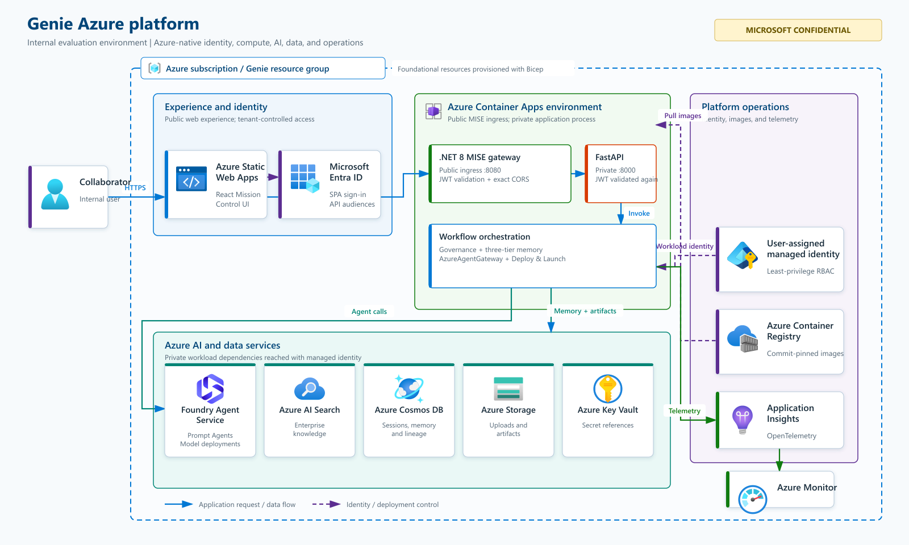
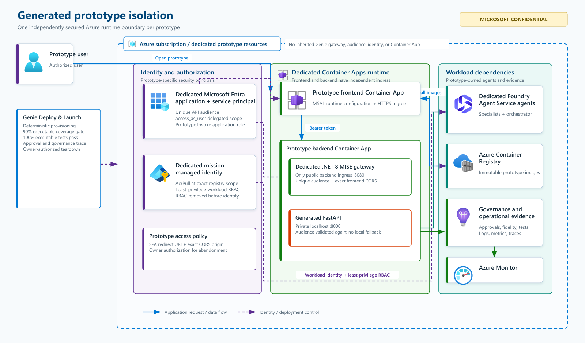

# Genie — Agentic Experience Center

Genie is an Azure-native Agentic AI solutioning platform. It ingests transcripts, recordings, documents, and customer context and transforms them into an interactive AI **Mission Control** experience — where requirement discovery, agent collaboration, architecture design, governance decisions, memory updates, approvals, and final outputs can all be observed **in real time**.

## Purpose and use boundary

> [!IMPORTANT]
> **MICROSOFT CONFIDENTIAL — INTERNAL COLLABORATION ONLY**
>
> Genie is an **art-of-the-possible prototype** for rapidly validating an agentic solution vision, architecture, interaction model, and requirement coverage. It is not a generally available Microsoft product, production reference implementation, or support commitment. **Do not deploy Genie, or a Genie-generated prototype, directly to production.** Before any production use, complete an independent architecture review, threat model, privacy and Responsible AI review, accessibility review, data-governance assessment, operational-readiness review, performance and resilience testing, and approval through the owning organization's standard engineering and release processes.

Genie is **not** a report generator. Every artifact it produces is backed by a traceable chain of agent execution, governance events, and approved memory rather than a static template.

---

## Table of contents

- [Purpose and use boundary](#purpose-and-use-boundary)
- [Architecture](#architecture)
  - [Genie Azure platform](#genie-azure-platform)
  - [Generated prototype isolation](#generated-prototype-isolation)
- [Core concepts](#core-concepts)
- [Agents](#agents)
- [Workflows](#workflows)
- [How a mission gets built](#how-a-mission-gets-built)
- [Deploy & Launch pipeline](#deploy--launch-pipeline)
- [Repository layout](#repository-layout)
- [Local development](#local-development)
- [Configuration reference](#configuration-reference)
- [Authentication](#authentication)
- [Deployment strategy](#deployment-strategy)
  - [Deploying into a brand-new Azure subscription](#deploying-into-a-brand-new-azure-subscription)
  - [Provisioning Foundry agents](#provisioning-foundry-agents)
  - [Deploying application code (backend + frontend)](#deploying-application-code-backend--frontend)
  - [Continuous deployment (GitHub Actions)](#continuous-deployment-github-actions)
- [Testing](#testing)
- [Troubleshooting](#troubleshooting)
- [Deploy log](#deploy-log)
- [Known gaps / next phases](#known-gaps--next-phases)

---

## Architecture

Genie follows Clean Architecture in application code and uses Azure-native identity, hosting, data, AI, and observability services. The diagrams below separate the long-lived **Genie control plane** from the isolated Azure resources created for each generated prototype.

### Genie Azure platform

[](docs/architecture/genie-azure-platform.svg)

*Figure 1. Genie evaluation platform. Select the diagram to open the scalable SVG. The service symbols come from the [official Microsoft Azure Architecture Icons](https://learn.microsoft.com/azure/architecture/icons/).*

| Azure concern | Implementation |
|---|---|
| **Web experience** | React/TypeScript on Azure Static Web Apps; MSAL authenticates internal collaborators with Microsoft Entra ID |
| **API security boundary** | Public Azure Container Apps ingress reaches only the .NET 8 MISE gateway on `8080`; FastAPI remains private on `localhost:8000` and validates the token again |
| **Agent execution** | `AzureAgentGateway` is the only production execution path to independently provisioned Azure AI Foundry Prompt Agents |
| **Identity and secrets** | User-assigned managed identity and least-privilege Azure RBAC; secrets belong in Key Vault and are never embedded in images or source |
| **Memory and artifacts** | Cosmos DB for durable session/memory/lineage state, Azure AI Search for enterprise knowledge, and Azure Storage for uploads and generated artifacts |
| **Images and hosting** | Commit-pinned backend and gateway images in Azure Container Registry, deployed together to Azure Container Apps |
| **Observability** | Application Insights and Azure Monitor receive structured logs, traces, metrics, correlation IDs, and governance telemetry |
| **Infrastructure** | Subscription-scoped Bicep creates the resource group and foundational Azure resources; GitHub Actions deploys application revisions through Azure OIDC |

### Generated prototype isolation

Deploy & Launch creates a separate security and runtime boundary for every newly generated prototype. Prototypes reuse the immutable gateway image, but they do **not** inherit Genie's gateway, Entra audience, managed identity, or Container App.

[](docs/architecture/generated-prototype-isolation.svg)

*Figure 2. Per-prototype security and runtime isolation. Select the diagram to open the scalable SVG.*

Each prototype receives its own single-tenant Entra application and service principal, API audience, delegated scope, application role, SPA redirect URI, exact CORS origin, gateway container, backend/frontend Container Apps, mission managed identity, RBAC assignments, and generated Foundry agents. Failed runs retain the protected boundary for safe retry. An owner-authorized abandonment operation deletes the runtime resources, RBAC assignments, identity, and Entra application in dependency order.

### Layering rules (enforced by tests)

- Azure SDK imports are confined to an explicit allow-list of Foundry, deployment, transcription, and generated-prototype infrastructure adapters. A standing test (`tests/unit/test_architecture_boundary.py`) scans the backend source tree and fails if an application/domain module crosses that boundary.
- Every Genie business/debugging **agent is an independently deployed Azure AI Foundry agent resource** (created via the Foundry portal, CLI, or the provisioning scripts in this repo) — Genie never implements agent reasoning as ad hoc Python classes, and never calls `create_agent()` at request time.
- The frontend **never** calls Azure AI Foundry directly — a static scan test (`no_foundry_direct_access.test.tsx`) fails the build if any non-`httpClient.ts` file performs a raw `fetch()` call or imports a Foundry SDK / hostname.
- Execution goes through `AzureAgentGateway` whenever Azure AI Foundry is configured. Local/mock agents, static demo data, and fallback execution are only permitted when `GENIE_ALLOW_LOCAL_AGENTS=true` (and no Foundry endpoint is configured) — otherwise the gateway fails closed instead of ever silently falling back.

### Three-tier memory architecture

| Tier | Purpose | Backend |
|---|---|---|
| **Personal Agent Memory** | Observations, work products, intermediate summaries — accessible only by the owning agent unless policy allows | In-memory (dev) / Cosmos DB (production) |
| **Shared Collaboration Memory** | Goals, constraints, assumptions, risks, findings, approved artifacts — every read/write emits a governance event | In-memory (dev) / Cosmos DB (production) |
| **Enterprise Knowledge Memory** | Industry patterns, reference architectures, reusable best practices — customer data is never promoted here without approval | Azure AI Search |

### Governance

Every agent execution, agent-to-agent handoff, memory read/write, tool invocation, policy check, and approval decision is recorded as a `GovernanceEvent`, giving full session replay and decision-lineage traceability. `GovernanceProvider` is a pluggable interface (`Agent365GovernanceProvider` marker for production, `LocalGovernanceTraceProvider` for local/dev only) — production startup fails closed if no real provider is injected.

**Triage Mode** (sidebar toggle, off by default) renders a full-height, right-docked panel that polls `GET /sessions/{id}/governance/events` and filters to `agent_execution` events. Because `WorkflowStepExecutor.execute_step()` records that event the instant an individual agent call resolves — not once a whole (possibly multi-step) workflow run/resume call returns — the panel reflects the orchestrator's real agent-call order and timing, including cases where several ungated steps execute back-to-back within one HTTP call. Each feed item shows a gamified XP/level readout plus a truncated preview of that agent's real output (`detail.output_preview`); there is no synthetic or simulated activity.

### Fail-closed startup

Before accepting any traffic, the backend runs 10 mandatory startup validators (`RuntimeVersion`, `Configuration`, `ProviderMode`, `ProductionSafety`, `AgentRegistry`, `WorkflowRegistry`, `PromptTemplate`, `MemoryPolicy`, `GovernanceProvider`, `NoHardcoding`), plus (in production mode only) Foundry-specific validators that verify every enabled agent's `foundry_agent_id` actually resolves in Azure AI Foundry and has no critical configuration drift. `/health/ready` only returns 200 once all validation has passed.

---

## Core concepts

- **Config-driven, never hardcoded.** Agent definitions, workflow definitions, prompt templates, endpoints, deployment names, subscription/tenant ids, customer data, secrets, and expected AI outputs are never hardcoded — they live under `config/agents`, `config/prompts`, `config/workflows`, `config/policies`, and environment variables.
- **Strongly typed everywhere.** Pydantic v2 models on the backend, TypeScript types mirroring every backend model on the frontend.
- **Async throughout** the backend service layer.
- **Dependency injection** — every service is constructed via a `create_X(...)` factory that takes its collaborators as explicit parameters, making every layer independently testable.

---

## Agents

Agents are **never** implemented as Python/TypeScript classes containing reasoning logic. Each agent is a real resource provisioned in Azure AI Foundry; Genie's `config/agents/registry.yaml` registry only records *which* Foundry resource backs each logical agent id, its capabilities, memory access, and prompt template reference. `AzureAgentGateway` resolves the prompt, opens a thread against the existing Foundry agent, posts the message, and reads the reply — it never creates agents at runtime.

### The real agent lineup

Genie's mission pipeline is deliberately lean — seven real Foundry agents, no inert "catalog" of unused agents:

| Agent id | Name | Role | Prompt template | Notes |
|---|---|---|---|---|
| `genie-orchestrator` | Genie Orchestrator | mission_orchestration | `orchestrator-mission-v1` | The **only** agent every workflow step actually addresses directly — see [delegation pattern](#the-orchestrator-delegation-pattern) below |
| `requirements-analyst` | Requirements Analyst | requirement_discovery | `requirements-extraction-v1` | Extracts goals/requirements/risks and rules on agentic-workflow qualification |
| `architecture-designer` | Architecture Designer | architecture_design | `architecture-recommendation-v1` | Designs the multi-agent workflow and shapes an [Impeccable](https://impeccable.style/)-style, domain-specific surface mode and visual direction for the single-page UI |
| `build-agent` | Build Agent | solution_build | `build-generation-v1` / `build-generation-component-v1` / `build-component-regeneration-v1` | Generates the real UI + specialist agent + orchestrator code one component at a time; every UI generation/regeneration path applies the Impeccable design contract |
| `security-assessment-agent` | Security Assessment Agent | security_assessment | `security-assessment-v1` | Independent OWASP Top 10 review of the generated build; reports `SECURITY_GATE: PASS/FAIL` |
| `test-generation-agent` | Test Generation Agent | test_generation | `test-generation-v1` | Independent test-coverage review of the generated build; reports `TEST_COVERAGE_GATE: PASS/FAIL` |
| `debugging-agent` | Debugging Agent | debugging | `failure-diagnosis-v1` | Diagnoses a detected workflow/agent execution failure |

### The orchestrator delegation pattern

Every `solution-discovery-workflow` step invokes `genie-orchestrator`, never the specialist directly. `genie-orchestrator` calls exactly one of its own registered Foundry function-calling tools (`call_requirements_analyst`, `call_architecture_designer`, `call_build_agent`, `call_security_assessment_agent`, `call_test_generation_agent` — implemented in `app/agents/tools/orchestration_tools.py`) to execute that phase's real specialist through the exact same `AzureAgentGateway` path as any other agent call, then returns that specialist's output **verbatim** as the step's own result. This exists because the pinned `azure-ai-projects` SDK version has no native "Connected Agents" mechanism for Prompt Agents — `connected_agent_ids` in the registry is realized via genuine per-phase function tools instead, not a Foundry-native feature. Each agent's own registry entry also declares `connected_agent_ids` purely for inventory/documentation, mirroring what `genie-orchestrator` is actually wired to call.

### Agent metadata fields

Every agent entry carries: `id`, `name`, `role`, `description`, `capabilities`, `allowed_tools`, `memory_access` (subset of `personal`/`shared`/`enterprise`), `foundry_agent_id` (the real provisioned Foundry resource id), `model_deployment_ref` (optional — informational only, defaults to `Settings.default_llm`), `owner` (accountable team, never a person), `governance_policy_id`, `prompt_template_ref`, `connected_agent_ids` (documentation only — see above), and `enabled`.

### Default LLM

`Settings.default_llm` (env `GENIE_DEFAULT_LLM`) applies to any agent that doesn't declare its own `model_deployment_ref`. Currently `gpt-5-mini` by default (`architecture-designer` overrides to `gpt-5-1`, demonstrating per-agent LLM configurability). Anthropic Claude models were evaluated but require an Azure Marketplace subscription with non-zero SKU quota, which is not available by default.

---

## Workflows

Workflows (`config/workflows/registry.yaml`) define ordered, dependency-graphed steps; `WorkflowRuntime` computes execution "waves" from the `depends_on` graph and runs same-wave steps in parallel via `asyncio.gather`. Genie's own Mission Control flow is deliberately just human-paced stages — each step has `requires_human_proceed: true`, so a run simply stops at `waiting_for_proceed` until a human explicitly resumes it; editing an earlier, already-persisted stage never cascades into automatically re-running a downstream one.

- **`solution-discovery-workflow`** — three steps, all addressed to `genie-orchestrator` (see [delegation pattern](#the-orchestrator-delegation-pattern) above):
  1. `analyze-requirements` (prompt `orchestrator-requirements-phase-v1`, tool `call_requirements_analyst`) — extract requirements from the session transcript.
  2. `design-architecture` (prompt `orchestrator-architecture-phase-v1`, tool `call_architecture_designer`, human-gated) — derive the multi-agent workflow + UI design from the approved requirements.
  3. `build-solution` (prompt `orchestrator-build-phase-v1`, tool `call_build_agent`, human-gated) — generate the real UI + agent + orchestrator code for the approved architecture. On a retried attempt, this step's own prior output is fed back in as `previous_build_output` so `call_build_agent` skips regenerating any component that already succeeded, instead of rebuilding the whole mission from scratch.

  Test generation and its real execution are deliberately **not** steps in this workflow — they happen later, inside the separate [Deploy & Launch pipeline](#deploy--launch-pipeline), against the mission's actually-deployed build.
- **`debugging-workflow`** — a single `diagnose-failure` step (agent `debugging-agent`, prompt `failure-diagnosis-v1`) triggered on a detected workflow/agent execution failure, executed through the exact same `AzureAgentGateway` path as every other workflow (never a bespoke/local diagnostic path).

### Agentic-workflow qualification check

The Requirement Discovery Map doesn't just list extracted requirements — it also surfaces whether they actually **qualify for a multi-agent agentic workflow** in the first place, versus being better served by a simpler, deterministic solution. This is deliberately **not** a Python business rule: the judgment is made by the existing `requirements-analyst` agent as part of its normal `analyze-requirements` step. Its prompt (`requirements-extraction-v1`) instructs it to end its output with two machine-parseable lines:

```
AGENTIC_WORKFLOW_QUALIFICATION: QUALIFIED | NOT_QUALIFIED
QUALIFICATION_REASON: <one or two plain-language sentences>
```

The backend (`RequirementsService.get_qualification`, `GET /sessions/{id}/requirements/{workflow_run_id}/qualification`) only *extracts* this verdict via a regex parser — it never invents or overrides the agent's own reasoning. If the requirements don't qualify, `RequirementDiscoveryPage` shows a graceful Fluent `MessageBar` banner explaining why, using the agent's own stated reason. The step id this check watches is configurable via `GENIE_REQUIREMENTS_QUALIFICATION_STEP_ID` (defaults to `analyze-requirements`), never hardcoded.

---

## How a mission gets built

This is the "how": the exact mechanism Genie uses to turn an uploaded transcript into a working, requirements-traceable UI + multi-agent backend — end to end, nothing hardcoded or templated.

| Stage | Governed outcome | Approval or gate |
|---|---|---|
| **1. Ingest** | Transcript, recording, or document enters the session scope | Upload validation |
| **2. Requirements** | Requirements Analyst classifies scope and creates the numbered critical path | Human approval |
| **3. Architecture** | Architecture Designer produces the multi-agent workflow and single-page UI design | Human approval |
| **4. Build** | Build Agent generates one traceable component at a time | Requirement-fidelity validation |
| **5. Assess and test** | Security Assessment and Test Generation run independently | `SECURITY_GATE` and `TEST_COVERAGE_GATE` |
| **6. Workshop** | Peer-review findings and selected fixes are reconciled | Human approval |
| **7. Deploy & Launch** | The deterministic pipeline provisions the isolated Azure prototype | At least 90% executable coverage and 100% of executable tests passing |

### 1. Requirements are pinned into a single scope contract

`requirements-analyst` (prompt `requirements-extraction-v1`) classifies every functional requirement as `MUST-HAVE` or `NICE-TO-HAVE` (erring toward MUST-HAVE when ambiguous — the goal is to capture full scope, never shrink it), then emits a numbered **"Critical path (must build first):"** list. This list is the one scope boundary every later stage is measured against. The same step also emits the `AGENTIC_WORKFLOW_QUALIFICATION` verdict described above.

### 2. Architecture Designer decides *what* to build — strictly bounded to that scope

`architecture-designer` (prompt `architecture-recommendation-v1`) reasons out two sections from the approved requirements alone:

- **`## Multi-Agent Workflow`** — exactly one Orchestrator Agent plus however many specialist agents the critical path genuinely needs (no "best practice" agents invented beyond what the requirements ask for).
- **`## Single-Page UI Design`** — only the mission-specific *input* zone(s) (1-3 zones), using a fixed, deterministic field→control mapping so every mission's UI stays consistent: ≤6 mutually exclusive choices → dropdown; multi-select → checkbox group; bounded number where position matters → slider; exact number → number input; toggle → checkbox; file/folder → drag-and-drop picker; date/time → picker; only genuinely open-ended values → text field. The surrounding shell always supplies the live Agent Pipeline panel and Mission Queue (progress, streamed narration, results, downloads) identically for every mission, so this design step never touches that — only the bespoke input surface.

The prompt is explicit: *"Stay strictly within the 'Critical path:' scope... treat [anything outside it] as future backlog, out of scope for this design."*

### 3. Build Agent turns that design into real code — one component at a time, with zero drift allowed

`call_build_agent` (`app/agents/tools/orchestration_tools.py`) invokes the Build Agent **once per component** (`build-generation-component-v1`), in a fixed bottom-up order: each specialist agent module (alphabetical), then the Orchestrator module, then the UI component. The prompt hard-constrains every component to the architecture's own list: *"Every zone and every agent you generate code for MUST come directly from that exact list below — never invent, add, rename, or merge."* The UI component must implement **only** the input zones named in step 2, using the same deterministic control-mapping rule, styled with Genie's own shell classes (`genie-card`, `genie-zone-title`, `genie-btn-primary`, `genie-dropzone`) and a fixed contract (`{ onSubmit: (message, attachments?) => void }`) — it never renders its own progress/output/agent-status UI, because the shell already does. On a retried build, `previous_build_output` lets the tool skip regenerating any component that already succeeded rather than rebuilding the whole mission from scratch. Users can also request a targeted change to a single already-generated component from Workshop Center (`WorkshopService.regenerate_component`, prompt `build-component-regeneration-v1`) without touching anything else.

Which requirement IDs belong to which component is never left purely to the Build Agent's own judgment. `architecture_parsing.parse_component_requirement_assignments` deterministically extracts the `REQ-###` ids already cited in each specialist/UI bullet's own text (the Architecture Designer prompt requires this), and `call_build_agent` (1) fails closed with a governed error **before generating any component** if an approved requirement is never assigned to any specialist, the Orchestrator, or a UI zone, and (2) passes each component only its own assigned requirement ids via the `{assigned_requirements}` prompt variable — cheaper and more reliable than discovering a coverage gap only after a full build+deploy+test cycle.

The generated orchestrator module has one more fail-closed contract: `code_materializer.materialize_build` rejects the parsed build with a `MaterializedCodeError` unless it defines the exact literal class `class OrchestratorAgent:` — the deterministic backend scaffold (`_MAIN_PY_TEMPLATE`) hardcodes `from orchestrator import OrchestratorAgent`, so a misnamed class would otherwise deploy a prototype whose backend never actually runs the generated business logic. This is enforced at materialization time (before any deploy), on top of the `build-generation-component-v1` prompt's own instruction to name the class correctly.

### 4. Two independent agents verify the build against the original requirements — never trusting the builder's own claims

- **Security Assessment Agent** (`security-assessment-v1`) reviews the entire generated artifact against the OWASP Top 10 every time (not just the diff) and is explicitly told to *"form your own independent judgment... do not defer to, assume the correctness of, or be swayed by"* the Build Agent's own claims. Ends with `SECURITY_GATE: PASS|FAIL` plus structured findings.
- **Test Generation Agent** (`test-generation-v1`) generates real, pytest-discoverable unit/integration tests and Vitest/RTL UI tests, and independently confirms *"every requirement's critical path have at least one covering test"* before reporting `TEST_COVERAGE_GATE: PASS|FAIL`.

Both marker-line verdicts are parsed verbatim (never invented or overridden) by `PeerReviewService` (`app/services/peer_review_service.py`) using the same "agents return marker lines, never JSON" convention used throughout Genie. Workshop Center's **Apply Selected Fixes** action regenerates the build with a customer-chosen subset of findings and forces both gates to re-run against the new artifact.

### 5. Human approval + full decision lineage at every hop

Every stage above (`design-architecture`, `build-solution`) is `requires_human_proceed: true` — nothing auto-advances, and revisiting an earlier stage never silently cascades into re-running a downstream one. `TraceabilityService` (`app/governance/traceability_service.py`) assembles a complete, customer-facing lineage per recommendation — which agent produced it, which evidence/memory it used, which approvals were granted, and every governance event on its trace id — so any generated screen or agent can be traced back to the exact requirement and approval that authorized it. This is what Genie's **Replay Center** and **Triage Mode** panels render live.

---

## Deploy & Launch pipeline

Deploy & Launch is deliberately **not** an LLM-narrative workflow step — it is a real, deterministic, code-driven Azure provisioning pipeline (`app/deploy_launch/pipeline_service.py`) that executes each named step in this exact order against real Azure SDKs — never fabricating a result for a step it didn't actually perform. Production startup fails when required deployment or prototype-MISE settings are absent; explicit Null collaborators exist only for local tests. It runs once a mission's `build-solution` step has been approved, and it deploys **one customer mission's generated build** (a separate concern from Genie's own infrastructure, which is provisioned once via `infra/main.bicep`).

| # | Step id | Customer-facing name | What actually happens |
|---|---|---|---|
| 1 | `generate-access-policy` | Generate Access Policy & Least Access | Derives a least-privilege access policy for the mission's generated agents |
| 2 | `provision-foundry-agents` | Deploy Agents to Foundry | Provisions each generated specialist + orchestrator agent as a real Azure AI Foundry resource |
| 3 | `deploy-backend-service` | Deploy Backend Service | Creates a unique single-tenant Entra API/SPA registration and service principal, builds the mission backend, and deploys it with its own MISE gateway container. External ingress targets gateway port `8080`; generated FastAPI stays private on `8000` and validates the same prototype-specific audience again |
| 4 | `sync-frontend-integration` | Update Frontend Integrations | Wires the generated UI to the deployed backend and writes that prototype's non-secret MSAL client, tenant, and delegated-scope runtime configuration |
| 5 | `deploy-frontend-app` | Deploy Frontend | Builds the mission UI under Node 22, runs the pinned Apache-2.0 Impeccable `3.6.0` detector over generated TSX/CSS, fails closed on deterministic design anti-patterns, then deploys the Vite build. After Azure returns the frontend URL, the pipeline finalizes the Entra SPA redirect and replaces the gateway's deny-by-default bootstrap CORS origin with that one exact HTTPS origin |
| 6 | `generate-test-suite` | Generate Requirement Acceptance Tests | Test Generation Agent writes real black-box tests against the deployed prototype's actual mission URLs (no mocks/patches), targeting every approved requirement id. Normal API calls use `MISSION_BACKEND_URL`, which points to the trusted authenticated loopback proxy during execution; generated code never handles credentials. A requirement-coverage repair loop retries omitted IDs up to `GENIE_DEPLOYMENT_FIDELITY_MAX_REPAIR_ATTEMPTS`; after that, executable coverage must meet `GENIE_DEPLOYMENT_FIDELITY_MIN_COVERAGE_PERCENT` (default 90%) and every omitted ID remains an explicit fidelity gap. For a real deployed backend, `validate_real_action_tests` also rejects test doubles in place of real HTTP calls |
| 7 | `execute-test-suite` | Requirement Fidelity Gate | `TestExecutionService` gets a short-lived application token scoped only to the current prototype but never gives it to generated code. A trusted parent-side loopback proxy owns the token, forwards only to the fixed prototype backend, and injects `Authorization`; the stripped pytest environment receives only the loopback URL. Launch requires the configured executable-coverage threshold and 100% passing evidence for all executable requirement tests. Failed, errored, skipped, timed-out, or unobserved executable tests still trigger automatic regeneration and redeployment up to `GENIE_DEPLOYMENT_FIDELITY_MAX_REPAIR_ATTEMPTS` times (default 3), then fail closed |
| 8 | `run-security-scan` | Security Scan (Backend & Frontend) | Real security scan of the deployed backend and frontend artifacts |
| 9 | `launch-mission` | Launch | Mints the customer-facing launch link once every prior step has passed |

Each step's real status (`pending` → `running` → `completed`/`failed`/`skipped`) streams live to the Deploy & Launch page so the human watches actual provisioning happen — never a simulated progress bar. The **Requirement Fidelity Gate** (step 7) is Genie's last line of defense: it never trusts the Build Agent's or Test Generation Agent's own claims of completeness, it only trusts pytest actually passing against the real running prototype.

---

## Repository layout

```
backend/           FastAPI application (Python 3.12+)
  app/
    agents/        AgentRegistry, AzureAgentGateway, orchestration tools, Foundry provider/sync/lifecycle
    api/            19 routers (thin — auth + delegation only)
    architecture/   Architecture Studio services
    config/         Settings (pydantic-settings, env prefix GENIE_)
    debugging/      Debugging workflow trigger service
    deploy_launch/  Deploy & Launch pipeline (real, deterministic Azure provisioning
                    of one mission's generated build - see "Deploy & Launch pipeline")
    deployment/     Pre-infra deployment-readiness tooling (resource provider checks)
    governance/      Governance, lineage, decision graph, approval, replay, traceability services
    memory/         Personal / Shared / Enterprise memory services
    models/         Shared Pydantic models
    orchestration/  WorkflowRuntime, AgentOrchestrator, handoff/collaboration/reanalysis
    outputs/        Final Output Center services
    prompts/        PromptRegistry
    repositories/   Protocol + in-memory repository implementations
    security/       Entra ID token validation, auth dependencies
    services/       Session / Requirements / Workshop / Architecture / Peer Review / Output /
                    Foundry agent provisioning & lifecycle services
    transcription/  Upload/recording transcription (speech-to-text) service
    utils/          Shared YAML loader
    validation/     10 fail-closed startup validators + runner
    workflows/      WorkflowRegistry
  tests/            Unit + integration tests (pytest)

frontend/           React + TypeScript Mission Control UI (Vite)
  src/
    app/            App bootstrap (MSAL init, router)
    components/     Shared UI components
    features/       9 feature pages (landing, upload, requirement-map,
                     architecture-studio, workshop-center, deploy-launch,
                     replay-center, final-output-center, triage) - plus two
                     hub wrappers in layouts/ (RequirementsHubPage,
                     OutputsHubPage) that group related pages under one
                     linear nav step via sub-tabs
    hooks/          Data-fetching hooks per feature
    layouts/        AppShell (nav + auth status)
    services/        httpClient, authProvider (MSAL), one API client per backend router
    state/           SessionContext, trace id registry
    types/           TypeScript types mirroring backend Pydantic models
  tests/            Vitest component + static-scan tests

config/             Externalized configuration (never hardcoded in source)
  agents/           Agent registry + Foundry Supported Agents catalog
  prompts/          Prompt templates
  workflows/        Workflow registry
  policies/         memory_policy.yaml, governance_policy.yaml, approval_policy.yaml
  deployment/       resource_providers.yaml (Azure RP allow-list for deployment tooling)

infra/              Bicep infrastructure-as-code
  main.bicep                        Subscription-scoped entry point (creates its own RG)
  modules/foundational-resources.bicep   RG-scope aggregator
  modules/*.bicep                   One module per resource type

scripts/            Operator CLI scripts (deployment readiness, RBAC role generation,
                    Foundry agent provisioning/sync/validation/inventory export)

docs/GENIE_BUILD_SPEC.md   Full build specification
e2e/                       Playwright end-to-end tests (scaffolding)
.github/copilot-instructions.md   Architecture/coding rules enforced across the repo
```

---

## Local development

### Prerequisites

- Python 3.12+
- Node.js 20+ (LTS)
- An Azure subscription with an Azure AI Foundry project (for anything beyond `LocalAgentGateway` dev mode)

### Backend

```powershell
cd backend
python -m venv .venv
.\.venv\Scripts\python.exe -m pip install -e ".[dev]"
.\.venv\Scripts\python.exe -m pytest -v          # run tests
.\.venv\Scripts\python.exe -m ruff check app tests  # lint
.\.venv\Scripts\python.exe -m uvicorn app.main:create_app --factory --reload
```

> **Windows on ARM64 note:** do not install `uvicorn[standard]` — `httptools` has no `win_arm64` wheel. Use plain `uvicorn`. If `azure-identity`'s dependency resolver pulls a `cryptography` version with no `win_arm64` wheel, run `pip install cryptography --only-binary=:all:` first.

Copy `.env.example` (if present) or set the environment variables listed in [Configuration reference](#configuration-reference). With `GENIE_ALLOW_LOCAL_AGENTS=true` and no Foundry endpoint configured, the backend runs entirely against in-memory stores and `LocalAgentGateway` (no Azure required).

### Frontend

```powershell
cd frontend
npm install
npm run dev          # local dev server
npm run build         # tsc -b && vite build -> dist/
npm run test          # vitest
npm run typecheck
npm run lint
```

Set `frontend/.env.development` (or `.env.local`) with at least `VITE_GENIE_API_BASE_URL` pointing at your local backend. Leave the `VITE_ENTRA_*` variables unset locally to use the manual-token fallback in `authProvider.ts` instead of a full Entra redirect login (useful for backend-only development).

---

## Configuration reference

All backend configuration is via environment variables prefixed `GENIE_` (pydantic-settings, see `backend/app/config/settings.py`). Nothing here should ever be hardcoded into source — every value below is meant to be supplied per-deployment.

| Variable | Default | Purpose |
|---|---|---|
| `GENIE_SERVICE_NAME` | `genie-backend` | Service identity for logs/telemetry |
| `GENIE_ENVIRONMENT` | `development` | `development` \| `test` \| `production` |
| `GENIE_LOG_LEVEL` | `INFO` | Log verbosity |
| `GENIE_GOVERNANCE_PROVIDER` | `local` | `local` \| `agent365` — production requires a real provider |
| `GENIE_ALLOW_MOCK_AGENTS` | `true` | Must be `false` in production |
| `GENIE_ALLOW_LOCAL_AGENTS` | `true` | Must be `false` in production |
| `GENIE_USE_SYNTHETIC_DATA` | `true` | Must be `false` in production |
| `GENIE_AZURE_FOUNDRY_ENDPOINT` | *(none)* | `https://<account>.services.ai.azure.com/api/projects/<project>` |
| `GENIE_AZURE_FOUNDRY_PROJECT_NAME` | *(none)* | Foundry project name |
| `GENIE_MEMORY_STORE_BACKEND` | `in_memory` | `in_memory` \| `cosmos_db` — production requires `cosmos_db` |
| `GENIE_MEMORY_STORE_ENDPOINT` | *(none)* | Required in production when backend is `cosmos_db` |
| `GENIE_LINEAGE_STORE_BACKEND` | `in_memory` | Same pattern as memory store, for governance/lineage |
| `GENIE_LINEAGE_STORE_ENDPOINT` | *(none)* | Required in production |
| `GENIE_DEFAULT_LLM` | `gpt-5.1` | Default model deployment name for agents that omit `model_deployment_ref` |
| `GENIE_DEBUGGING_WORKFLOW_ID` | `debugging-workflow` | Workflow id run on `FailureDetected` |
| `GENIE_REQUIREMENTS_QUALIFICATION_STEP_ID` | `analyze-requirements` | Workflow step id whose output is checked for an agentic-workflow qualification verdict |
| `GENIE_DEPLOYMENT_FIDELITY_MAX_REPAIR_ATTEMPTS` | `3` | Max automatic regenerate-and-redeploy attempts the Requirement Fidelity Gate makes before failing closed |
| `GENIE_DEPLOYMENT_FIDELITY_MIN_COVERAGE_PERCENT` | `90` | Minimum approved-requirement percentage with executable acceptance tests required for launch; every executable test must still pass and uncovered requirement IDs remain visible as gaps |
| `GENIE_DEPLOYMENT_TEST_EXECUTION_TIMEOUT_SECONDS` | `300` | Max seconds the Requirement Fidelity Gate's real pytest subprocess (real black-box HTTP acceptance tests against the live deployed prototype, one per approved requirement) is allowed to run before being killed |
| `GENIE_PROTOTYPE_MISE_ENABLED` | `false` | Enables one independently configured MISE gateway and Entra audience for every newly deployed prototype; it is mandatory (`true`) in production and startup fails closed when it or its dependent settings are absent |
| `GENIE_PROTOTYPE_MISE_GATEWAY_IMAGE` | *(none)* | Immutable, commit-pinned `genie-auth-gateway` image used to create each prototype's own gateway container |
| `GENIE_PROTOTYPE_MISE_TEST_PRINCIPAL_CLIENT_ID` | *(none)* | Client id of Genie's user-assigned managed identity; receives each prototype's `Prototype.Invoke` app role and acquires the audience-limited acceptance-test token |
| `GENIE_KEY_VAULT_URI` | *(none)* | Required in production |
| `GENIE_ENTRA_AUTHORITY` | *(none)* | Microsoft Entra ID authority, e.g. `https://login.microsoftonline.com` |
| `GENIE_ENTRA_TENANT_ID` | *(none)* | Microsoft Entra ID tenant for token validation + login |
| `GENIE_ENTRA_CLIENT_ID` | *(none)* | App registration (API) client id |
| `GENIE_ALLOW_LOCAL_TOKEN_VALIDATION` | `false` | Allows `LocalDevTokenValidator` (unverified-signature JWT decode) when Entra isn't configured; must be `false` in production |
| `GENIE_CORS_ALLOWED_ORIGINS` | *(empty)* | Comma-separated browser origins allowed to call the API (e.g. the deployed frontend's URL) |
| `GENIE_CONFIG_ROOT` | `config` | Root directory for agents/prompts/workflows/policies |
| `AZURE_CLIENT_ID` | *(none)* | **Required** when running under a Container App / VM with a **user-assigned** managed identity — tells `DefaultAzureCredential` which identity to use |

Frontend (`frontend/.env.production` / `.env.development`, Vite `VITE_` prefix):

| Variable | Purpose |
|---|---|
| `VITE_GENIE_API_BASE_URL` | Base URL of the deployed/local Genie backend |
| `VITE_ENTRA_CLIENT_ID` | SPA/API app registration client id (leave unset to fall back to manual token entry) |
| `VITE_ENTRA_TENANT_ID` | Microsoft Entra ID tenant id |
| `VITE_ENTRA_API_SCOPE` | `api://<client-id>/access_as_user` scope requested at login |

---

## Authentication

Genie uses **Microsoft Entra ID** end to end:

- **Authentication gateway**: every external API request first reaches the .NET 8 gateway in `gateway/Genie.AuthenticationGateway`. The gateway uses `Microsoft.Identity.ServiceEssentials.AspNetCore` (MISE) to validate Entra bearer tokens, allows both delegated user and application access tokens for the configured API audiences, and proxies accepted requests to `http://localhost:8000`. Public Container App ingress targets gateway port `8080`; FastAPI port `8000` is reachable only inside the replica. Liveness/readiness probes and configured CORS preflight requests are anonymous; all API routes require authentication.
- **Backend defense in depth**: `EntraTokenValidator` (see `backend/app/security/token_validator.py`) validates the bearer token again against the tenant's Microsoft Entra ID OpenID metadata and JWKS (RS256 signature, issuer, audience, `exp`/`iat`). The gateway preserves the original `Authorization` header when proxying. Validation activates once `GENIE_ENTRA_AUTHORITY`, `GENIE_ENTRA_TENANT_ID`, and `GENIE_ENTRA_CLIENT_ID` are all set. `LocalDevTokenValidator` is available only when `GENIE_ALLOW_LOCAL_TOKEN_VALIDATION=true` and Entra isn't configured — never in production. `create_token_validator()` fails closed otherwise.
- **Frontend**: MSAL (`@azure/msal-browser`) drives an automatic redirect sign-in flow — on load, the app silently acquires a token if a session exists, or redirects to the Microsoft sign-in page if not, then redirects back with no manual steps. Silent token refresh runs on a 5-minute timer via `acquireTokenSilent`, falling back to `acquireTokenRedirect` on `InteractionRequiredAuthError`. If the three `VITE_ENTRA_*` variables aren't set, the app transparently falls back to the pre-existing manual token-entry seam (`setAccessToken()`), so local/backend-only development never requires an Entra app registration.
- **App registration**: a single Azure AD application acts as both the SPA client and the API it calls (self-referencing `access_as_user` OAuth2 permission scope). Its access-token optional claims must include `idtyp` with `include_user_token` so MISE can distinguish delegated user tokens from application tokens; this is configured for the production Genie registration. Grant admin consent for the scope in **Entra admin center → App registrations → API permissions → Grant admin consent** so users aren't prompted individually; if consent can't be granted centrally, users will see a one-time interactive consent prompt on first sign-in instead.
- **Generated prototypes**: every new Deploy & Launch run creates its own single-tenant Entra application, API identifier URI, `access_as_user` delegated scope, `Prototype.Invoke` application role, and service principal. The immutable gateway image is reused, but each prototype owns a separate gateway container, audience, SPA redirect, exact CORS origin, and app-role assignment. The generated SPA uses MSAL redirect login and five-minute silent refresh; its generated FastAPI service independently verifies RS256 signature, issuer, exact audience, subject, and either `access_as_user` or `Prototype.Invoke`. No prototype routes through Genie's gateway instance. Both generated backend and frontend Container Apps use the mission user-assigned identity for ACR pulls; no registry admin password is added to either revision. Failed runs retain this complete protected boundary so an in-process retry cannot resume against a deleted audience. Owner-authorized `DELETE /sessions/{session_id}/deploy-launch/{pipeline_run_id}` explicitly abandons a terminal run and removes its backend/gateway, frontend, Foundry agents, every RBAC assignment for the mission principal, mission identity, and Entra application in dependency order; failed cleanup remains retryable, and Graph deletion uses bounded retries.
- **Graph prerequisite**: the Genie backend managed identity needs Microsoft Graph **application** permissions `Application.ReadWrite.OwnedBy`, `AppRoleAssignment.ReadWrite.All`, and `Application.Read.All`, with tenant-admin consent. Azure RBAC does not grant Graph access. `Application.ReadWrite.OwnedBy` limits application mutation to registrations that Genie owns; app-role assignment requires the additional two documented permissions. Missing consent, Graph unavailability, malformed responses, absent settings, or token acquisition failures stop Deploy & Launch rather than falling back to an unprotected prototype.

---

## Deployment strategy

An Azure **evaluation environment** consists of: (1) Bicep infrastructure-as-code that provisions the foundational Azure resources, (2) a .NET 8 MISE gateway and private FastAPI container deployed together in every Azure Container Apps replica, and (3) a static React frontend deployed to Azure Static Web Apps. Deployment is split into readiness validation → infrastructure provisioning → agent provisioning → application deployment, matching the repo's fail-closed philosophy: nothing proceeds until the previous step is verified. These deployment instructions reproduce the prototype environment; they do not supersede the production-readiness work required by the [purpose and use boundary](#purpose-and-use-boundary).

### Deploying into a brand-new Azure subscription

**Prerequisites**

- Azure CLI (`az`) installed and logged in (`az login`) against the target subscription and tenant.
- Contributor-equivalent (or the custom role generated below) rights on the target subscription.
- PowerShell (scripts are `.ps1`; can be run via `pwsh` on non-Windows too).

**1. Create a least-privilege deployment identity (optional but recommended)**

```powershell
python scripts/generate_deployment_role_definition.py   # renders a custom RBAC role from config/deployment/resource_providers.yaml
./scripts/create_deployment_identity.ps1                # creates/assigns the "Genie Infrastructure Deployer" role
```

This role only grants `<namespace>/*` actions for the 12 resource-provider namespaces Genie actually needs (never `Owner`/`Contributor`). If your tenant blocks service-principal secret/certificate creation (common in managed/enterprise tenants), the script falls back to assigning the role directly to your signed-in user account.

**2. Validate deployment readiness**

```powershell
python scripts/validate_deployment_readiness.py
```

Confirms every required Azure resource-provider namespace (`Microsoft.Resources`, `Authorization`, `ManagedIdentity`, `KeyVault`, `Storage`, `CognitiveServices`, `Search`, `DocumentDB`, `App`, `Web`, `OperationalInsights`, `Insights`, plus `Marketplace`/`MarketplaceOrdering`/`SaaS` if you plan to deploy partner models) is `Registered`. Registers via:

```powershell
az provider register --namespace <namespace>
```

Re-run the validator until every provider shows `Registered` (registration is asynchronous and can take several minutes) before proceeding.

**3. Provision infrastructure**

```powershell
./scripts/deploy_infra.ps1 -EnvironmentName dev -Location eastus2
# Optional: -AiSearchLocation eastus   (if AI Search lacks capacity in the primary region)
```

This gates on step 2 passing, then runs:

```powershell
az deployment sub create `
  --location <location> `
  --template-file infra/main.bicep `
  --parameters infra/main.parameters.json environmentName=<env> location=<location>
```

`main.bicep` is **subscription-scoped** and assumes the target subscription is empty — it creates its own resource group (`<resourcePrefix>-<environmentName>-rg`, default prefix `genie`) and every foundational resource:

| Module | Resource |
|---|---|
| `managed-identity.bicep` | User-assigned managed identity (shared by every resource below via least-privilege RBAC) |
| `key-vault.bicep` | Azure Key Vault |
| `storage-account.bicep` | Azure Storage Account |
| `ai-search.bicep` | Azure AI Search (Enterprise Knowledge Memory) |
| `cosmos-db.bicep` | Cosmos DB (Shared/Personal Memory, sessions) |
| `ai-foundry.bicep` | Azure AI Foundry account + project |
| `container-apps-environment.bicep` | Container Apps environment (hosts the backend) |
| `static-web-app.bicep` | Azure Static Web App (hosts the frontend) |
| `log-analytics.bicep` + `app-insights.bicep` | Observability |

Every resource is granted only the specific RBAC role it needs on the shared managed identity (Key Vault Secrets User, Storage Blob Data Contributor, Search Index Data Contributor, Cognitive Services User, Cosmos DB Built-in Data Contributor) — never a broad Owner/Contributor grant.

Capture the outputs (`aiFoundryEndpoint`, `aiSearchEndpoint`, `keyVaultUri`, `storageAccountName`, `cosmosDbEndpoint`, `managedIdentityPrincipalId`, `containerAppsEnvironmentId`, `staticWebAppDefaultHostname`, `applicationInsightsConnectionString`) via:

```powershell
az deployment sub show --name <deployment-name> --query properties.outputs
```

**4. Deploy an LLM model**

Deploy at least one model to the AI Foundry account (Cognitive Services deployment). For models sold directly by Azure (e.g. `gpt-5.1`):

```powershell
az cognitiveservices account deployment create `
  --name <foundry-account-name> --resource-group <rg> `
  --deployment-name <deployment-name> --model-name <model> --model-version <version> `
  --model-format OpenAI --sku-name GlobalStandard --sku-capacity 10
```

For Azure Marketplace / partner models (e.g. Anthropic Claude), the CLI has no flag for `ModelProviderData` — use a direct REST call instead:

```powershell
az rest --method put `
  --uri "https://management.azure.com/subscriptions/<sub>/resourceGroups/<rg>/providers/Microsoft.CognitiveServices/accounts/<account>/deployments/<name>?api-version=2026-05-15-preview" `
  --body '{"properties":{"model":{"format":"...","name":"...","version":"..."},"modelProviderData":{"industry":"Technology","organizationName":"<org>","countryCode":"US"}},"sku":{"name":"GlobalStandard","capacity":1}}'
```

> Requires the target Marketplace SKU to actually have non-zero quota on the subscription — request a quota increase first if `InsufficientQuota` is returned.

Set `Settings.DEFAULT_LLM` / `GENIE_DEFAULT_LLM` (and any per-agent `model_deployment_ref` overrides in `config/agents/registry.yaml`) to match the deployment name you chose.

### Provisioning Foundry agents

Genie agents are **real Foundry agent resources**, provisioned once per environment — never created ad hoc by the running application.

```powershell
# Requires the caller to hold "Cognitive Services User" (or equivalent) at the
# Foundry PROJECT scope (not just the account scope) for data-plane writes.
python scripts/provision_foundry_agents.py
```

Uses the `azure-ai-projects` SDK (`AIProjectClient(endpoint=..., credential=DefaultAzureCredential())`) to create one Foundry agent per enabled entry in `config/agents/*.yaml` and prints each resulting `foundry_agent_id` for you to paste back into the registry YAML (the script deliberately never writes back to source control itself).

Verify every agent resolves correctly:

```powershell
python scripts/validate_foundry_agents.py     # runs the fail-closed Foundry validators directly
python scripts/sync_foundry_agents.py         # confirms each enabled agent's foundry_agent_id exists (status: synchronized)
python scripts/export_foundry_inventory.py    # dumps the config-derived inventory as JSON
```

All three require `GENIE_AZURE_FOUNDRY_ENDPOINT` / `GENIE_AZURE_FOUNDRY_PROJECT_NAME` to be set and must be run from the repository root (so the relative `config/` path resolves correctly).

### Deploying application code (backend + frontend)

**Backend and authentication gateway (Azure Container Apps)**

1. Configure a MicrosoftIT Azure DevOps PAT with **Packaging Read** access as `AZURE_DEVOPS_TOKEN`. MISE `2.5.3` is distributed through the restricted `PS-GCM-FieldExperiencePlatform` feed, while public .NET dependencies resolve through Microsoft's `packagefeedproxy.microsoft.io` proxy. Never write the PAT into `NuGet.config`, a Docker layer, logs, or command output.

2. Build and push both immutable images to Azure Container Registry. Pass the feed credential as a secret build argument:

   ```powershell
   az acr build --registry <acr-name> --image genie-backend:<commit> `
     --file backend/Dockerfile <source>
   az acr build --registry <acr-name> --image genie-auth-gateway:<commit> `
     --file gateway/Dockerfile --secret-build-arg AZURE_DEVOPS_TOKEN=$env:AZURE_DEVOPS_TOKEN <source>
   ```

   `<source>` can be a local directory (`.`) or a git URL (`https://github.com/<org>/<repo>.git#<branch>`, optionally with an embedded token for a private repo: `https://<token>@github.com/...`) — use whichever works reliably in your build environment.

3. Create the Container App initially with the FastAPI container and its existing managed-identity configuration. Before exposing it to users, atomically install the gateway, update both images, and move ingress to port `8080`:

   ```powershell
   ./scripts/deploy_authentication_gateway.ps1 `
     -SubscriptionId <subscription-id> `
     -ResourceGroup <rg> `
     -ContainerAppName genie-backend `
     -TenantId <tenant-id> `
     -ClientId <api-client-id> `
     -BackendImage <acr-name>.azurecr.io/genie-backend:<commit> `
     -GatewayImage <acr-name>.azurecr.io/genie-auth-gateway:<commit> `
     -AllowedOrigin https://<static-web-app-host> `
     -RevisionSuffix <unique-suffix>
   ```

   The script preserves the existing FastAPI environment, secrets, probes, and
   resources; removes the obsolete validation-sidecar setting; adds exactly one
   gateway container per replica; and changes external ingress from `8000` to
  `8080` in the same ARM patch. It also enables per-prototype MISE using the same
  commit-pinned gateway image and derives the acceptance-test principal from the
  backend's existing `AZURE_CLIENT_ID`. It waits for the new revision, verifies gateway
   readiness, and confirms that an unauthenticated API request returns `401`.
   Roll back by running the same script with the previous backend and gateway
   image tags and a new revision suffix. Never roll back ingress to port `8000`.

   > If you're using a **user-assigned** managed identity, retain
   > `AZURE_CLIENT_ID=<identity-client-id>` or `DefaultAzureCredential` cannot
   > resolve which identity to use and the container will crash-loop.

4. Verify:

   ```powershell
   curl https://<container-app-fqdn>/health/live
   curl https://<container-app-fqdn>/health/ready
  curl -i https://<container-app-fqdn>/sessions  # must return 401
   ```

**Frontend (Azure Static Web Apps)**

1. Set `frontend/.env.production` with `VITE_GENIE_API_BASE_URL` (the Container App FQDN from above) and, for automatic Entra login, `VITE_ENTRA_CLIENT_ID` / `VITE_ENTRA_TENANT_ID` / `VITE_ENTRA_API_SCOPE`.
2. Build:

   ```powershell
   cd frontend
   npm ci
   npm run build      # -> dist/
   ```

3. Deploy:

   ```powershell
   $token = az staticwebapp secrets list --name <swa-name> --query properties.apiKey -o tsv
   npx @azure/static-web-apps-cli deploy dist --deployment-token $token --env production
   ```

4. Update the app registration's SPA redirect URIs to include the deployed Static Web App URL (and `http://localhost:5173` for local dev), and grant admin consent for the API's self-referencing scope (see [Authentication](#authentication)).

### Continuous deployment (GitHub Actions)

`.github/workflows/ci.yml` runs on every push/PR to `master` (the repo's actual default branch — double-check this before ever pointing it at `main`). On a real push to `master`, once the `backend`, `frontend`, and `gateway` CI jobs pass, two deploy jobs run the exact same steps documented above, automatically:

- **`gateway`** — restores MISE from the authenticated MicrosoftIT feed, builds the .NET 8 gateway, and runs its host-level security tests.
- **`deploy-backend`** — logs into Azure via OIDC federated credential (no client secret), builds commit-pinned FastAPI and gateway images, then runs `deploy_authentication_gateway.ps1` so both containers and ingress are updated atomically in one revision.
- **`deploy-frontend`** — builds the frontend and deploys it with `@azure/static-web-apps-cli` using a stored deployment token.

**One-time setup** (already performed for this environment — documented here so it can be reproduced on a new subscription/repo):

1. A dedicated app registration (`genie-github-actions-deploy`, no client secret) holds a **federated identity credential** trusting this repo's GitHub Actions OIDC issuer, scoped to the `production` GitHub Environment — narrower than a branch-based subject, since it also requires the workflow job to declare `environment: production`. **Important**: the subject must match GitHub's *actual* token claim exactly, which is `repo:<org>/<repo>:environment:<env>` only if the org/repo have never been renamed — if either has been renamed, GitHub appends numeric IDs instead (`repo:<org>@<orgId>/<repo>@<repoId>:environment:<env>`). Get the exact value from a failed `azure/login@v2` run's log line `Federated token details: ... subject claim - ...` if login fails with `AADSTS700213`.
2. That identity's service principal holds exactly two least-privilege, resource-scoped RBAC roles (never a subscription- or resource-group-wide Owner/Contributor grant):
   - **Container Registry Tasks Contributor**, scoped to just the ACR resource — covers `az acr build`'s scheduleRun/upload actions without granting registry data-plane push/pull.
  - **Container Apps Contributor**, scoped to just the `genie-backend` Container App resource — covers the atomic ARM patch.
3. The **runtime Genie backend managed identity** (not the GitHub deployment identity) has tenant-admin-consented Microsoft Graph application permissions `Application.ReadWrite.OwnedBy`, `AppRoleAssignment.ReadWrite.All`, and `Application.Read.All`. These are directory permissions, not Azure RBAC roles, and are required only for creating each prototype's owned registration/service principal and assigning Genie's test identity its prototype-specific role.
4. The repo's **Settings → Secrets and variables → Actions** has:
  - **Secrets**: `AZURE_CLIENT_ID`, `AZURE_TENANT_ID`, `AZURE_SUBSCRIPTION_ID` (identify the federated deployment app — not credentials by themselves), `AZURE_DEVOPS_TOKEN` (MicrosoftIT PAT with Packaging Read only), and `SWA_DEPLOYMENT_TOKEN`.
  - **Variables**: `AZURE_ACR_NAME`, `AZURE_CONTAINER_APP_NAME`, `AZURE_RESOURCE_GROUP`, `GENIE_GATEWAY_ALLOWED_ORIGIN` (the exact Static Web App origin), `VITE_GENIE_API_BASE_URL`, `VITE_ENTRA_CLIENT_ID`, `VITE_ENTRA_TENANT_ID`, `VITE_ENTRA_API_SCOPE`.

If this identity/RBAC/secrets setup is ever missing or revoked, `deploy-backend`/`deploy-frontend` fail fast (within seconds, at an explicit "Check required secrets" step) rather than hanging — the `backend`/`frontend` test jobs are unaffected either way and still gate every PR.

---

## Testing

| Layer | Command | Notes |
|---|---|---|
| Backend unit + integration | `pytest` (from `backend/`) | Includes production-safety and fail-closed startup tests |
| Backend lint | `ruff check app tests` | |
| Frontend component tests | `npm run test` (Vitest) | Includes static-scan tests guarding against hardcoded demo data and direct Foundry access |
| Frontend type check | `npm run typecheck` | |
| Frontend lint | `npm run lint` | `--max-warnings=0` |
| Authentication gateway | `dotnet test gateway/Genie.AuthenticationGateway.Tests/Genie.AuthenticationGateway.Tests.csproj` | Requires `AZURE_DEVOPS_TOKEN` with MicrosoftIT Packaging Read access |
| End-to-end | Playwright (`e2e/`) | Scaffolding present; expand per feature as needed |

---

## Troubleshooting

- **`az acr build` hangs indefinitely with a local (`.`) build context** — a known issue on some Windows ARM64 machines (tar-packing step never completes). Workaround: build from a pushed git remote URL instead (`az acr build ... https://github.com/<org>/<repo>.git#<branch>`); for a private repository, embed a token in the URL rather than making the repository public.
- **Container App crash-loops with `ManagedIdentityCredential: ... Unable to load the proper Managed Identity`** — set `AZURE_CLIENT_ID` to the user-assigned identity's **client id** (not principal id).
- **`PermissionDenied` calling `create_agent`** — the "Cognitive Services User" role must be assigned at the Foundry **project** scope, not just the account scope; RBAC propagation can take a few minutes.
- **`InsufficientQuota` deploying a Marketplace model** — the subscription has a default quota of 0 for most partner model SKUs; request a quota increase before retrying.
- **az/gh/npm not found in a fresh terminal** — these CLIs are commonly installed but not yet appended to `PATH` in a brand-new shell session; re-add their install directories to `$env:Path` for that session.

---

## Deploy log

Every deployment to the shared Azure evaluation environment (backend Container App and/or frontend Static Web App) is recorded here: commit, what changed, and why. Update this section as part of the same commit that ships the fix/feature, before pushing to `master` triggers [Continuous deployment](#continuous-deployment-github-actions).

### 2026-09-03 — Azure architecture and usage boundary

- **Documentation**: replaced Mermaid diagrams with professional, renderer-independent architecture images built from the official Microsoft Azure Architecture Icons. The diagrams separate the Genie control plane from each generated prototype and cover Static Web Apps, Container Apps, MISE, Entra ID, managed identity/RBAC, Foundry, Azure data services, ACR, and Azure Monitor.
- **Usage boundary**: added a prominent **Microsoft Confidential — Internal Collaboration Only** notice. Genie is an art-of-the-possible rapid-prototyping environment and must not be deployed directly to production without independent security, privacy, Responsible AI, accessibility, data-governance, resilience, and operational-readiness reviews.

### 2026-09-03 — Independent MISE gateway for every generated prototype

- **What changed**: Deploy & Launch now creates one owned Entra API/SPA registration and one independently configured MISE gateway container for each new prototype. Public backend ingress targets that gateway on `8080`; generated FastAPI remains private on `8000` and validates the same unique audience as defense in depth.
- **Browser and test authentication**: generated Vite shells use MSAL redirect login, the prototype's `access_as_user` scope, bearer forwarding, and silent refresh. A trusted loopback proxy owns the short-lived `Prototype.Invoke` app token and injects it only while forwarding to the fixed prototype backend; generated pytest code receives no bearer token.
- **Fail-closed lifecycle**: the backend starts only when the pinned gateway image, tenant, and managed-identity test principal are configured. Entra app creation, service-principal creation, app-role assignment, mission-identity ACR pull configuration, SPA redirect finalization, exact-origin CORS revision, and token acquisition all fail the deployment rather than exposing FastAPI or selecting a local fallback. Failed runs retain the complete protected boundary for retry; explicit owner-authorized abandonment removes runtime resources, RBAC assignments, the mission identity, and the Entra application in dependency order.
- **Deployment**: CI/CD passes the already-built commit-pinned gateway image into Genie's runtime through `scripts/deploy_authentication_gateway.ps1`; no manual application deploy is used. The runtime managed identity requires tenant-admin-consented Graph application permissions documented in [Authentication](#authentication).
- **Operational verification**: the implementation and fail-closed tests are complete, but this environment's Graph application permissions and tenant-admin consent remain unverified until a real Deploy & Launch run successfully provisions its prototype registration, service principal, and role assignment.

### 2026-09-02 — Impeccable design contract for generated prototype frontends

- **What changed**: the Architecture Designer now shapes a domain-specific surface mode and visual direction using the method from [Impeccable](https://impeccable.style/); initial UI generation, component generation, and Workshop UI regeneration all enforce the same anti-slop, responsive, accessible design contract.
- **Fail-closed design check**: every materialized prototype frontend pins `impeccable` `3.6.0` and runs `impeccable detect MissionApp.tsx src/` before Vite. The generated frontend image now builds on Node 22 to satisfy the CLI runtime requirement. A deterministic finding exits with code 2 and prevents deployment. The generated scaffold's Vite pin moves from vulnerable `6.0.7` to npm's non-major fixed release `6.4.3`.
- **Shell quality**: removed nested mission-input cards and replaced bounce motion with a restrained loading cadence. The exact generated shell templates pass the real Impeccable detector with zero findings.
- **Scope**: this affects newly generated or regenerated prototypes and future Deploy & Launch runs. It does not retroactively redesign already-deployed prototype source.

### 2026-08-31 — MISE authentication gateway and private FastAPI ingress

- **What changed**: added a .NET 8 ASP.NET Core gateway using `Microsoft.Identity.ServiceEssentials.AspNetCore` `2.5.3` and YARP, host-level authentication/CORS/readiness tests, and an atomic Container App rollout that deploys one gateway per replica and moves external ingress from FastAPI port `8000` to gateway port `8080`. FastAPI retains its existing Entra token validation as defense in depth.
- **Security boundary**: liveness/readiness and configured browser preflight are anonymous; every API request requires a valid user or application access token for the configured Genie API audience. The Entra registration now emits `idtyp` for delegated tokens, and the original bearer token is forwarded to FastAPI. MISE feed credentials are supplied only through GitHub Actions secrets and ACR secret build arguments.
- **Deployment**: CI/CD builds both commit-pinned images and applies them with `scripts/deploy_authentication_gateway.ps1`. `AZURE_DEVOPS_TOKEN` is configured with MicrosoftIT Packaging Read access; authenticated MISE restore, gateway build/tests, and both ACR image builds passed. Rollout failures remained fail-closed before changing ingress: Linux PowerShell required `[System.IO.Path]::GetTempPath()`, and ARM rejected the unsupported legacy `imageType` container property, which has been removed.
- **Post-deploy evidence**: record the ready revision, UTC authenticated-request window, correlation ID, response status, and MCAPS SFI telemetry confirmation in `docs/MISE_SFI_VERIFICATION.md`.

### 2026-08-21 — Requirement Fidelity Gate: fix false "no JUnit result" for parametrized acceptance tests

- **What changed**: `backend/app/services/requirement_fidelity_service.py` (`record_fidelity_execution`) now matches an expected acceptance-test name against pytest's JUnit XML output by exact name **or** any `name[param]`-bracketed instance of it, instead of exact string equality only.
- **Root cause**: pytest always reports a `@pytest.mark.parametrize`-decorated test's real JUnit case name as `"<def name>[<param id>]"`, never the bare `def` name alone. Any requirement whose generated acceptance test used `parametrize` (a natural way to test "cover N languages/items") always showed `"no JUnit result"` evidence in the Requirement Fidelity Gate, even when every parametrized case actually passed — an unrecoverable false failure loop.
- **Tests**: new regression test `test_parametrized_test_case_names_are_matched_to_their_bare_def_name` (`backend/tests/unit/services/test_requirement_fidelity_service.py`); full backend suite (515 tests) + ruff clean.
- **Deployed via**: CI/CD (`.github/workflows/ci.yml`) on push to `master` — no manual `az acr build`/`az containerapp update` needed.

### 2026-08-21 — Requirement fidelity: fix dropped-leading-zero test name matching for Generate Requirement Acceptance Tests

- **What changed**: `backend/app/services/requirement_fidelity_service.py` (`_test_names_for_requirement`) now matches a generated test's function name against a requirement id with a digit-boundary-aware, leading-zero-tolerant regex (`_requirement_name_pattern`) instead of a plain substring check.
- **Root cause**: the Test Generation Agent occasionally writes a test function name that drops a requirement id's leading zero(s) — e.g. `test_req_16_...` for `REQ-016` — which a plain `"req_016" in name` substring check never matches, permanently reporting that requirement as having no executable acceptance test (`generate-test-suite` step failure: "Generated test suite does not cover every approved requirement"). The old substring check was also unsafe in the other direction — it could wrongly match `REQ-016` against a test written for an unrelated id like `REQ-0160`.
- **Tests**: new regression tests `test_test_name_matching_tolerates_a_dropped_leading_zero` and `test_test_name_matching_does_not_collide_with_a_similar_numeric_id` (`backend/tests/unit/services/test_requirement_fidelity_service.py`); full backend suite (517 tests) + ruff clean.
- **Deployed via**: CI/CD (`.github/workflows/ci.yml`) on push to `master` — no manual `az acr build`/`az containerapp update` needed.

### 2026-08-22 — Requirement fidelity: replace fragile name-based coverage matching with an explicit `# REQ-xxx` tag comment

- **What changed**: this is the second real bug in two days in the same "map a generated test back to a requirement id" logic (the earlier parametrize-bracket bug, then the dropped-leading-zero bug). Rather than another narrow regex patch, `backend/app/services/requirement_fidelity_service.py` adds `_tagged_test_names`, a new *primary* coverage signal: a `# REQ-xxx` comment directly above a test function (blank lines and decorator lines like `@pytest.mark.parametrize(...)` may sit between the comment and the `def`; any other line clears a pending tag). The Test Generation Agent only has to copy the id verbatim from the requirements it was already given — never transform it into a valid, zero-padded Python identifier, which is exactly what kept going wrong. The old name-based regex (`_requirement_name_pattern`) is kept as a secondary fallback for tests that don't carry a tag. `config/prompts/registry.yaml`'s `test-generation-v1` prompt (bumped to version `1.7.0`) now requires this tag comment on every generated test, in addition to (not instead of) naming the function after the requirement.
- **Tests**: new regression tests `test_tag_comment_covers_a_requirement_regardless_of_function_name`, `test_tag_comment_survives_blank_lines_and_decorators_but_not_other_code`, `test_one_tag_comment_block_covers_multiple_requirement_ids`; updated `test_comment_only_requirement_mention_is_not_executable_coverage` to test a true narrative in-body mention (which still correctly does not count) rather than a tag directly above a `def` (which now correctly does). Full backend suite (520 tests) + ruff clean.
- **Deployed via**: CI/CD (`.github/workflows/ci.yml`) on push to `master` — no manual `az acr build`/`az containerapp update` needed.

### 2026-08-24 — Requirement Fidelity Gate: fix every requirement wrongly reporting "no JUnit result" when the real test run times out

- **What changed**: this is a fourth, previously-unaddressed bug in the Requirement Fidelity Gate — but unlike the three prior fixes (all about matching a generated test's *name* back to a requirement id), this one is about the pytest subprocess never finishing at all. `backend/app/deploy_launch/test_execution_service.py`'s hardcoded 120s subprocess timeout was too short for the gate's *real* black-box acceptance tests — genuine HTTP calls against a live deployed mission prototype, one test per approved requirement, which can easily take several minutes for a mission with dozens of requirements. On timeout, the pytest process is killed before it can write any JUnit XML, so every requirement's expected test name is "unobserved" — previously reported as "no JUnit result: `<test name>`" for every single requirement, which reads exactly like the test-name-matching bugs already fixed and sent debugging in the wrong direction. Fixed by (1) making the timeout a real, externalized setting — `GENIE_DEPLOYMENT_TEST_EXECUTION_TIMEOUT_SECONDS` (`Settings.deployment_test_execution_timeout_seconds`, default `300`, up from the old hardcoded `120`) — instead of a hardcoded constant, and (2) adding a `TestExecutionResult.timed_out` flag that `record_fidelity_execution` (`backend/app/services/requirement_fidelity_service.py`) uses to report a clear, honest "Test execution did not finish: `<summary>`" evidence string instead of a misleading per-requirement "no JUnit result".
- **Tests**: `test_run_tests_times_out_on_a_hanging_generated_test` now also asserts `result.timed_out is True`; new regression test `test_execution_incomplete_reports_a_timeout_not_a_name_mismatch_for_every_requirement` (`backend/tests/unit/services/test_requirement_fidelity_service.py`). Full backend suite (523 tests) + ruff clean.
- **Deployed via**: CI/CD (`.github/workflows/ci.yml`) on push to `master` — no manual `az acr build`/`az containerapp update` needed.

## Known gaps / next phases

- CI/CD (`.github/workflows/ci.yml`) runs backend pytest/ruff, frontend typecheck/lint/vitest, and gateway build/tests on every push/PR to `master`, then auto-deploys the gateway-protected Container App and Static Web App on pushes once all pass. The MISE build/deploy remains fail-closed until `AZURE_DEVOPS_TOKEN` is configured with MicrosoftIT Packaging Read access.
- End-to-end Playwright coverage (`e2e/`) is scaffolded but not yet fully built out.
- Admin consent for the Entra API permission may require a tenant administrator in some tenants — see [Authentication](#authentication).
- Shared Collaboration Memory currently has no write call sites anywhere in the backend — nothing ever calls `memory_service.shared.write`. The Requirement Discovery Map's main requirements list (which reads from Shared Memory) is therefore likely empty in real usage today; the agentic-workflow qualification check above was deliberately built to read `WorkflowRunResult.step_results` directly instead, so it works independently of this gap.
