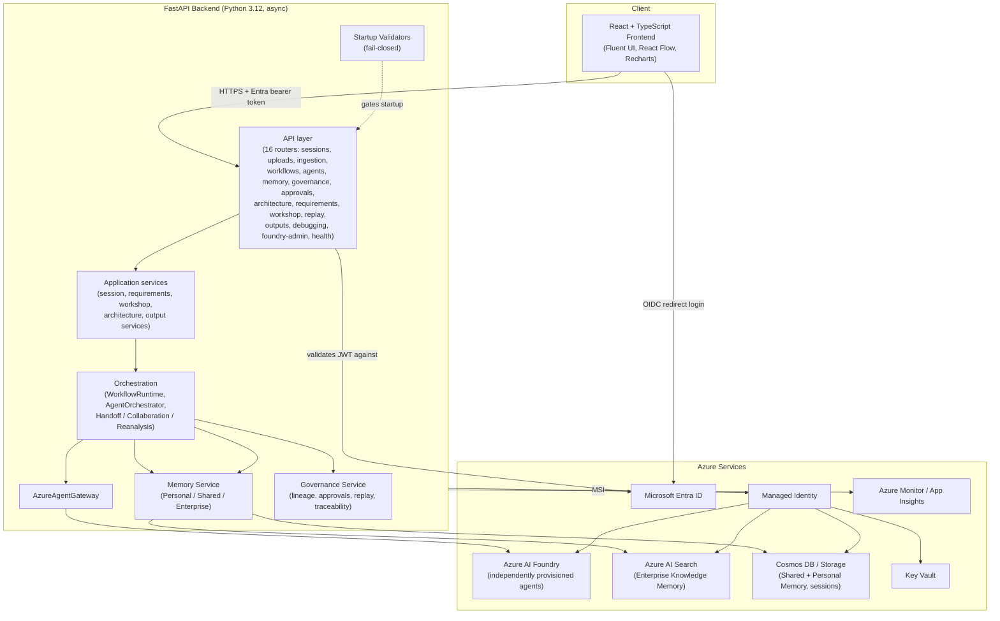

# Genie — Agentic Experience Center

Genie is an Azure-native Agentic AI solutioning platform. It ingests transcripts, recordings, documents, and customer context and transforms them into an interactive AI **Mission Control** experience — where requirement discovery, agent collaboration, architecture design, governance decisions, memory updates, approvals, and final outputs can all be observed **in real time**.

> Genie is **not** a report generator. Every artifact it produces is backed by a traceable chain of agent execution, governance events, and approved memory — never a static template.

---

## Table of contents

- [Architecture](#architecture)
- [Core concepts](#core-concepts)
- [Agents](#agents)
- [Workflows](#workflows)
- [Repository layout](#repository-layout)
- [Local development](#local-development)
- [Configuration reference](#configuration-reference)
- [Authentication](#authentication)
- [Deployment strategy](#deployment-strategy)
  - [Deploying into a brand-new Azure subscription](#deploying-into-a-brand-new-azure-subscription)
  - [Deploying application code (backend + frontend)](#deploying-application-code-backend--frontend)
  - [Provisioning Foundry agents](#provisioning-foundry-agents)
- [Testing](#testing)
- [Troubleshooting](#troubleshooting)
- [Known gaps / next phases](#known-gaps--next-phases)

---

## Architecture

Genie follows Clean Architecture with strict layering: API routes never contain business logic, business logic never talks to Azure AI Foundry directly, and only one narrow module is allowed to import the Foundry SDK.



### Layering rules (enforced by tests)

- Only `app/agents/foundry/project_service.py` (and, for deployment tooling, `app/deployment/provider_status_source.py`) may import `azure-ai-projects` / `azure-identity`. A standing test (`tests/unit/test_architecture_boundary.py`) greps the whole backend source tree to guarantee this.
- Every Genie business/debugging **agent is an independently deployed Azure AI Foundry agent resource** (created via the Foundry portal, CLI, or the provisioning scripts in this repo) — Genie never implements agent reasoning as ad hoc Python classes, and never calls `create_agent()` at request time.
- The frontend **never** calls Azure AI Foundry directly — a static scan test (`no_foundry_direct_access.test.tsx`) fails the build if any non-`httpClient.ts` file performs a raw `fetch()` call or imports a Foundry SDK / hostname.
- Production execution always goes through `AzureAgentGateway`. Local/mock agents, static demo data, and fallback execution are only permitted when `GENIE_PROVIDER_MODE=local` **and** `GENIE_ALLOW_LOCAL_AGENTS=true` — production mode fails closed instead of ever silently falling back.

### Three-tier memory architecture

| Tier | Purpose | Backend |
|---|---|---|
| **Personal Agent Memory** | Observations, work products, intermediate summaries — accessible only by the owning agent unless policy allows | In-memory (dev) / Cosmos DB (production) |
| **Shared Collaboration Memory** | Goals, constraints, assumptions, risks, findings, approved artifacts — every read/write emits a governance event | In-memory (dev) / Cosmos DB (production) |
| **Enterprise Knowledge Memory** | Industry patterns, reference architectures, reusable best practices — customer data is never promoted here without approval | Azure AI Search |

### Governance

Every agent execution, agent-to-agent handoff, memory read/write, tool invocation, policy check, and approval decision is recorded as a `GovernanceEvent`, giving full session replay and decision-lineage traceability. `GovernanceProvider` is a pluggable interface (`Agent365GovernanceProvider` marker for production, `LocalGovernanceTraceProvider` for local/dev only) — production startup fails closed if no real provider is injected.

**Triage Mode** (sidebar toggle, off by default) renders a full-height, right-docked panel that polls `GET /sessions/{id}/governance/events` and filters to `agent_execution` events. Because `WorkflowStepExecutor.execute_step()` records that event the instant an individual agent call resolves — not once a whole (possibly multi-step) workflow run/resume call returns — the panel reflects the orchestrator's real agent-call order and timing, including cases where several ungated steps execute back-to-back within one HTTP call. Each feed item shows a gamified XP/level readout plus a truncated preview of that agent's real output (`detail.output_preview`); there is no synthetic or simulated activity.

### Fail-closed startup

Before accepting any traffic, the backend runs 10 mandatory startup validators (`RuntimeVersion`, `Configuration`, `ProviderMode`, `ProductionSafety`, `AgentRegistry`, `WorkflowRegistry`, `PromptTemplate`, `MemoryPolicy`, `GovernanceProvider`, `NoHardcoding`), plus (in production mode only) Foundry-specific validators that verify every enabled agent's `foundry_agent_id` actually resolves in Azure AI Foundry and has no critical configuration drift. `/health/ready` only returns 200 once all validation has passed.

---

## Core concepts

- **Config-driven, never hardcoded.** Agent definitions, workflow definitions, prompt templates, endpoints, deployment names, subscription/tenant ids, customer data, secrets, and expected AI outputs are never hardcoded — they live under `config/agents`, `config/prompts`, `config/workflows`, `config/policies`, and environment variables.
- **Strongly typed everywhere.** Pydantic v2 models on the backend, TypeScript types mirroring every backend model on the frontend.
- **Async throughout** the backend service layer.
- **Dependency injection** — every service is constructed via a `create_X(...)` factory that takes its collaborators as explicit parameters, making every layer independently testable.

---

## Agents

Agents are **never** implemented as Python/TypeScript classes containing reasoning logic. Each agent is a real resource provisioned in Azure AI Foundry; Genie's `config/agents/*.yaml` registry only records *which* Foundry resource backs each logical agent id, its capabilities, memory access, and prompt template reference. `AzureAgentGateway` resolves the prompt, opens a thread against the existing Foundry agent, posts the message, and reads the reply — it never creates agents at runtime.

### Enabled agents (wired into real workflows)

| Agent id | Name | Role | Capabilities | Memory access | Prompt template |
|---|---|---|---|---|---|
| `requirements-analyst` | Requirements Analyst | requirement_discovery | transcript_analysis, requirement_extraction, risk_identification | personal, shared | `requirements-extraction-v1` |
| `architecture-designer` | Architecture Designer | architecture_design | architecture_generation, alternative_design_generation | shared, enterprise | `architecture-recommendation-v1` |
| `risk-assessor` | Risk Assessor | risk_analysis | risk_scoring, readiness_scoring | shared | `risk-assessment-v1` |
| `governance-reviewer` | Governance Reviewer | governance | policy_review, approval_recording | shared | `governance-review-v1` |
| `memory-curator` | Memory Curator | memory_management | memory_promotion_review | shared, enterprise | `memory-curation-review-v1` |
| `debugging-agent` | Debugging Agent | debugging | failure_diagnosis | shared | `failure-diagnosis-v1` |

### Supported agents catalog (provisioned in Foundry, now wired into real workflow steps)

Defined in `config/agents/foundry_agents_catalog.yaml` — all 22 are `enabled: true` and each has a real Foundry agent resource. They are wired into the workflows above so they actually execute during a real session (not just inert inventory entries).

**Business agents (14, wired into `solution-discovery-workflow`):** Discovery Agent, Requirements Agent, Industry Expert Agent, Data Architect Agent, Solution Architect Agent, Risk & Compliance Agent, Innovation Agent, UI Designer Agent, Roadmap Agent, Governance Agent, Executive Summary Agent, Cost Optimization Agent, Responsible AI Agent, Workshop Facilitator Agent.

**Debugging agents (8, wired into `debugging-workflow`):** Test Failure Analyst Agent, Backend Debugging Agent, Frontend Debugging Agent, Agent Orchestration Debugging Agent, Security Debugging Agent, Azure Deployment Debugging Agent, Governance Trace Debugging Agent, Memory Debugging Agent.

### Agent metadata fields

Every agent entry carries: `id`, `name`, `role`, `description`, `capabilities`, `allowed_tools`, `memory_access` (subset of `personal`/`shared`/`enterprise`), `foundry_agent_id` (the real provisioned Foundry resource id), `model_deployment_ref` (optional — informational only, defaults to `Settings.default_llm`), `owner` (accountable team, never a person), `governance_policy_id`, `prompt_template_ref`, and `enabled`.

### Default LLM

`Settings.default_llm` (env `GENIE_DEFAULT_LLM`) applies to any agent that doesn't declare its own `model_deployment_ref`. Currently `gpt-5.1` (GA, sold directly through Azure — no Marketplace subscription needed). Anthropic Claude models were evaluated but require an Azure Marketplace subscription with non-zero SKU quota, which is not available by default.

---

## Workflows

Workflows (`config/workflows/registry.yaml`) define ordered, dependency-graphed steps across agents; `WorkflowRuntime` computes execution "waves" from the `depends_on` graph and runs same-wave steps in parallel via `asyncio.gather`.

- **`solution-discovery-workflow`** — 18 steps spanning 18 agents (4 of the original 6 registry agents + all 14 business catalog agents) across 9 dependency waves: initial discovery (`discovery-agent`, `workshop-facilitator-agent`) → requirements capture (`requirements-analyst`, `requirements-agent`) → industry context + risk (`industry-expert-agent`, `risk-assessor`, `risk-compliance-agent`) → architecture design (`architecture-designer`, `data-architect-agent`) → end-to-end solution architecture (`solution-architect-agent`) → parallel enrichment (`innovation-agent`, `ui-designer-agent`, `cost-optimization-agent`, `responsible-ai-agent`, `roadmap-agent`) → governance review (`governance-reviewer`, gated by an `architecture-approval` checkpoint) → cross-cutting governance coordination (`governance-agent`) → executive summary (`executive-summary-agent`, gated by a `final-output-approval` checkpoint).
- **`debugging-workflow`** — `debugging-agent` plus all 8 specialist debugging catalog agents (test-failure, backend, frontend, orchestration, security, Azure deployment, governance-trace, memory) run in parallel on `FailureDetected`, each diagnosing from its own domain angle, executed through the exact same `AzureAgentGateway` path as every other workflow (never a bespoke/local diagnostic path).

### Agentic-workflow qualification check

The Requirement Discovery Map doesn't just list extracted requirements — it also surfaces whether they actually **qualify for a multi-agent agentic workflow** in the first place, versus being better served by a simpler, deterministic solution. This is deliberately **not** a Python business rule: the judgment is made by the existing `requirements-analyst` agent as part of its normal `analyze-requirements` step. Its prompt (`requirements-extraction-v1`) instructs it to end its output with two machine-parseable lines:

```
AGENTIC_WORKFLOW_QUALIFICATION: QUALIFIED | NOT_QUALIFIED
QUALIFICATION_REASON: <one or two plain-language sentences>
```

The backend (`RequirementsService.get_qualification`, `GET /sessions/{id}/requirements/{workflow_run_id}/qualification`) only *extracts* this verdict via a regex parser — it never invents or overrides the agent's own reasoning. If the requirements don't qualify, `RequirementDiscoveryPage` shows a graceful Fluent `MessageBar` banner explaining why, using the agent's own stated reason. The step id this check watches is configurable via `GENIE_REQUIREMENTS_QUALIFICATION_STEP_ID` (defaults to `analyze-requirements`), never hardcoded.

---

## Repository layout

```
backend/           FastAPI application (Python 3.12+)
  app/
    agents/        AgentRegistry, AzureAgentGateway, Foundry provider/sync/lifecycle
    api/            16 routers (thin — auth + delegation only)
    architecture/   Architecture Studio services
    config/         Settings (pydantic-settings, env prefix GENIE_)
    debugging/      Debugging workflow trigger service
    deployment/     Pre-infra deployment-readiness tooling (resource provider checks)
    governance/      Governance, lineage, decision graph, approval, replay services
    memory/         Personal / Shared / Enterprise memory services
    models/         Shared Pydantic models
    orchestration/  WorkflowRuntime, AgentOrchestrator, handoff/collaboration/reanalysis
    outputs/        Final Output Center services
    prompts/        PromptRegistry
    repositories/   Protocol + in-memory repository implementations
    security/       Entra ID token validation, auth dependencies
    services/       Session / Requirements / Workshop / Architecture / Output /
                    Foundry agent provisioning & lifecycle services
    utils/          Shared YAML loader
    validation/     10 fail-closed startup validators + runner
    workflows/      WorkflowRegistry
  tests/            Unit + integration tests (pytest)

frontend/           React + TypeScript Mission Control UI (Vite)
  src/
    app/            App bootstrap (MSAL init, router)
    components/     Shared UI components
    features/       9 feature pages (landing, upload, requirement-map,
                     architecture-studio, workshop-center, governance-center,
                     replay-center, final-output-center, triage) - plus two
                     hub wrappers in layouts/ (RequirementsHubPage,
                     OutputsHubPage) that group related pages under one
                     linear nav step via sub-tabs
    hooks/          Data-fetching hooks per feature
    layouts/        AppShell (nav + auth status)
    services/        httpClient, authProvider (MSAL), one API client per backend router
    state/           SessionContext, trace id registry
    types/           TypeScript types mirroring backend Pydantic models
  tests/            Vitest component + static-scan tests

config/             Externalized configuration (never hardcoded in source)
  agents/           Agent registry + Foundry Supported Agents catalog
  prompts/          Prompt templates
  workflows/        Workflow registry
  policies/         memory_policy.yaml, governance_policy.yaml, approval_policy.yaml
  deployment/       resource_providers.yaml (Azure RP allow-list for deployment tooling)

infra/              Bicep infrastructure-as-code
  main.bicep                        Subscription-scoped entry point (creates its own RG)
  modules/foundational-resources.bicep   RG-scope aggregator
  modules/*.bicep                   One module per resource type

scripts/            Operator CLI scripts (deployment readiness, RBAC role generation,
                    Foundry agent provisioning/sync/validation/inventory export)

docs/GENIE_BUILD_SPEC.md   Full build specification
e2e/                       Playwright end-to-end tests (scaffolding)
.github/copilot-instructions.md   Architecture/coding rules enforced across the repo
```

---

## Local development

### Prerequisites

- Python 3.12+
- Node.js 20+ (LTS)
- An Azure subscription with an Azure AI Foundry project (for anything beyond `LocalAgentGateway` dev mode)

### Backend

```powershell
cd backend
python -m venv .venv
.\.venv\Scripts\python.exe -m pip install -e ".[dev]"
.\.venv\Scripts\python.exe -m pytest -v          # run tests
.\.venv\Scripts\python.exe -m ruff check app tests  # lint
.\.venv\Scripts\python.exe -m uvicorn app.main:create_app --factory --reload
```

> **Windows on ARM64 note:** do not install `uvicorn[standard]` — `httptools` has no `win_arm64` wheel. Use plain `uvicorn`. If `azure-identity`'s dependency resolver pulls a `cryptography` version with no `win_arm64` wheel, run `pip install cryptography --only-binary=:all:` first.

Copy `.env.example` (if present) or set the environment variables listed in [Configuration reference](#configuration-reference). With `GENIE_PROVIDER_MODE=local` and `GENIE_ALLOW_LOCAL_AGENTS=true`, the backend runs entirely against in-memory stores and `LocalAgentGateway` (no Azure required).

### Frontend

```powershell
cd frontend
npm install
npm run dev          # local dev server
npm run build         # tsc -b && vite build -> dist/
npm run test          # vitest
npm run typecheck
npm run lint
```

Set `frontend/.env.development` (or `.env.local`) with at least `VITE_GENIE_API_BASE_URL` pointing at your local backend. Leave the `VITE_ENTRA_*` variables unset locally to use the manual-token fallback in `authProvider.ts` instead of a full Entra redirect login (useful for backend-only development).

---

## Configuration reference

All backend configuration is via environment variables prefixed `GENIE_` (pydantic-settings, see `backend/app/config/settings.py`). Nothing here should ever be hardcoded into source — every value below is meant to be supplied per-deployment.

| Variable | Default | Purpose |
|---|---|---|
| `GENIE_SERVICE_NAME` | `genie-backend` | Service identity for logs/telemetry |
| `GENIE_ENVIRONMENT` | `development` | `development` \| `test` \| `production` |
| `GENIE_LOG_LEVEL` | `INFO` | Log verbosity |
| `GENIE_PROVIDER_MODE` | `local` | `local` \| `production` — production forbids all local/mock fallback |
| `GENIE_GOVERNANCE_PROVIDER` | `local` | `local` \| `agent365` — production requires a real provider |
| `GENIE_ALLOW_MOCK_AGENTS` | `true` | Must be `false` in production |
| `GENIE_ALLOW_LOCAL_AGENTS` | `true` | Must be `false` in production |
| `GENIE_USE_SYNTHETIC_DATA` | `true` | Must be `false` in production |
| `GENIE_AZURE_FOUNDRY_ENDPOINT` | *(none)* | `https://<account>.services.ai.azure.com/api/projects/<project>` |
| `GENIE_AZURE_FOUNDRY_PROJECT_NAME` | *(none)* | Foundry project name |
| `GENIE_MEMORY_STORE_BACKEND` | `in_memory` | `in_memory` \| `cosmos_db` — production requires `cosmos_db` |
| `GENIE_MEMORY_STORE_ENDPOINT` | *(none)* | Required in production when backend is `cosmos_db` |
| `GENIE_LINEAGE_STORE_BACKEND` | `in_memory` | Same pattern as memory store, for governance/lineage |
| `GENIE_LINEAGE_STORE_ENDPOINT` | *(none)* | Required in production |
| `GENIE_DEFAULT_LLM` | `gpt-5.1` | Default model deployment name for agents that omit `model_deployment_ref` |
| `GENIE_DEBUGGING_WORKFLOW_ID` | `debugging-workflow` | Workflow id run on `FailureDetected` |
| `GENIE_REQUIREMENTS_QUALIFICATION_STEP_ID` | `analyze-requirements` | Workflow step id whose output is checked for an agentic-workflow qualification verdict |
| `GENIE_KEY_VAULT_URI` | *(none)* | Required in production |
| `GENIE_ENTRA_TENANT_ID` | *(none)* | Microsoft Entra ID tenant for token validation + login |
| `GENIE_ENTRA_CLIENT_ID` | *(none)* | App registration (API) client id |
| `GENIE_CORS_ALLOWED_ORIGINS` | *(empty)* | Comma-separated browser origins allowed to call the API (e.g. the deployed frontend's URL) |
| `GENIE_CONFIG_ROOT` | `config` | Root directory for agents/prompts/workflows/policies |
| `AZURE_CLIENT_ID` | *(none)* | **Required** when running under a Container App / VM with a **user-assigned** managed identity — tells `DefaultAzureCredential` which identity to use |

Frontend (`frontend/.env.production` / `.env.development`, Vite `VITE_` prefix):

| Variable | Purpose |
|---|---|
| `VITE_GENIE_API_BASE_URL` | Base URL of the deployed/local Genie backend |
| `VITE_ENTRA_CLIENT_ID` | SPA/API app registration client id (leave unset to fall back to manual token entry) |
| `VITE_ENTRA_TENANT_ID` | Microsoft Entra ID tenant id |
| `VITE_ENTRA_API_SCOPE` | `api://<client-id>/access_as_user` scope requested at login |

---

## Authentication

Genie uses **Microsoft Entra ID** end to end:

- **Backend**: `EntraIdTokenValidator` validates bearer tokens via PyJWT against the tenant's JWKS discovery document. A `LocalDevTokenValidator` fallback only activates when `GENIE_ALLOW_LOCAL_AGENTS=true` (never in production).
- **Frontend**: MSAL (`@azure/msal-browser`) drives an automatic redirect sign-in flow — on load, the app silently acquires a token if a session exists, or redirects to the Microsoft sign-in page if not, then redirects back with no manual steps. Silent token refresh runs on a 5-minute timer via `acquireTokenSilent`, falling back to `acquireTokenRedirect` on `InteractionRequiredAuthError`. If the three `VITE_ENTRA_*` variables aren't set, the app transparently falls back to the pre-existing manual token-entry seam (`setAccessToken()`), so local/backend-only development never requires an Entra app registration.
- **App registration**: a single Azure AD application acts as both the SPA client and the API it calls (self-referencing `access_as_user` OAuth2 permission scope). Grant admin consent for this scope in **Entra admin center → App registrations → API permissions → Grant admin consent** so users aren't prompted individually; if consent can't be granted centrally, users will see a one-time interactive consent prompt on first sign-in instead.

---

## Deployment strategy

Genie ships as: (1) Bicep infrastructure-as-code that provisions every foundational Azure resource into a brand-new subscription, (2) a containerized FastAPI backend deployed to Azure Container Apps, and (3) a static React frontend deployed to Azure Static Web Apps. Deployment is split into readiness validation → infrastructure provisioning → agent provisioning → application deployment, matching the repo's fail-closed philosophy: nothing proceeds until the previous step is verified.

### Deploying into a brand-new Azure subscription

**Prerequisites**

- Azure CLI (`az`) installed and logged in (`az login`) against the target subscription and tenant.
- Contributor-equivalent (or the custom role generated below) rights on the target subscription.
- PowerShell (scripts are `.ps1`; can be run via `pwsh` on non-Windows too).

**1. Create a least-privilege deployment identity (optional but recommended)**

```powershell
python scripts/generate_deployment_role_definition.py   # renders a custom RBAC role from config/deployment/resource_providers.yaml
./scripts/create_deployment_identity.ps1                # creates/assigns the "Genie Infrastructure Deployer" role
```

This role only grants `<namespace>/*` actions for the 12 resource-provider namespaces Genie actually needs (never `Owner`/`Contributor`). If your tenant blocks service-principal secret/certificate creation (common in managed/enterprise tenants), the script falls back to assigning the role directly to your signed-in user account.

**2. Validate deployment readiness**

```powershell
python scripts/validate_deployment_readiness.py
```

Confirms every required Azure resource-provider namespace (`Microsoft.Resources`, `Authorization`, `ManagedIdentity`, `KeyVault`, `Storage`, `CognitiveServices`, `Search`, `DocumentDB`, `App`, `Web`, `OperationalInsights`, `Insights`, plus `Marketplace`/`MarketplaceOrdering`/`SaaS` if you plan to deploy partner models) is `Registered`. Registers via:

```powershell
az provider register --namespace <namespace>
```

Re-run the validator until every provider shows `Registered` (registration is asynchronous and can take several minutes) before proceeding.

**3. Provision infrastructure**

```powershell
./scripts/deploy_infra.ps1 -EnvironmentName dev -Location eastus2
# Optional: -AiSearchLocation eastus   (if AI Search lacks capacity in the primary region)
```

This gates on step 2 passing, then runs:

```powershell
az deployment sub create `
  --location <location> `
  --template-file infra/main.bicep `
  --parameters infra/main.parameters.json environmentName=<env> location=<location>
```

`main.bicep` is **subscription-scoped** and assumes the target subscription is empty — it creates its own resource group (`<resourcePrefix>-<environmentName>-rg`, default prefix `genie`) and every foundational resource:

| Module | Resource |
|---|---|
| `managed-identity.bicep` | User-assigned managed identity (shared by every resource below via least-privilege RBAC) |
| `key-vault.bicep` | Azure Key Vault |
| `storage-account.bicep` | Azure Storage Account |
| `ai-search.bicep` | Azure AI Search (Enterprise Knowledge Memory) |
| `cosmos-db.bicep` | Cosmos DB (Shared/Personal Memory, sessions) |
| `ai-foundry.bicep` | Azure AI Foundry account + project |
| `container-apps-environment.bicep` | Container Apps environment (hosts the backend) |
| `static-web-app.bicep` | Azure Static Web App (hosts the frontend) |
| `log-analytics.bicep` + `app-insights.bicep` | Observability |

Every resource is granted only the specific RBAC role it needs on the shared managed identity (Key Vault Secrets User, Storage Blob Data Contributor, Search Index Data Contributor, Cognitive Services User, Cosmos DB Built-in Data Contributor) — never a broad Owner/Contributor grant.

Capture the outputs (`aiFoundryEndpoint`, `aiSearchEndpoint`, `keyVaultUri`, `storageAccountName`, `cosmosDbEndpoint`, `managedIdentityPrincipalId`, `containerAppsEnvironmentId`, `staticWebAppDefaultHostname`, `applicationInsightsConnectionString`) via:

```powershell
az deployment sub show --name <deployment-name> --query properties.outputs
```

**4. Deploy an LLM model**

Deploy at least one model to the AI Foundry account (Cognitive Services deployment). For models sold directly by Azure (e.g. `gpt-5.1`):

```powershell
az cognitiveservices account deployment create `
  --name <foundry-account-name> --resource-group <rg> `
  --deployment-name <deployment-name> --model-name <model> --model-version <version> `
  --model-format OpenAI --sku-name GlobalStandard --sku-capacity 10
```

For Azure Marketplace / partner models (e.g. Anthropic Claude), the CLI has no flag for `ModelProviderData` — use a direct REST call instead:

```powershell
az rest --method put `
  --uri "https://management.azure.com/subscriptions/<sub>/resourceGroups/<rg>/providers/Microsoft.CognitiveServices/accounts/<account>/deployments/<name>?api-version=2026-05-15-preview" `
  --body '{"properties":{"model":{"format":"...","name":"...","version":"..."},"modelProviderData":{"industry":"Technology","organizationName":"<org>","countryCode":"US"}},"sku":{"name":"GlobalStandard","capacity":1}}'
```

> Requires the target Marketplace SKU to actually have non-zero quota on the subscription — request a quota increase first if `InsufficientQuota` is returned.

Set `Settings.DEFAULT_LLM` / `GENIE_DEFAULT_LLM` (and any per-agent `model_deployment_ref` overrides in `config/agents/registry.yaml`) to match the deployment name you chose.

### Provisioning Foundry agents

Genie agents are **real Foundry agent resources**, provisioned once per environment — never created ad hoc by the running application.

```powershell
# Requires the caller to hold "Cognitive Services User" (or equivalent) at the
# Foundry PROJECT scope (not just the account scope) for data-plane writes.
python scripts/provision_foundry_agents.py
```

Uses the `azure-ai-projects` SDK (`AIProjectClient(endpoint=..., credential=DefaultAzureCredential())`) to create one Foundry agent per enabled entry in `config/agents/*.yaml` and prints each resulting `foundry_agent_id` for you to paste back into the registry YAML (the script deliberately never writes back to source control itself).

Verify every agent resolves correctly:

```powershell
python scripts/validate_foundry_agents.py     # runs the fail-closed Foundry validators directly
python scripts/sync_foundry_agents.py         # confirms each enabled agent's foundry_agent_id exists (status: synchronized)
python scripts/export_foundry_inventory.py    # dumps the config-derived inventory as JSON
```

All three require `GENIE_AZURE_FOUNDRY_ENDPOINT` / `GENIE_AZURE_FOUNDRY_PROJECT_NAME` to be set and must be run from the repository root (so the relative `config/` path resolves correctly).

### Deploying application code (backend + frontend)

**Backend (Azure Container Apps)**

1. Build and push the container image to an Azure Container Registry:

   ```powershell
   az acr build --registry <acr-name> --image genie-backend:latest --file backend/Dockerfile <source>
   ```

   `<source>` can be a local directory (`.`) or a git URL (`https://github.com/<org>/<repo>.git#<branch>`, optionally with an embedded token for a private repo: `https://<token>@github.com/...`) — use whichever works reliably in your build environment.

2. Create (first time) or update (subsequent deploys) the Container App:

   ```powershell
   az containerapp create `
     --name genie-backend --resource-group <rg> --environment <container-apps-environment-id> `
     --image <acr-name>.azurecr.io/genie-backend:latest --target-port 8000 --ingress external `
     --user-assigned <managed-identity-resource-id> `
     --registry-server <acr-name>.azurecr.io --registry-identity <managed-identity-resource-id> `
     --env-vars <see Configuration reference above>
   ```

   ```powershell
   az containerapp update --name genie-backend --resource-group <rg> `
     --image <acr-name>.azurecr.io/genie-backend:latest `
     --set-env-vars GENIE_CORS_ALLOWED_ORIGINS=<frontend-url> ...
   ```

   > `az containerapp update --set-env-vars` only adds/overwrites the named variables — it does not clear ones you don't mention. If you're using a **user-assigned** managed identity, you must also set `AZURE_CLIENT_ID=<identity-client-id>` or `DefaultAzureCredential` cannot resolve which identity to use and the container will crash-loop.

3. Verify:

   ```powershell
   curl https://<container-app-fqdn>/health/live
   curl https://<container-app-fqdn>/health/ready
   ```

**Frontend (Azure Static Web Apps)**

1. Set `frontend/.env.production` with `VITE_GENIE_API_BASE_URL` (the Container App FQDN from above) and, for automatic Entra login, `VITE_ENTRA_CLIENT_ID` / `VITE_ENTRA_TENANT_ID` / `VITE_ENTRA_API_SCOPE`.
2. Build:

   ```powershell
   cd frontend
   npm ci
   npm run build      # -> dist/
   ```

3. Deploy:

   ```powershell
   $token = az staticwebapp secrets list --name <swa-name> --query properties.apiKey -o tsv
   npx @azure/static-web-apps-cli deploy dist --deployment-token $token --env production
   ```

4. Update the app registration's SPA redirect URIs to include the deployed Static Web App URL (and `http://localhost:5173` for local dev), and grant admin consent for the API's self-referencing scope (see [Authentication](#authentication)).

---

## Testing

| Layer | Command | Notes |
|---|---|---|
| Backend unit + integration | `pytest` (from `backend/`) | Includes production-safety and fail-closed startup tests |
| Backend lint | `ruff check app tests` | |
| Frontend component tests | `npm run test` (Vitest) | Includes static-scan tests guarding against hardcoded demo data and direct Foundry access |
| Frontend type check | `npm run typecheck` | |
| Frontend lint | `npm run lint` | `--max-warnings=0` |
| End-to-end | Playwright (`e2e/`) | Scaffolding present; expand per feature as needed |

---

## Troubleshooting

- **`az acr build` hangs indefinitely with a local (`.`) build context** — a known issue on some Windows ARM64 machines (tar-packing step never completes). Workaround: build from a pushed git remote URL instead (`az acr build ... https://github.com/<org>/<repo>.git#<branch>`); for a private repository, embed a token in the URL rather than making the repository public.
- **Container App crash-loops with `ManagedIdentityCredential: ... Unable to load the proper Managed Identity`** — set `AZURE_CLIENT_ID` to the user-assigned identity's **client id** (not principal id).
- **`PermissionDenied` calling `create_agent`** — the "Cognitive Services User" role must be assigned at the Foundry **project** scope, not just the account scope; RBAC propagation can take a few minutes.
- **`InsufficientQuota` deploying a Marketplace model** — the subscription has a default quota of 0 for most partner model SKUs; request a quota increase before retrying.
- **az/gh/npm not found in a fresh terminal** — these CLIs are commonly installed but not yet appended to `PATH` in a brand-new shell session; re-add their install directories to `$env:Path` for that session.

---

## Known gaps / next phases

- No CI pipeline (`.github/workflows/`) exists yet.
- `memory-curator` is provisioned and enabled but intentionally not a workflow step (it's invoked separately as part of the shared→enterprise memory promotion flow, not the discovery/debugging pipelines).
- End-to-end Playwright coverage (`e2e/`) is scaffolded but not yet fully built out.
- Admin consent for the Entra API permission may require a tenant administrator in some tenants — see [Authentication](#authentication).
- Shared Collaboration Memory currently has no write call sites anywhere in the backend — nothing ever calls `memory_service.shared.write`. The Requirement Discovery Map's main requirements list (which reads from Shared Memory) is therefore likely empty in real usage today; the agentic-workflow qualification check above was deliberately built to read `WorkflowRunResult.step_results` directly instead, so it works independently of this gap.
