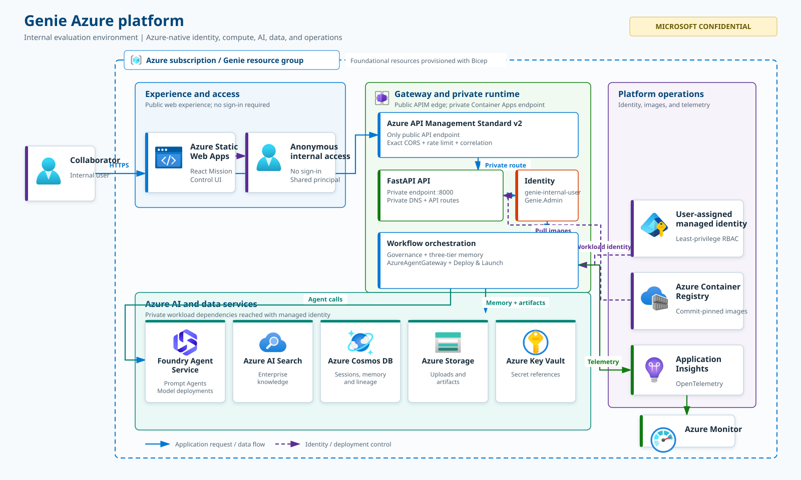
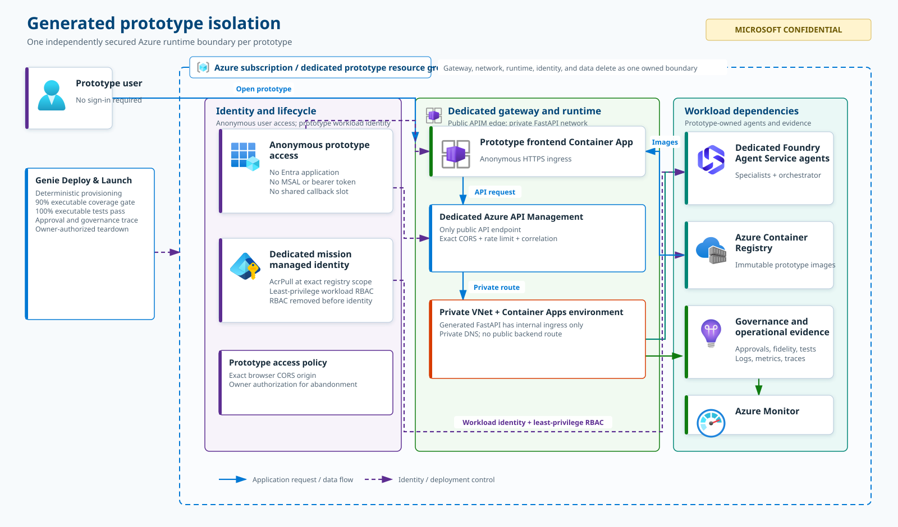

# Genie — Agentic Experience Center

Genie is an Azure-native Agentic AI solutioning platform. It ingests transcripts, recordings, documents, and customer context and transforms them into an interactive AI **Mission Control** experience — where requirement discovery, agent collaboration, architecture design, governance decisions, memory updates, approvals, and final outputs can all be observed **in real time**.

## Purpose and use boundary

> [!IMPORTANT]
> **MICROSOFT CONFIDENTIAL — INTERNAL COLLABORATION ONLY**
>
> Genie is an **art-of-the-possible prototype** for rapidly validating an agentic solution vision, architecture, interaction model, and requirement coverage. It is not a generally available Microsoft product, production reference implementation, or support commitment. **Do not deploy Genie, or a Genie-generated prototype, directly to production.** Before any production use, complete an independent architecture review, threat model, privacy and Responsible AI review, accessibility review, data-governance assessment, operational-readiness review, performance and resilience testing, and approval through the owning organization's standard engineering and release processes.

Genie is **not** a report generator. Every artifact it produces is backed by a traceable chain of agent execution, governance events, and approved memory rather than a static template.

---

## Table of contents

- [Purpose and use boundary](#purpose-and-use-boundary)
- [Architecture](#architecture)
  - [Genie Azure platform](#genie-azure-platform)
  - [Generated prototype isolation](#generated-prototype-isolation)
- [Core concepts](#core-concepts)
- [Agents](#agents)
- [Workflows](#workflows)
- [How a mission gets built](#how-a-mission-gets-built)
- [Deploy & Launch pipeline](#deploy--launch-pipeline)
- [Repository layout](#repository-layout)
- [Local development](#local-development)
- [Configuration reference](#configuration-reference)
- [Authentication](#authentication)
- [Deployment strategy](#deployment-strategy)
  - [Deploying into a brand-new Azure subscription](#deploying-into-a-brand-new-azure-subscription)
  - [Provisioning Foundry agents](#provisioning-foundry-agents)
  - [Deploying application code (backend + frontend)](#deploying-application-code-backend--frontend)
  - [Continuous deployment (GitHub Actions)](#continuous-deployment-github-actions)
- [Testing](#testing)
- [Troubleshooting](#troubleshooting)
- [Deploy log](#deploy-log)
- [Known gaps / next phases](#known-gaps--next-phases)

---

## Architecture

Genie follows Clean Architecture in application code and uses Azure-native identity, hosting, data, AI, and observability services. The diagrams below separate the long-lived **Genie control plane** from the isolated Azure resources created for each generated prototype.

### Genie Azure platform

[](docs/architecture/genie-azure-platform.svg)

*Figure 1. Genie evaluation platform. Select the diagram to open the scalable SVG. The service symbols come from the [official Microsoft Azure Architecture Icons](https://learn.microsoft.com/azure/architecture/icons/).*

| Azure concern | Implementation |
|---|---|
| **Web experience** | React/TypeScript on Azure Static Web Apps; no sign-in or bearer token is required |
| **API access boundary** | Public Standard v2 API Management is the only Internet-facing API endpoint; outbound VNet integration, private DNS, and a Container Apps environment private endpoint reach FastAPI on `8000` while environment public access remains disabled |
| **Agent execution** | `AzureAgentGateway` is the only production execution path to independently provisioned Azure AI Foundry Prompt Agents |
| **Evidence understanding** | Azure Content Understanding `prebuilt-documentSearch` converts supported documents and images into grounded Markdown through managed identity before Discovery agents run |
| **Identity and secrets** | User-assigned managed identity and least-privilege Azure RBAC; secrets belong in Key Vault and are never embedded in images or source |
| **Memory and artifacts** | Cosmos DB for durable session/memory/lineage state, Azure AI Search for enterprise knowledge, and Azure Storage for uploads and generated artifacts |
| **Images and hosting** | Commit-pinned FastAPI images in Azure Container Registry, deployed to Azure Container Apps |
| **Observability** | Application Insights and Azure Monitor receive structured logs, traces, metrics, correlation IDs, and governance telemetry |
| **Infrastructure** | Subscription-scoped Bicep creates the resource group, foundational Azure resources, and dedicated APIM subnet; GitHub Actions deploys the gateway/private endpoint and application revisions through Azure OIDC |

### Generated prototype isolation

Deploy & Launch creates a separate runtime boundary for every newly generated prototype. Generated prototypes do **not** use Microsoft Entra ID or inherit Genie's managed identity, Container Apps environment, resource group, network, or data ownership. Genie and generated prototypes require no sign-in.

[](docs/architecture/generated-prototype-isolation.svg)

*Figure 2. Per-prototype security and runtime isolation. Select the diagram to open the scalable SVG.*

Each prototype receives a tagged `genie-proto-<mission-slug>` resource group, dedicated APIM service, VNet and private DNS, an internal backend Container Apps environment, a public frontend Container Apps environment, exact CORS origin, backend/frontend Container Apps, mission managed identity, RBAC assignments, and generated Foundry agents. The backend enables ingress at the app boundary so VNet-integrated APIM can reach it, while the internal environment keeps that ingress private and unreachable from the internet. The separate public environment makes only the generated static frontend internet-reachable and remains disposable with the prototype resource group. The generated frontend and APIM endpoint are anonymous; APIM enforces exact-origin browser CORS, per-client rate limiting, and correlation IDs before forwarding over the private network. CORS is not authentication, so non-browser clients that know the APIM URL can call it. The durable Cosmos inventory records the shared `genie-internal-user` owner, mission metadata, URLs, resource group, TTL, and cleanup state. The fixed internal principal has `Genie.Admin`, so all callers share inventory and cleanup authority.

### Layering rules (enforced by tests)

- Azure SDK imports are confined to an explicit allow-list of Foundry, deployment, transcription, and generated-prototype infrastructure adapters. A standing test (`tests/unit/test_architecture_boundary.py`) scans the backend source tree and fails if an application/domain module crosses that boundary.
- Every Genie business/debugging **agent is an independently deployed Azure AI Foundry agent resource** (created via the Foundry portal, CLI, or the provisioning scripts in this repo) — Genie never implements agent reasoning as ad hoc Python classes, and never calls `create_agent()` at request time.
- The frontend **never** calls Azure AI Foundry directly — a static scan test (`no_foundry_direct_access.test.tsx`) fails the build if any non-`httpClient.ts` file performs a raw `fetch()` call or imports a Foundry SDK / hostname.
- Execution goes through `AzureAgentGateway` whenever Azure AI Foundry is configured. Local/mock agents, static demo data, and fallback execution are only permitted when `GENIE_ALLOW_LOCAL_AGENTS=true` (and no Foundry endpoint is configured) — otherwise the gateway fails closed instead of ever silently falling back.

### Three-tier memory architecture

| Tier | Purpose | Backend |
|---|---|---|
| **Personal Agent Memory** | Observations, work products, intermediate summaries — accessible only by the owning agent unless policy allows | In-memory (dev) / Cosmos DB (production) |
| **Shared Collaboration Memory** | Goals, constraints, assumptions, risks, findings, approved artifacts — every read/write emits a governance event | In-memory (dev) / Cosmos DB (production) |
| **Enterprise Knowledge Memory** | Industry patterns, reference architectures, reusable best practices — customer data is never promoted here without approval | Azure AI Search |

### Governance

Every agent execution, agent-to-agent handoff, memory read/write, tool invocation, policy check, and approval decision is recorded as a `GovernanceEvent`, giving full session replay and decision-lineage traceability. `GovernanceProvider` is a pluggable interface (`Agent365GovernanceProvider` marker for production, `LocalGovernanceTraceProvider` for local/dev only) — production startup fails closed if no real provider is injected.

**Triage Mode** (sidebar toggle, off by default) renders a full-height, right-docked panel that polls `GET /sessions/{id}/governance/events` and filters to `agent_execution` events. Because `WorkflowStepExecutor.execute_step()` records that event the instant an individual agent call resolves — not once a whole (possibly multi-step) workflow run/resume call returns — the panel reflects the orchestrator's real agent-call order and timing, including cases where several ungated steps execute back-to-back within one HTTP call. Each feed item shows a gamified XP/level readout plus a truncated preview of that agent's real output (`detail.output_preview`); there is no synthetic or simulated activity.

### Fail-closed startup

Before accepting any traffic, the backend runs 10 mandatory startup validators (`RuntimeVersion`, `Configuration`, `ProviderMode`, `ProductionSafety`, `AgentRegistry`, `WorkflowRegistry`, `PromptTemplate`, `MemoryPolicy`, `GovernanceProvider`, `NoHardcoding`), plus (in production mode only) Foundry-specific validators that verify every enabled agent's `foundry_agent_id` actually resolves in Azure AI Foundry and has no critical configuration drift. `/health/ready` only returns 200 once all validation has passed.

---

## Core concepts

- **Config-driven, never hardcoded.** Agent definitions, workflow definitions, prompt templates, endpoints, deployment names, subscription/tenant ids, customer data, secrets, and expected AI outputs are never hardcoded — they live under `config/agents`, `config/prompts`, `config/workflows`, `config/policies`, and environment variables.
- **Strongly typed everywhere.** Pydantic v2 models on the backend, TypeScript types mirroring every backend model on the frontend.
- **Async throughout** the backend service layer.
- **Dependency injection** — every service is constructed via a `create_X(...)` factory that takes its collaborators as explicit parameters, making every layer independently testable.

---

## Agents

Agents are **never** implemented as Python/TypeScript classes containing reasoning logic. Each agent is a real resource provisioned in Azure AI Foundry; Genie's `config/agents/registry.yaml` registry only records *which* Foundry resource backs each logical agent id, its capabilities, memory access, and prompt template reference. `AzureAgentGateway` resolves the prompt, opens a thread against the existing Foundry agent, posts the message, and reads the reply — it never creates agents at runtime.

### The real agent lineup

Genie's mission pipeline is deliberately lean — seven real Foundry agents, no inert "catalog" of unused agents:

| Agent id | Name | Role | Prompt template | Notes |
|---|---|---|---|---|
| `genie-orchestrator` | Genie Orchestrator | mission_orchestration | `orchestrator-mission-v1` | The **only** agent every workflow step actually addresses directly — see [delegation pattern](#the-orchestrator-delegation-pattern) below |
| `requirements-analyst` | Requirements Analyst | requirement_discovery | `requirements-extraction-v1` | Extracts goals/requirements/risks and rules on agentic-workflow qualification |
| `architecture-designer` | Architecture Designer | architecture_design | `architecture-recommendation-v1` | Designs the multi-agent workflow and shapes an [Impeccable](https://impeccable.style/)-style, domain-specific surface mode and visual direction for the single-page UI |
| `build-agent` | Build Agent | solution_build | `build-generation-v1` / `build-generation-component-v1` / `build-component-regeneration-v1` | Generates the real UI + specialist agent + orchestrator code one component at a time; every UI generation/regeneration path applies the Impeccable design contract |
| `security-assessment-agent` | Security Assessment Agent | security_assessment | `security-assessment-v1` | Independent OWASP Top 10 review of the generated build; reports `SECURITY_GATE: PASS/FAIL` |
| `test-generation-agent` | Test Generation Agent | test_generation | `test-generation-v1` | Independent test-coverage review of the generated build; reports `TEST_COVERAGE_GATE: PASS/FAIL` |
| `debugging-agent` | Debugging Agent | debugging | `failure-diagnosis-v1` | Diagnoses a detected workflow/agent execution failure |

### The orchestrator delegation pattern

Every `solution-discovery-workflow` step invokes `genie-orchestrator`, never the specialist directly. `genie-orchestrator` calls exactly one of its own registered Foundry function-calling tools (`call_requirements_analyst`, `call_architecture_designer`, `call_build_agent`, `call_security_assessment_agent`, `call_test_generation_agent` — implemented in `app/agents/tools/orchestration_tools.py`) to execute that phase's real specialist through the exact same `AzureAgentGateway` path as any other agent call, then returns that specialist's output **verbatim** as the step's own result. This exists because the pinned `azure-ai-projects` SDK version has no native "Connected Agents" mechanism for Prompt Agents — `connected_agent_ids` in the registry is realized via genuine per-phase function tools instead, not a Foundry-native feature. Each agent's own registry entry also declares `connected_agent_ids` purely for inventory/documentation, mirroring what `genie-orchestrator` is actually wired to call.

### Agent metadata fields

Every agent entry carries: `id`, `name`, `role`, `description`, `capabilities`, `allowed_tools`, `memory_access` (subset of `personal`/`shared`/`enterprise`), `foundry_agent_id` (the real provisioned Foundry resource id), `model_deployment_ref` (optional — informational only, defaults to `Settings.default_llm`), `owner` (accountable team, never a person), `governance_policy_id`, `prompt_template_ref`, `connected_agent_ids` (documentation only — see above), and `enabled`.

### Default LLM

`Settings.default_llm` (env `GENIE_DEFAULT_LLM`) applies to any agent that doesn't declare its own `model_deployment_ref`. Currently `gpt-5-mini` by default (`architecture-designer` overrides to `gpt-5-1`, demonstrating per-agent LLM configurability). Anthropic Claude models were evaluated but require an Azure Marketplace subscription with non-zero SKU quota, which is not available by default.

---

## Workflows

Workflows (`config/workflows/registry.yaml`) define ordered, dependency-graphed steps; `WorkflowRuntime` computes execution "waves" from the `depends_on` graph and runs same-wave steps in parallel via `asyncio.gather`. Genie's own Mission Control flow is deliberately just human-paced stages — each step has `requires_human_proceed: true`, so a run simply stops at `waiting_for_proceed` until a human explicitly resumes it; editing an earlier, already-persisted stage never cascades into automatically re-running a downstream one.

- **`solution-discovery-workflow`** — three steps, all addressed to `genie-orchestrator` (see [delegation pattern](#the-orchestrator-delegation-pattern) above):
  1. `analyze-requirements` (prompt `orchestrator-requirements-phase-v1`, tool `call_requirements_analyst`) — extract requirements from the session transcript.
  2. `design-architecture` (prompt `orchestrator-architecture-phase-v1`, tool `call_architecture_designer`, human-gated) — derive the multi-agent workflow + UI design from the approved requirements.
  3. `build-solution` (prompt `orchestrator-build-phase-v1`, tool `call_build_agent`, human-gated) — generate the real UI + agent + orchestrator code for the approved architecture. On a retried attempt, this step's own prior output is fed back in as `previous_build_output` so `call_build_agent` skips regenerating any component that already succeeded, instead of rebuilding the whole mission from scratch.

  Test generation and its real execution are deliberately **not** steps in this workflow — they happen later, inside the separate [Deploy & Launch pipeline](#deploy--launch-pipeline), against the mission's actually-deployed build.
- **`discovery-build-workflow`** — a Build-only path used after a user selects a fully analyzed Discovery solution. The approved Discovery `requirements_text` and `architecture_text` are supplied directly to the existing `genie-orchestrator` → `build-agent` path; Requirements and Architecture are not rerun or represented by synthetic completed steps. Deploy & Launch reads those durable Build inputs when the legacy upstream steps are absent.
- **`debugging-workflow`** — a single `diagnose-failure` step (agent `debugging-agent`, prompt `failure-diagnosis-v1`) triggered on a detected workflow/agent execution failure, executed through the exact same `AzureAgentGateway` path as every other workflow (never a bespoke/local diagnostic path).

### Persona-led Discovery

The Landing page offers two distinct paths: **Start Prototype** enters the original Requirements-first workflow, while **Start Discovery** opens one durable progressive workspace. In production, Discovery sends supported customer documents and images to Azure Content Understanding before agent analysis. Its explicit allowlist covers PDF, TIFF and common image formats, Word, Excel, PowerPoint, OpenDocument, email, EPUB, HTML, Markdown, RTF, XML, JSON, CSV/TSV, KML, and plain text. Content Understanding contributes OCR, document structure, tables, and grounded Markdown; PDF and standalone image inputs can additionally contribute generated descriptions of diagrams and charts. Embedded-image semantic analysis in Office files is not claimed. Local development remains intentionally narrower: deterministic UTF-8 text, text PDFs, and DOCX only, with unsupported or lossy input rejected rather than treated as evidence.

The Foundry-hosted Discovery agents synthesize that evidence across files, identify personas, and keep known facts, risks, contradictions, assumptions, and information gaps distinct. Clarification questions target unresolved evidence needed for implementation. Probable Azure-native solutions include tradeoffs, evidence references, structured reference-architecture nodes and edges, AI feasibility, and independently resolved Azure Retail Prices data. Removing analyzed evidence invalidates every derived result so stale conclusions cannot survive a source change.

When material clarification is needed, customers can answer all questions in a batch or work through unresolved questions one at a time. Every question includes two to four Foundry-generated, evidence-aware answer choices and an editable free-text field, so a customer can select a likely answer or provide a different one. When the evidence already resolves every material implementation decision, Genie does not show an empty Q&A mode choice and proceeds directly to probable-solution generation. Skipping a question records only a recommendation offer; Genie calls the Architecture Designer for a Microsoft/Azure best-practice recommendation only after the user explicitly accepts that offer. The user can stop after Q&A and resume the same Cosmos-backed case later, add customer material for a new analysis revision, or delete an abandoned pre-Build case together with only its case-prefixed Shared Collaboration Memory records.

Probable solutions include Build-ready requirements and architecture, tradeoffs, AI feasibility, a deterministic React Flow service topology backed by a fixed allowlist of local [official Microsoft Azure Architecture Icons](https://learn.microsoft.com/azure/architecture/icons/), and an architecture-derived Azure solution cost. Foundry supplies the Azure services and their relationships, while Dagre computes stable left-to-right presentation coordinates so model-generated positions cannot overlap the service nodes. Every pricing input must map to an explicit service node. The agent proposes Retail Prices service/product/SKU/meter/region and billing-unit assumptions but never supplies prices; Genie resolves unit prices through the Azure Retail Prices API and presents monthly and annual solution totals, the contributing service inputs, assumptions, exclusions, and `complete`, `partial`, or `unavailable` retail-price coverage instead of inventing missing costs. Exact lookups are preferred; a bounded normalized lookup handles differences between architecture labels and Retail API taxonomy plus globally priced services. Partial or unavailable persisted estimates expose **Refresh Azure pricing**, which recalculates only pricing without regenerating the architecture.

Every active Discovery also exposes **Export PDF** beside **Save discovery**. It uses the browser's native Save as PDF flow with an A4 landscape print layout containing the complete rendered Discovery: evidence, selected personas, findings, gaps and assumptions, answered questions, probable solutions, Azure architecture, tradeoffs, feasibility, and cost details. Application navigation, trace panels, and interactive controls are excluded from the exported document.

### Agentic-workflow qualification check

The Requirement Discovery Map doesn't just list extracted requirements — it also surfaces whether they actually **qualify for a multi-agent agentic workflow** in the first place, versus being better served by a simpler, deterministic solution. This is deliberately **not** a Python business rule: the judgment is made by the existing `requirements-analyst` agent as part of its normal `analyze-requirements` step. Its prompt (`requirements-extraction-v1`) instructs it to end its output with two machine-parseable lines:

```
AGENTIC_WORKFLOW_QUALIFICATION: QUALIFIED | NOT_QUALIFIED
QUALIFICATION_REASON: <one or two plain-language sentences>
```

The backend (`RequirementsService.get_qualification`, `GET /sessions/{id}/requirements/{workflow_run_id}/qualification`) only *extracts* this verdict via a regex parser — it never invents or overrides the agent's own reasoning. If the requirements don't qualify, `RequirementDiscoveryPage` shows a graceful Fluent `MessageBar` banner explaining why, using the agent's own stated reason. The step id this check watches is configurable via `GENIE_REQUIREMENTS_QUALIFICATION_STEP_ID` (defaults to `analyze-requirements`), never hardcoded.

---

## How a mission gets built

This is the "how": the exact mechanism Genie uses to turn an uploaded transcript into a working, requirements-traceable UI + multi-agent backend — end to end, nothing hardcoded or templated.

| Stage | Governed outcome | Approval or gate |
|---|---|---|
| **1. Ingest** | Transcript, recording, or document enters the session scope | Upload validation |
| **2. Requirements** | Requirements Analyst classifies scope and creates the numbered critical path | Human approval |
| **3. Architecture** | Architecture Designer produces the multi-agent workflow and single-page UI design | Human approval |
| **4. Build** | Build Agent generates one traceable component at a time | Requirement-fidelity validation |
| **5. Assess and test** | Security Assessment and Test Generation run independently | `SECURITY_GATE` and `TEST_COVERAGE_GATE` |
| **6. Workshop** | Peer-review findings and selected fixes are reconciled | Human approval |
| **7. Deploy & Launch** | The deterministic pipeline provisions the isolated Azure prototype | At least 90% executable coverage and 100% of executable tests passing |

### 1. Requirements are pinned into a single scope contract

`requirements-analyst` (prompt `requirements-extraction-v1`) classifies every functional requirement as `MUST-HAVE` or `NICE-TO-HAVE` (erring toward MUST-HAVE when ambiguous — the goal is to capture full scope, never shrink it), then emits a numbered **"Critical path (must build first):"** list. This list is the one scope boundary every later stage is measured against. The same step also emits the `AGENTIC_WORKFLOW_QUALIFICATION` verdict described above.

### 2. Architecture Designer decides *what* to build — strictly bounded to that scope

`architecture-designer` (prompt `architecture-recommendation-v1`) reasons out two sections from the approved requirements alone:

- **`## Multi-Agent Workflow`** — exactly one Orchestrator Agent plus however many specialist agents the critical path genuinely needs (no "best practice" agents invented beyond what the requirements ask for).
- **`## Single-Page UI Design`** — only the mission-specific *input* zone(s) (1-3 zones), using a fixed, deterministic field→control mapping so every mission's UI stays consistent: ≤6 mutually exclusive choices → dropdown; multi-select → checkbox group; bounded number where position matters → slider; exact number → number input; toggle → checkbox; file/folder → drag-and-drop picker; date/time → picker; only genuinely open-ended values → text field. The surrounding shell always supplies the live Agent Pipeline panel and Mission Queue (progress, streamed narration, results, downloads) identically for every mission, so this design step never touches that — only the bespoke input surface.

The prompt is explicit: *"Stay strictly within the 'Critical path:' scope... treat [anything outside it] as future backlog, out of scope for this design."*

### 3. Build Agent turns that design into real code — one component at a time, with zero drift allowed

`call_build_agent` (`app/agents/tools/orchestration_tools.py`) invokes the Build Agent **once per component** (`build-generation-component-v1`), in a fixed bottom-up order: each specialist agent module (alphabetical), then the Orchestrator module, then the UI component. The prompt hard-constrains every component to the architecture's own list: *"Every zone and every agent you generate code for MUST come directly from that exact list below — never invent, add, rename, or merge."* The UI component must implement **only** the input zones named in step 2, using the same deterministic control-mapping rule, styled with Genie's own shell classes (`genie-card`, `genie-zone-title`, `genie-btn-primary`, `genie-dropzone`) and a fixed contract (`{ onSubmit: (message, attachments?) => void }`) — it never renders its own progress/output/agent-status UI, because the shell already does. On a retried build, `previous_build_output` lets the tool skip regenerating any component that already succeeded rather than rebuilding the whole mission from scratch. Users can also request a targeted change to a single already-generated component from Workshop Center (`WorkshopService.regenerate_component`, prompt `build-component-regeneration-v1`) without touching anything else.

Which requirement IDs belong to which component is never left purely to the Build Agent's own judgment. `architecture_parsing.parse_component_requirement_assignments` deterministically extracts the `REQ-###` ids already cited in each specialist/UI bullet's own text (the Architecture Designer prompt requires this), and `call_build_agent` (1) fails closed with a governed error **before generating any component** if an approved requirement is never assigned to any specialist, the Orchestrator, or a UI zone, and (2) passes each component only its own assigned requirement ids via the `{assigned_requirements}` prompt variable — cheaper and more reliable than discovering a coverage gap only after a full build+deploy+test cycle.

The generated-code boundary also fails closed before Azure provisioning. `code_materializer.materialize_build` requires the exact `class OrchestratorAgent:` contract used by the deterministic backend scaffold, rejects interactive generated UIs that never call `onSubmit`, rejects direct UI calls to `/invoke`, and requires every file input to use `File.text()` and pass attachments through the shell. Browser code may validate presence, readability, non-empty content, and general file type only; schema, record counts, provenance, blindness, and all other business rules belong to the generated backend/Orchestrator after the complete attachment has been persisted. This prevents a guessed client-side rule from blocking the real mission process.

### 4. Two independent agents verify the build against the original requirements — never trusting the builder's own claims

- **Security Assessment Agent** (`security-assessment-v1`) reviews the entire generated artifact against the OWASP Top 10 every time (not just the diff) and is explicitly told to *"form your own independent judgment... do not defer to, assume the correctness of, or be swayed by"* the Build Agent's own claims. Ends with `SECURITY_GATE: PASS|FAIL` plus structured findings.
- **Test Generation Agent** (`test-generation-v1`) generates real, pytest-discoverable unit/integration tests and Vitest/RTL UI tests, and independently confirms *"every requirement's critical path have at least one covering test"* before reporting `TEST_COVERAGE_GATE: PASS|FAIL`.

Both marker-line verdicts are parsed verbatim (never invented or overridden) by `PeerReviewService` (`app/services/peer_review_service.py`) using the same "agents return marker lines, never JSON" convention used throughout Genie. Workshop Center's **Apply Selected Fixes** action regenerates the build with a customer-chosen subset of findings and forces both gates to re-run against the new artifact.

### 5. Human approval + full decision lineage at every hop

Every stage above (`design-architecture`, `build-solution`) is `requires_human_proceed: true` — nothing auto-advances, and revisiting an earlier stage never silently cascades into re-running a downstream one. `TraceabilityService` (`app/governance/traceability_service.py`) assembles a complete, customer-facing lineage per recommendation — which agent produced it, which evidence/memory it used, which approvals were granted, and every governance event on its trace id — so any generated screen or agent can be traced back to the exact requirement and approval that authorized it. This is what Genie's **Replay Center** and **Triage Mode** panels render live.

---

## Deploy & Launch pipeline

Deploy & Launch is deliberately **not** an LLM-narrative workflow step — it is a real, deterministic, code-driven Azure provisioning pipeline (`app/deploy_launch/pipeline_service.py`) that executes each named step in this exact order against real Azure SDKs — never fabricating a result for a step it didn't actually perform. Production startup fails when required deployment or prototype-APIM settings are absent; explicit Null collaborators exist only for local tests. It runs once a mission's `build-solution` step has been approved, and it deploys **one customer mission's generated build** (a separate concern from Genie's own infrastructure, which is provisioned once via `infra/main.bicep`).

| # | Step id | Customer-facing name | What actually happens |
|---|---|---|---|
| 1 | `generate-access-policy` | Generate Access Policy & Least Access | Derives a least-privilege access policy for the mission's generated agents |
| 2 | `provision-foundry-agents` | Deploy Agents to Foundry | Provisions each generated specialist + orchestrator agent as a real Azure AI Foundry resource |
| 3 | `deploy-backend-service` | Deploy Backend Service | Provisions a prototype-owned VNet, private DNS zone, internal Container Apps environment, and dedicated Standard v2 API Management service; builds FastAPI; and enables app-boundary ingress inside the internal environment. APIM is the only public API endpoint and reaches FastAPI only over the prototype private network |
| 4 | `sync-frontend-integration` | Update Frontend Integrations | Wires the generated anonymous UI to the dedicated APIM endpoint; no Entra, MSAL, bearer-token, or acceptance-key runtime configuration is generated |
| 5 | `deploy-frontend-app` | Deploy Frontend | Builds the mission UI under Node 22, runs the pinned Apache-2.0 Impeccable `3.6.0` detector over generated TSX/CSS, fails closed on deterministic design anti-patterns, provisions a prototype-owned public Consumption Container Apps environment, then deploys a mission-specific frontend Container App. APIM's deny-by-default bootstrap CORS origin is replaced with the returned exact HTTPS origin |
| 6 | `security-copilot-scan` | Microsoft Defender & Security Copilot Scan | Queries the Microsoft Defender for Cloud assessments REST API directly (via `DefaultAzureCredential`, deterministic primary source) scoped to the mission's own resource group, and — when configured — additionally invokes a pre-configured Microsoft Security Copilot Automated Action (Logic Apps HTTP trigger) as an optional narrative overlay; findings from both sources are merged and tagged with their `source`. **Informational-only**: honestly reports `available=false` when neither `GENIE_DEFENDER_FOR_CLOUD_ENABLED` nor `GENIE_SECURITY_COPILOT_LOGIC_APP_URL` is configured (or both calls fail), and never fails or blocks the pipeline |
| 7 | `finops-cost-report` | Azure FinOps Cost Report | Queries an operator-configured FinOps toolkit hub (Azure Data Explorer/Kusto), via the `finops-hub-agent` Foundry agent calling a self-hosted Azure MCP Server's Kusto query tool, when configured, falling back to the Azure Cost Management REST API directly (via `DefaultAzureCredential`, no extra SDK dependency) scoped to the mission's own resource group and records real spend; the report is tagged with which `data_source` actually answered. **Informational-only**: honestly reports `available=false` when `GENIE_FINOPS_COST_REPORT_ENABLED` is off or both sources fail, and never fails or blocks the pipeline. This is the one deliberate, explicitly-documented exception to Deploy & Launch's otherwise-deterministic, non-LLM-driven design (see `backend/app/deploy_launch/models.py`'s module docstring) |
| 8 | `launch-mission` | Launch | Mints the customer-facing launch link once the prior deployment steps have completed |

Each step's real status (`pending` → `running` → `completed`/`failed`/`skipped`) streams live to the Deploy & Launch page so the human watches actual provisioning happen — never a simulated progress bar. Steps 6 and 7 (Defender & Security Copilot scan, FinOps cost report) are deliberately informational-only — unlike every other step, neither can ever fail the pipeline or block Launch; they surface real evidence for the human to review without gating the mission on it.

---

## Repository layout

```
backend/           FastAPI application (Python 3.12+)
  app/
    agents/        AgentRegistry, AzureAgentGateway, orchestration tools, Foundry provider/sync/lifecycle
    discovery/     Durable Discovery case models, repository, and state service
    api/            19 routers (thin — auth + delegation only)
    architecture/   Architecture Studio services
    config/         Settings (pydantic-settings, env prefix GENIE_)
    debugging/      Debugging workflow trigger service
    deploy_launch/  Deploy & Launch pipeline (real, deterministic Azure provisioning
                    of one mission's generated build - see "Deploy & Launch pipeline")
    deployment/     Pre-infra deployment-readiness tooling (resource provider checks)
    governance/      Governance, lineage, decision graph, approval, replay, traceability services
    memory/         Personal / Shared / Enterprise memory services
    models/         Shared Pydantic models
    orchestration/  WorkflowRuntime, AgentOrchestrator, handoff/collaboration/reanalysis
    outputs/        Final Output Center services
    prompts/        PromptRegistry
    repositories/   Protocol + in-memory repository implementations
    security/       Fixed internal principal and authorization dependencies
    services/       Session / Requirements / Workshop / Architecture / Peer Review / Output /
                    Foundry agent provisioning & lifecycle services
    transcription/  Upload/recording transcription (speech-to-text) service
    utils/          Shared YAML loader
    validation/     10 fail-closed startup validators + runner
    workflows/      WorkflowRegistry
  tests/            Unit + integration tests (pytest)

frontend/           React + TypeScript Mission Control UI (Vite)
  src/
    app/            App bootstrap and router
    components/     Shared UI components
    features/       9 feature pages (landing, upload, requirement-map,
                     architecture-studio, workshop-center, deploy-launch,
                     replay-center, final-output-center, triage) - plus two
                     hub wrappers in layouts/ (RequirementsHubPage,
                     OutputsHubPage) that group related pages under one
                     linear nav step via sub-tabs
    hooks/          Data-fetching hooks per feature
    layouts/        AppShell and navigation
    services/        httpClient and one API client per backend router
    state/           SessionContext, trace id registry
    types/           TypeScript types mirroring backend Pydantic models
  tests/            Vitest component + static-scan tests

config/             Externalized configuration (never hardcoded in source)
  agents/           Agent registry + Foundry Supported Agents catalog
  prompts/          Prompt templates
  workflows/        Workflow registry
  policies/         memory_policy.yaml, governance_policy.yaml, approval_policy.yaml
  deployment/       resource_providers.yaml (Azure RP allow-list for deployment tooling)

infra/              Bicep infrastructure-as-code
  main.bicep                        Subscription-scoped entry point (creates its own RG)
  modules/foundational-resources.bicep   RG-scope aggregator
  modules/*.bicep                   One module per resource type

scripts/            Operator CLI scripts (deployment readiness, RBAC role generation,
                    Foundry agent provisioning/sync/validation/inventory export)

docs/GENIE_BUILD_SPEC.md   Full build specification
e2e/                       Playwright end-to-end tests (scaffolding)
.github/copilot-instructions.md   Architecture/coding rules enforced across the repo
```

---

## Local development

### Prerequisites

- Python 3.12+
- Node.js 24+ (LTS)
- An Azure subscription with an Azure AI Foundry project (for anything beyond `LocalAgentGateway` dev mode)

### Backend

```powershell
cd backend
python -m venv .venv
.\.venv\Scripts\python.exe -m pip install -e ".[dev]"
.\.venv\Scripts\python.exe -m pytest -v          # run tests
.\.venv\Scripts\python.exe -m ruff check app tests  # lint
.\.venv\Scripts\python.exe -m uvicorn app.main:create_app --factory --reload
```

> **Windows on ARM64 note:** do not install `uvicorn[standard]` — `httptools` has no `win_arm64` wheel. Use plain `uvicorn`. If `azure-identity`'s dependency resolver pulls a `cryptography` version with no `win_arm64` wheel, run `pip install cryptography --only-binary=:all:` first.

Copy `.env.example` (if present) or set the environment variables listed in [Configuration reference](#configuration-reference). With `GENIE_ALLOW_LOCAL_AGENTS=true` and no Foundry endpoint configured, the backend runs entirely against in-memory stores and `LocalAgentGateway` (no Azure required).

### Frontend

```powershell
cd frontend
npm install
npm run dev          # local dev server
npm run build         # tsc -b && vite build -> dist/
npm run test          # vitest
npm run typecheck
npm run lint
```

Set `frontend/.env.development` (or `.env.local`) with `VITE_GENIE_API_BASE_URL` pointing at your local backend. No authentication variables are required.

---

## Configuration reference

All backend configuration is via environment variables prefixed `GENIE_` (pydantic-settings, see `backend/app/config/settings.py`). Nothing here should ever be hardcoded into source — every value below is meant to be supplied per-deployment.

| Variable | Default | Purpose |
|---|---|---|
| `GENIE_SERVICE_NAME` | `genie-backend` | Service identity for logs/telemetry |
| `GENIE_ENVIRONMENT` | `development` | `development` \| `test` \| `production` |
| `GENIE_LOG_LEVEL` | `INFO` | Log verbosity |
| `GENIE_GOVERNANCE_PROVIDER` | `local` | `local` \| `agent365` — production requires a real provider |
| `GENIE_ALLOW_MOCK_AGENTS` | `true` | Must be `false` in production |
| `GENIE_ALLOW_LOCAL_AGENTS` | `true` | Must be `false` in production |
| `GENIE_USE_SYNTHETIC_DATA` | `true` | Must be `false` in production |
| `GENIE_AZURE_FOUNDRY_ENDPOINT` | *(none)* | `https://<account>.services.ai.azure.com/api/projects/<project>` |
| `GENIE_AZURE_FOUNDRY_PROJECT_NAME` | *(none)* | Foundry project name |
| `GENIE_AZURE_CONTENT_UNDERSTANDING_ENDPOINT` | *(derived from Foundry endpoint)* | Optional HTTPS AIServices account root URL for document/image evidence analysis |
| `GENIE_CONTENT_UNDERSTANDING_ANALYZER_ID` | `prebuilt-documentSearch` | Externally selectable Content Understanding analyzer |
| `GENIE_CONTENT_UNDERSTANDING_API_VERSION` | `2025-11-01` | Pinned GA Content Understanding REST API |
| `GENIE_CONTENT_UNDERSTANDING_PROCESSING_LOCATION` | `geography` | `geography` \| `dataZone` \| `global` processing boundary |
| `GENIE_CONTENT_UNDERSTANDING_TIMEOUT_SECONDS` | `300` | End-to-end analysis polling deadline |
| `GENIE_CONTENT_UNDERSTANDING_POLL_INTERVAL_SECONDS` | `2` | Delay between operation-status requests |
| `GENIE_AZURE_RETAIL_PRICES_ENDPOINT` | `https://prices.azure.com/api/retail/prices` | Public Azure Retail Prices API used for deterministic Discovery estimates |
| `GENIE_MEMORY_STORE_BACKEND` | `in_memory` | `in_memory` \| `cosmos_db` — production requires `cosmos_db` |
| `GENIE_MEMORY_STORE_ENDPOINT` | *(none)* | Required in production when backend is `cosmos_db` |
| `GENIE_MEMORY_STORE_DATABASE_NAME` | `genie` | Cosmos database containing durable sessions, upload text, workflow checkpoints, and prototype inventory |
| `GENIE_MEMORY_STORE_CONTAINER_NAME` | `memory` | Shared Cosmos container partitioned by record family |
| `GENIE_LINEAGE_STORE_BACKEND` | `in_memory` | Same pattern as memory store, for governance/lineage |
| `GENIE_LINEAGE_STORE_ENDPOINT` | *(none)* | Required in production |
| `GENIE_DEFAULT_LLM` | `gpt-5.1` | Default model deployment name for agents that omit `model_deployment_ref` |
| `GENIE_DEBUGGING_WORKFLOW_ID` | `debugging-workflow` | Workflow id run on `FailureDetected` |
| `GENIE_REQUIREMENTS_QUALIFICATION_STEP_ID` | `analyze-requirements` | Workflow step id whose output is checked for an agentic-workflow qualification verdict |
| `GENIE_DEPLOYMENT_MAX_REPAIR_ATTEMPTS` | `3` | Max automatic regenerate-and-redeploy attempts the generated-build validation repair loop makes before failing closed |
| `GENIE_DEFENDER_FOR_CLOUD_ENABLED` | `false` | Enables the `security-copilot-scan` step's real Microsoft Defender for Cloud assessments query (primary/deterministic security source); reports `available=false` when off or `GENIE_AZURE_SUBSCRIPTION_ID` is unset |
| `GENIE_DEFENDER_FOR_CLOUD_TIMEOUT_SECONDS` | `60` | Max seconds to wait for the Defender for Cloud assessments REST API call |
| `GENIE_SECURITY_COPILOT_LOGIC_APP_URL` | *(none)* | SAS-signed Logic Apps HTTP-trigger URL for the optional Microsoft Security Copilot Automated Action (narrative overlay on top of Defender for Cloud); that source reports `available=false` when unset |
| `GENIE_SECURITY_COPILOT_TIMEOUT_SECONDS` | `120` | Max seconds to wait for the Security Copilot Automated Action call |
| `GENIE_FINOPS_COST_REPORT_ENABLED` | `false` | Enables the `finops-cost-report` step's real cost query (FinOps hub agent if configured, else Azure Cost Management); reports `available=false` when off |
| `GENIE_FINOPS_COST_REPORT_TIMEOUT_SECONDS` | `30` | Max seconds to wait for the Azure Cost Management REST API call |
| `GENIE_FINOPS_HUB_KUSTO_CLUSTER_URI` | *(none)* | Optional FinOps toolkit hub Azure Data Explorer (Kusto) cluster URI, passed to the `finops-hub-agent` prompt as context; when set alongside the database and MCP server URL below, the cost step tries the hub agent first and falls back to Cost Management on any failure |
| `GENIE_FINOPS_HUB_KUSTO_DATABASE` | *(none)* | Kusto database name on the configured FinOps hub cluster |
| `GENIE_FINOPS_HUB_MCP_SERVER_URL` | *(none)* | HTTPS endpoint of a self-hosted Azure MCP Server (`mcr.microsoft.com/azure-sdk/azure-mcp`, see `infra/modules/finops-mcp-server.bicep`) exposing the Kusto query tool the `finops-hub-agent` calls; the agent itself authors its own KQL from `config/prompts/registry.yaml`'s `finops-hub-query-v1` prompt — Genie never assumes a specific FinOps toolkit/FOCUS schema beyond what that prompt documents |
| `GENIE_FINOPS_HUB_MCP_CLIENT_ID` | *(none)* | Microsoft Entra ID application (client) ID of the self-hosted Azure MCP Server's own Entra App Registration (`infra/modules/finops-mcp-server-entra-app.bicep` output `entraAppClientId`); when set, `FoundryAgentProvider`/`scripts/provision_foundry_agents.py` attach a Microsoft Entra ID bearer token for this audience to every MCP request, matching the server's default (never-disabled) incoming-auth enforcement |
| `GENIE_FINOPS_HUB_TIMEOUT_SECONDS` | `30` | Max seconds to wait for the FinOps hub agent's Foundry run |
| `GENIE_PROTOTYPE_API_GATEWAY_ENABLED` | `false` | Enables a dedicated Azure API Management service and private runtime network for every newly deployed prototype; mandatory (`true`) in production |
| `GENIE_PROTOTYPE_API_GATEWAY_PUBLISHER_EMAIL` | *(none)* | Required APIM publisher contact email supplied as external deployment configuration |
| `GENIE_PROTOTYPE_API_GATEWAY_PUBLISHER_NAME` | *(none)* | Required APIM publisher display name supplied as external deployment configuration |
| `GENIE_PROTOTYPE_API_GATEWAY_SKU_NAME` | `StandardV2` | APIM SKU; `StandardV2` or `PremiumV2` so the gateway can reach the private backend VNet |
| `GENIE_PROTOTYPE_API_GATEWAY_CAPACITY` | `1` | Capacity units for each prototype's dedicated APIM service |
| `GENIE_PROTOTYPE_DEFAULT_TTL_DAYS` | `7` | Initial owner prototype lifetime (1-90 days) |
| `GENIE_PROTOTYPE_MAX_ACTIVE_PER_OWNER` | `3` | Per-owner active prototype quota |
| `GENIE_PROTOTYPE_CLEANUP_INTERVAL_SECONDS` | `3600` | Expired-prototype reconciliation interval; failed deletion remains visible and retryable |
| `GENIE_KEY_VAULT_URI` | *(none)* | Required in production |
| `GENIE_CORS_ALLOWED_ORIGINS` | *(empty)* | Comma-separated browser origins allowed to call the API (e.g. the deployed frontend's URL) |
| `GENIE_CONFIG_ROOT` | `config` | Root directory for agents/prompts/workflows/policies |
| `AZURE_CLIENT_ID` | *(none)* | **Required** when running under a Container App / VM with a **user-assigned** managed identity — tells `DefaultAzureCredential` which identity to use |

Frontend (`frontend/.env.production` / `.env.development`, Vite `VITE_` prefix):

| Variable | Purpose |
|---|---|
| `VITE_GENIE_API_BASE_URL` | Platform APIM gateway URL in production; local FastAPI URL in development |

---

## Authentication

Genie and every generated prototype are intentionally anonymous:

- **Genie API and frontend**: the SPA opens without a redirect or token and sends no `Authorization` header. Public Standard v2 APIM enforces the configured exact-origin CORS policy, rate limit, and correlation header, then reaches FastAPI through outbound VNet integration and the Container Apps private endpoint. Container Apps environment public access is disabled. CORS does not stop non-browser clients that know the public APIM URL.
- **Internal principal**: every API request resolves to the deterministic `genie-internal-user` principal with `Genie.Admin`. Request headers cannot change that identity. Sessions, governance attribution, prototype ownership, inventory, and cleanup authority are therefore shared across all callers; there is no per-user isolation or meaningful user-role distinction.
- **Generated prototypes**: every Deploy & Launch run owns a dedicated API Management service, VNet, private DNS zone, internal Container Apps environment, exact CORS policy, resource group, managed identity, RBAC assignments, and Foundry agents. The generated SPA and APIM endpoint require no sign-in or bearer token. APIM enforces exact-origin browser CORS, rate limiting, and correlation before forwarding over the private network; generated FastAPI has no public ingress.
- **Retired Entra identities**: the application registration formerly used for interactive Genie authentication has been deleted. The 18 retired JeyDemo and DerekPoC Foundry agents were also deleted from the active Genie project; Foundry removed their 18 generated application registrations and 36 service principals. The unused legacy `Genie-db-sp` application and principal remain because they are owned by another directory user and therefore fall outside the current user's cleanup boundary. No frontend, API, APIM policy, deployment script, or generated prototype depends on either retired authentication registration.
- **Azure workload identity remains**: removing interactive user authentication does not remove managed identity. `DefaultAzureCredential` still uses the Container App's user-assigned identity for Cosmos DB, Foundry, Azure management, ACR, storage, and other Azure service calls under least-privilege RBAC.
- **Durable workflow and prototype state**: production uses managed-identity Cosmos access. Upload records retain extracted transcript/document text, and workflow runs checkpoint their full step results after each completed wave, so source material, requirements, architecture, and generated build outputs remain available after a backend revision rollout. Startup also hydrates deployment runs before readiness and marks interrupted deployment work failed rather than pretending it completed. A cancellable hourly reconciler deletes expired terminal prototypes, stores `deletion_pending`/`deletion_failed` state, and preserves failures for retry.

---

## Deployment strategy

The long-lived Genie **evaluation environment** consists of: (1) Bicep infrastructure-as-code that provisions foundational Azure resources and a dedicated APIM subnet, (2) a public Standard v2 APIM gateway with outbound VNet integration, (3) a FastAPI Container App reached only through its environment private endpoint, and (4) a static React frontend deployed to Azure Static Web Apps. Generated prototypes are separate: each receives its own APIM service and private Container Apps environment. Deployment is split into readiness validation → infrastructure provisioning → agent provisioning → gateway/private-network cutover → application deployment, matching the repo's fail-closed philosophy: nothing proceeds until the previous step is verified. These deployment instructions reproduce the evaluation environment; they do not supersede the production-readiness work required by the [purpose and use boundary](#purpose-and-use-boundary).

### Deploying into a brand-new Azure subscription

**Prerequisites**

- Azure CLI (`az`) installed and logged in (`az login`) against the target subscription and tenant.
- Contributor-equivalent (or the custom role generated below) rights on the target subscription.
- PowerShell (scripts are `.ps1`; can be run via `pwsh` on non-Windows too).

**1. Create a least-privilege deployment identity (optional but recommended)**

```powershell
python scripts/generate_deployment_role_definition.py   # renders a custom RBAC role from config/deployment/resource_providers.yaml
./scripts/create_deployment_identity.ps1                # creates/assigns the "Genie Infrastructure Deployer" role
```

This role only grants `<namespace>/*` actions for the 12 resource-provider namespaces Genie actually needs (never `Owner`/`Contributor`). If your tenant blocks service-principal secret/certificate creation (common in managed/enterprise tenants), the script falls back to assigning the role directly to your signed-in user account.

**2. Validate deployment readiness**

```powershell
python scripts/validate_deployment_readiness.py
```

Confirms every required Azure resource-provider namespace (`Microsoft.Resources`, `Authorization`, `ManagedIdentity`, `KeyVault`, `Storage`, `CognitiveServices`, `Search`, `DocumentDB`, `App`, `Web`, `OperationalInsights`, `Insights`, plus `Marketplace`/`MarketplaceOrdering`/`SaaS` if you plan to deploy partner models) is `Registered`. Registers via:

```powershell
az provider register --namespace <namespace>
```

Re-run the validator until every provider shows `Registered` (registration is asynchronous and can take several minutes) before proceeding.

**3. Provision infrastructure**

```powershell
./scripts/deploy_infra.ps1 -EnvironmentName dev -Location eastus2
# Optional: -AiSearchLocation eastus   (if AI Search lacks capacity in the primary region)
```

This gates on step 2 passing, then runs:

```powershell
az deployment sub create `
  --location <location> `
  --template-file infra/main.bicep `
  --parameters infra/main.parameters.json environmentName=<env> location=<location>
```

`main.bicep` is **subscription-scoped** and assumes the target subscription is empty — it creates its own resource group (`<resourcePrefix>-<environmentName>-rg`, default prefix `genie`) and every foundational resource:

| Module | Resource |
|---|---|
| `managed-identity.bicep` | User-assigned managed identity (shared by every resource below via least-privilege RBAC) |
| `key-vault.bicep` | Azure Key Vault |
| `storage-account.bicep` | Azure Storage Account |
| `ai-search.bicep` | Azure AI Search (Enterprise Knowledge Memory) |
| `cosmos-db.bicep` | Cosmos DB (Shared/Personal Memory, sessions) |
| `ai-foundry.bicep` | Azure AI Foundry account + project |
| `virtual-network.bicep` | VNet with dedicated Container Apps, private endpoint, and delegated APIM integration subnets |
| `container-apps-environment.bicep` | Container Apps environment (hosts the backend) |
| `static-web-app.bicep` | Azure Static Web App (hosts the frontend) |
| `log-analytics.bicep` + `app-insights.bicep` | Observability |

Every resource is granted only the specific RBAC role it needs on the shared managed identity (Key Vault Secrets User, Storage Blob Data Contributor, Search Index Data Contributor, Cognitive Services User, Cosmos DB Built-in Data Contributor) — never a broad Owner/Contributor grant.

After the backend Container App exists, `infra/platform-private-gateway.bicep` adds the Standard v2 APIM service and anonymous proxy API, exact-origin policy, private endpoint, and `privatelink.<region>.azurecontainerapps.io` DNS integration. `scripts/deploy_platform_gateway.ps1` controls the safe cutover rather than having foundational provisioning disable access before a gateway can be verified.

Capture the outputs (`aiFoundryEndpoint`, `aiSearchEndpoint`, `keyVaultUri`, `storageAccountName`, `cosmosDbEndpoint`, `managedIdentityPrincipalId`, `containerAppsEnvironmentId`, `staticWebAppDefaultHostname`, `applicationInsightsConnectionString`) via:

```powershell
az deployment sub show --name <deployment-name> --query properties.outputs
```

**4. Deploy an LLM model**

Deploy at least one model to the AI Foundry account (Cognitive Services deployment). For models sold directly by Azure (e.g. `gpt-5.1`):

```powershell
az cognitiveservices account deployment create `
  --name <foundry-account-name> --resource-group <rg> `
  --deployment-name <deployment-name> --model-name <model> --model-version <version> `
  --model-format OpenAI --sku-name GlobalStandard --sku-capacity 10
```

For Azure Marketplace / partner models (e.g. Anthropic Claude), the CLI has no flag for `ModelProviderData` — use a direct REST call instead:

```powershell
az rest --method put `
  --uri "https://management.azure.com/subscriptions/<sub>/resourceGroups/<rg>/providers/Microsoft.CognitiveServices/accounts/<account>/deployments/<name>?api-version=2026-05-15-preview" `
  --body '{"properties":{"model":{"format":"...","name":"...","version":"..."},"modelProviderData":{"industry":"Technology","organizationName":"<org>","countryCode":"US"}},"sku":{"name":"GlobalStandard","capacity":1}}'
```

> Requires the target Marketplace SKU to actually have non-zero quota on the subscription — request a quota increase first if `InsufficientQuota` is returned.

Set `Settings.DEFAULT_LLM` / `GENIE_DEFAULT_LLM` (and any per-agent `model_deployment_ref` overrides in `config/agents/registry.yaml`) to match the deployment name you chose.

### Provisioning Foundry agents

Genie agents are **real Foundry agent resources**, provisioned once per environment — never created ad hoc by the running application.

```powershell
# Requires the caller to hold "Cognitive Services User" (or equivalent) at the
# Foundry PROJECT scope (not just the account scope) for data-plane writes.
python scripts/provision_foundry_agents.py
```

Uses the `azure-ai-projects` SDK (`AIProjectClient(endpoint=..., credential=DefaultAzureCredential())`) to create one Foundry agent per enabled entry in `config/agents/*.yaml` and prints each resulting `foundry_agent_id` for you to paste back into the registry YAML (the script deliberately never writes back to source control itself).

Verify every agent resolves correctly:

```powershell
python scripts/validate_foundry_agents.py     # runs the fail-closed Foundry validators directly
python scripts/sync_foundry_agents.py         # confirms each enabled agent's foundry_agent_id exists (status: synchronized)
python scripts/export_foundry_inventory.py    # dumps the config-derived inventory as JSON
```

All three require `GENIE_AZURE_FOUNDRY_ENDPOINT` / `GENIE_AZURE_FOUNDRY_PROJECT_NAME` to be set and must be run from the repository root (so the relative `config/` path resolves correctly).

### Deploying application code (backend + frontend)

**Backend (Azure Container Apps)**

1. Build and push the immutable FastAPI image to Azure Container Registry:

   ```powershell
   az acr build --registry <acr-name> --image genie-backend:<commit> `
     --file backend/Dockerfile <source>
   ```

   `<source>` can be a local directory (`.`) or a git URL (`https://github.com/<org>/<repo>.git#<branch>`, optionally with an embedded token for a private repo: `https://<token>@github.com/...`) — use whichever works reliably in your build environment.

2. Provision APIM, prove it reaches the current backend, prepare private DNS, disable Container Apps environment public access, create the private endpoint, and prove both the private gateway route and direct-route denial:

   ```powershell
   $gateway = ./scripts/deploy_platform_gateway.ps1 `
     -SubscriptionId <subscription-id> `
     -ResourceGroup <rg> `
     -ContainerAppName genie-backend `
     -AllowedOrigin https://<static-web-app-host> `
     -PublisherEmail <publisher-email> `
     -PublisherName "Genie" | ConvertFrom-Json
   ```

    The first deployment can take tens of minutes while Standard v2 APIM is created. Public Container Apps access is not changed unless APIM is healthy and private DNS preparation succeeds. Azure requires environment public access to be disabled before private endpoint creation, so an endpoint failure leaves the backend closed rather than restoring public ingress. Repeated runs are idempotent and resume a closed-but-incomplete cutover by creating the missing private endpoint before probing APIM.

3. Atomically update the backend image, remove retired gateway containers and auth settings, configure CORS/probes, target FastAPI port `8000`, and verify the revision through APIM:

   ```powershell
   ./scripts/deploy_backend.ps1 `
     -SubscriptionId <subscription-id> `
     -ResourceGroup <rg> `
     -ContainerAppName genie-backend `
     -BackendImage <acr-name>.azurecr.io/genie-backend:<commit> `
     -AllowedOrigin https://<static-web-app-host> `
    -GatewayUrl $gateway.gatewayUrl `
     -MemoryStoreEndpoint https://<cosmos-account>.documents.azure.com/ `
     -PrototypeApiGatewayPublisherEmail <publisher-email> `
     -PrototypeApiGatewayPublisherName "Genie" `
     -RevisionSuffix <unique-suffix>
   ```

   The script preserves the existing identity, environment, secrets, resources,
   and unrelated containers; removes `genie-auth-gateway`/`mise-sidecar` plus
   stale user-auth settings; and applies the image, CORS, probes, and ingress
  target in one ARM patch. It requires environment public access to remain
  `Disabled`, waits for the exact revision, and verifies readiness plus anonymous
  `GET /sessions` through APIM. Roll back by running the same script with the
  previous backend image tag and a new revision suffix.

   > If you're using a **user-assigned** managed identity, retain
   > `AZURE_CLIENT_ID=<identity-client-id>` or `DefaultAzureCredential` cannot
   > resolve which identity to use and the container will crash-loop.

4. Verify:

   ```powershell
  curl https://<apim-name>.azure-api.net/health/live
  curl https://<apim-name>.azure-api.net/health/ready
  curl -i https://<apim-name>.azure-api.net/sessions  # must return 200
  curl -i https://<container-app-fqdn>/health/ready   # must not return 2xx
   ```

**Frontend (Azure Static Web Apps)**

1. Set `VITE_GENIE_API_BASE_URL` to the APIM gateway URL for the build. Production CI receives this URL directly from the verified `prepare-gateway` job; no production endpoint is committed in an env file.
2. Build:

   ```powershell
   cd frontend
   npm ci
   npm run build      # -> dist/
   ```

3. Deploy:

   ```powershell
   $token = az staticwebapp secrets list --name <swa-name> --query properties.apiKey -o tsv
   npx @azure/static-web-apps-cli deploy dist --deployment-token $token --env production
   ```

### Continuous deployment (GitHub Actions)

`.github/workflows/ci.yml` runs on every push/PR to `master` (the repo's actual default branch — double-check this before ever pointing it at `main`). On a real push to `master`, once the `backend` and `frontend` CI jobs pass, two deploy jobs run the exact same steps documented above, automatically:

The workflow runs application builds on Node.js 24 and consumes actions only from the official GitHub `actions/*` and Microsoft `azure/*` repositories. Its Node 24-capable majors are `actions/checkout@v7`, `actions/setup-node@v7`, `actions/setup-python@v7`, and `azure/login@v3`; no third-party GitHub Action is part of the deployment trust boundary.

- **`prepare-gateway`** — logs into Azure via OIDC federated credential (no client secret), idempotently provisions Standard v2 APIM and its delegated subnet/NSG, proves the gateway reaches the current backend, and emits the verified URL without changing Container Apps public access.
- **`deploy-frontend`** — builds the frontend against that exact gateway job output and deploys it with `@azure/static-web-apps-cli` using a stored deployment token. It no longer trusts a separately maintained production API URL variable.
- **`deploy-backend`** — waits for the frontend cutover, builds the commit-pinned FastAPI image, prepares private DNS, disables Container Apps public access, creates/verifies the private endpoint, proves APIM still works and direct ingress is denied, then runs `deploy_backend.ps1` so the image, retired-sidecar removal, CORS, probes, and ingress are updated atomically and verified through APIM.

**One-time setup** (already performed for this environment — documented here so it can be reproduced on a new subscription/repo):

1. A dedicated app registration (`genie-github-actions-deploy`, no client secret) holds a **federated identity credential** trusting this repo's GitHub Actions OIDC issuer, scoped to the `production` GitHub Environment — narrower than a branch-based subject, since it also requires the workflow job to declare `environment: production`. **Important**: the subject must match GitHub's *actual* token claim exactly, which is `repo:<org>/<repo>:environment:<env>` only if the org/repo have never been renamed — if either has been renamed, GitHub appends numeric IDs instead (`repo:<org>@<orgId>/<repo>@<repoId>:environment:<env>`). Get the exact value from a failed `azure/login@v3` run's log line `Federated token details: ... subject claim - ...` if login fails with `AADSTS700213`.
2. That identity's service principal holds three least-privilege assignments (never a subscription- or resource-group-wide Owner/Contributor grant):
   - **Container Registry Tasks Contributor**, scoped to just the ACR resource — covers `az acr build`'s scheduleRun/upload actions without granting registry data-plane push/pull.
  - **Container Apps Contributor**, scoped to just the `genie-backend-corporate` Container App resource — covers the atomic ARM patch.
  - **Genie Platform Gateway Deployer**, scoped to the Genie resource group — a custom role containing only resource-group deployment, APIM API, delegated subnet/NSG, VNet join, private endpoint/DNS, and Container Apps environment update/approval actions. It contains no delete or authorization-management action. Create/update and assign it once with `scripts/configure_platform_gateway_deployer.ps1 -SubscriptionId <id> -ResourceGroup <rg> -PrincipalObjectId <oidc-service-principal-object-id>`.
3. The **runtime Genie backend managed identity** has the custom `Genie Prototype Resource Group Operator` role plus API Management Service Contributor, Network Contributor, Container Apps Contributor, Managed Identity Contributor, and Managed Identity Operator at subscription scope. The custom role permits resource-group lifecycle plus only the managed-environment create/read and operation-status actions missing from Azure's built-in Container Apps Contributor role; the built-in roles remain restricted to their respective provider surfaces. Shared ACR and role-assignment permissions remain constrained to existing resource scopes. New prototypes do not require Microsoft Graph application writes. Create/update and assign the custom role with `scripts/configure_prototype_operator.ps1 -SubscriptionId <id> -PrincipalObjectId <runtime-managed-identity-object-id>`.
4. The repo's **Settings → Secrets and variables → Actions** has:
  - **Secrets**: `AZURE_CLIENT_ID`, `AZURE_TENANT_ID`, `AZURE_SUBSCRIPTION_ID` (identify the federated deployment app, not credentials by themselves), and `SWA_DEPLOYMENT_TOKEN`.
  - **Variables**: `AZURE_ACR_NAME`, `AZURE_CONTAINER_APP_NAME`, `AZURE_RESOURCE_GROUP`, `GENIE_GATEWAY_ALLOWED_ORIGIN`, `GENIE_MEMORY_STORE_ENDPOINT`, `GENIE_PROTOTYPE_API_GATEWAY_PUBLISHER_EMAIL`, and `GENIE_PROTOTYPE_API_GATEWAY_PUBLISHER_NAME`. `VITE_GENIE_API_BASE_URL` is no longer a production GitHub variable; `prepare-gateway` emits it from the APIM deployment.

If this identity/RBAC/secrets setup is ever missing or revoked, `deploy-backend`/`deploy-frontend` fail fast (within seconds, at an explicit "Check required secrets" step) rather than hanging — the `backend`/`frontend` test jobs are unaffected either way and still gate every PR.

Content Understanding also requires completion and embedding model aliases on the AIServices resource. Configure them once per environment with externally supplied deployment/model names:

```powershell
./scripts/configure_content_understanding.ps1 `
  -SubscriptionId <subscription-id> `
  -ResourceGroup <resource-group> `
  -AccountName <ai-services-account> `
  -CompletionDeploymentName <completion-deployment> `
  -CompletionModelName <supported-completion-model> `
  -CompletionModelVersion <completion-model-version> `
  -EmbeddingDeploymentName <embedding-deployment> `
  -EmbeddingModelName <supported-embedding-model> `
  -EmbeddingModelVersion <embedding-model-version>
```

The script uses Microsoft Entra authentication, creates only missing model deployments, checks both model families against the live analyzer's `supportedModels`, PATCHes the analyzer aliases as resource defaults, and reads them back. The runtime managed identity requires **Cognitive Services User** on the AIServices account. Production startup independently reads the analyzer and defaults and refuses readiness when the analyzer is unavailable or any required alias is unmapped.

---

## Testing

| Layer | Command | Notes |
|---|---|---|
| Backend unit + integration | `pytest` (from `backend/`) | Includes production-safety and fail-closed startup tests |
| Backend lint | `ruff check app tests` | |
| Frontend component tests | `npm run test` (Vitest) | Includes static-scan tests guarding against hardcoded demo data and direct Foundry access |
| Frontend type check | `npm run typecheck` | |
| Frontend lint | `npm run lint` | `--max-warnings=0` |
| End-to-end | Playwright (`e2e/`) | Scaffolding present; expand per feature as needed |

---

## Troubleshooting

- **`az acr build` hangs indefinitely with a local (`.`) build context** — a known issue on some Windows ARM64 machines (tar-packing step never completes). Workaround: build from a pushed git remote URL instead (`az acr build ... https://github.com/<org>/<repo>.git#<branch>`); for a private repository, embed a token in the URL rather than making the repository public.
- **Container App crash-loops with `ManagedIdentityCredential: ... Unable to load the proper Managed Identity`** — set `AZURE_CLIENT_ID` to the user-assigned identity's **client id** (not principal id).
- **`PermissionDenied` calling `create_agent`** — the "Cognitive Services User" role must be assigned at the Foundry **project** scope, not just the account scope; RBAC propagation can take a few minutes.
- **`InsufficientQuota` deploying a Marketplace model** — the subscription has a default quota of 0 for most partner model SKUs; request a quota increase before retrying.
- **az/gh/npm not found in a fresh terminal** — these CLIs are commonly installed but not yet appended to `PATH` in a brand-new shell session; re-add their install directories to `$env:Path` for that session.

---

## Deploy log

Every deployment to the shared Azure evaluation environment (backend Container App and/or frontend Static Web App) is recorded here: commit, what changed, and why. Update this section as part of the same commit that ships the fix/feature, before pushing to `master` triggers [Continuous deployment](#continuous-deployment-github-actions).

### 2026-09-18 — `infra/modules/finops-mcp-server.bicep` now uses a fully verified container config and enforces Microsoft Entra ID auth on the MCP connection; fixed the `azmcp_kusto_query` tool name

- **Resolved gap**: `infra/modules/finops-mcp-server.bicep`'s container `command`/`args`/port previously had no verified defaults (required parameters, no default value, header comment explicitly called this an unverified assumption). Fetched Microsoft's own reference deployment for this exact scenario, `Azure-Samples/azmcp-foundry-aca-mi` (`infra/modules/aca-infrastructure.bicep`), and Azure MCP Server's own CLI reference (`microsoft/mcp`'s `azmcp-commands.md`), and used the real, verified values: `command: []` (the image's `ENTRYPOINT` must never be overridden), `args` built from `--transport http --outgoing-auth-strategy UseHostingEnvironmentIdentity --mode all --read-only --namespace kusto`, `containerPort` default `8080`, and the full set of required environment variables (`ASPNETCORE_ENVIRONMENT`, `ASPNETCORE_URLS`, `AZURE_TOKEN_CREDENTIALS`, `AZURE_MCP_INCLUDE_PRODUCTION_CREDENTIALS`, `AZURE_MCP_COLLECT_TELEMETRY`, `AzureAd__Instance`/`AzureAd__TenantId`/`AzureAd__ClientId`, `AZURE_LOG_LEVEL`, `AZURE_MCP_DANGEROUSLY_DISABLE_HTTPS_REDIRECTION`).
- **Newly surfaced and fixed security gap**: the real Azure MCP Server enforces Microsoft Entra ID authentication on every incoming HTTP request by default — Genie's own MCP client code (`FoundryAgentProvider._build_mcp_tools` and `scripts/provision_foundry_agents.py`'s `_discover_mcp_function_tools`) was sending zero authentication, which would have failed against (or tempted disabling auth on) a real secured deployment. Fixed by adding `AgentMcpToolDefinition.client_id_setting` (new `GENIE_FINOPS_HUB_MCP_CLIENT_ID` setting) and a `header_provider` callable on both `MCPStreamableHTTPTool` call sites that acquires a Microsoft Entra ID access token (audience `api://<client-id>`) via the caller's own managed identity and attaches it as `Authorization: Bearer`. Token acquisition is isolated to `FoundryProjectService.get_mcp_access_token` (new method) rather than importing `azure.identity` directly in `agent_provider.py`, preserving the existing architecture-boundary test that confines Azure SDK imports to the Foundry access layer's `api_client.py`/`project_service.py`.
- **New Bicep modules**: `infra/modules/finops-mcp-server-entra-app.bicep` (Entra App Registration + custom `Mcp.Tools.ReadWrite.All` app role + Service Principal, using the `microsoftGraphV1` Bicep extension — new `infra/bicepconfig.json`) and `infra/modules/finops-mcp-server-role-assignment.bicep` (grants that app role to a given principal — intended for Genie's own backend managed identity, since Genie's backend, not Foundry, is the actual MCP client). Both adapted from `Azure-Samples/azmcp-foundry-aca-mi`'s verified `entra-app.bicep`/`foundry-role-assignment-entraapp.bicep`. **Operational note**: deploying these two new modules requires a Microsoft Graph application permission (e.g. `Application.ReadWrite.All`) on the deploying identity — a different privilege class than the ARM-only roles Genie's existing CI/CD OIDC deploy identity holds today; deploy them out-of-band with an operator identity that has that Graph permission, same as neither module is wired into `infra/main.bicep` or CI/CD.
- **Also fixed**: `config/agents/registry.yaml`'s `finops-hub-agent` `allowed_tools` and `config/prompts/registry.yaml`'s `finops-hub-query-v1` prompt both referenced a bare `kusto_query` tool name; corrected to `azmcp_kusto_query` per Azure MCP Server's `azmcp_<namespace>_<command>` naming convention in `--mode all`.
- **Verification**: added unit tests for `_build_mcp_tools`/`_build_mcp_header_provider` (skip-when-unconfigured, header-attached, and token-failure-fails-closed cases) in `backend/tests/unit/agents/foundry/test_agent_provider.py`. Full backend suite (629 tests) and `ruff check app scripts` pass; all three new/modified Bicep modules validated with `az bicep build --stdout`.
- Nothing in this commit is wired into CI/CD or `infra/main.bicep` — this is the same optional, operator-deployed-separately module set as the 2026-09-17 entry below.

### 2026-09-17 — FinOps hub source is now a real `finops-hub-agent` Foundry agent via a self-hosted Azure MCP Server, replacing the direct Kusto REST call

- **What changed**: the `finops-cost-report` step's FinOps-hub path no longer calls the Kusto v1 REST API directly with an operator-supplied fixed KQL query. It now invokes a new `finops-hub-agent` Foundry agent (`config/agents/registry.yaml`, prompt `finops-hub-query-v1` in `config/prompts/registry.yaml`) through the standard `AzureAgentGateway`, which itself calls a self-hosted Azure MCP Server's (`mcr.microsoft.com/azure-sdk/azure-mcp`) Kusto query tool — the model authors its own KQL from the prompt's schema guidance and returns a strict JSON cost summary that `finops_cost_service.py` parses, degrading to `available=false` (and the existing Cost Management fallback) on any malformed/failed response, never fabricating a figure. Removed the stale direct-Kusto-REST implementation (`_KUSTO_SCOPE`, `_parse_kusto_cost_report`, the `httpx` POST to `/v1/rest/query`) and the `GENIE_FINOPS_HUB_KUSTO_QUERY` setting (the agent no longer needs an operator-supplied fixed query); added `GENIE_FINOPS_HUB_MCP_SERVER_URL`. `data_source` literal value changed from `"finops-hub"` to `"finops-hub-agent"`.
- **New MCP tool integration mechanism** (`agent_framework.MCPStreamableHTTPTool`, verified via live package introspection — see `/memories/repo/mcp-tool-integration.md`): because Foundry strips all `tools`/`tool_choice` declarations from any request referencing a named agent, `scripts/provision_foundry_agents.py` now connects to an agent's configured `mcp_tools` at provisioning time, discovers the MCP server's real tool schemas, and persists them as ordinary `FunctionTool`s on the Foundry agent resource; `FoundryAgentProvider` builds a fresh `MCPStreamableHTTPTool` per run (connected via an `AsyncExitStack`) purely for client-side dispatch. `backend/app/agents/models.py` gained `AgentMcpToolDefinition`/`AgentDefinition.mcp_tools`.
- **New optional infrastructure**: `infra/modules/finops-mcp-server.bicep` (code only, not deployed by this commit, not wired into `infra/main.bicep`) provisions the self-hosted Azure MCP Server as an internal-ingress Container App with its own least-privilege managed identity, for operators who enable this path.
- **Deliberate, documented exception to "Deploy & Launch is NOT LLM-driven"**: per an explicit, informed product decision, `finops-cost-report`'s hub path is now the one step in the otherwise fully deterministic Deploy & Launch pipeline that involves a real LLM agent — see the module docstring in `backend/app/deploy_launch/models.py` for the full rationale (the step's existing non-blocking, honest-`available=false`-on-failure design is what makes this safe).
- **Why**: the operator asked for FinOps hub integration to go through a real conversational Foundry agent connected via the Azure MCP Server's Kusto tool, rather than a fixed deterministic query, after reviewing the FinOps toolkit hub deploy documentation and the architecture trade-offs.
- **Verification**: full backend suite (625 tests) and `ruff check app tests` pass; `scripts/provision_foundry_agents.py` lints clean; frontend `tsc -b && vite build` passes after updating `FinOpsDataSource`.

### 2026-09-16 — Fixed a backend crash-loop caused by pre-existing deployment runs from a removed step schema

- **Root cause**: the 2026-09-15 schema change (removing the `generate-test-suite`/`execute-test-suite`/`run-security-scan` step ids and the `test_summary`/`fidelity_report`/`security_findings_count` fields from `DeploymentPipelineRun`) left old runs already persisted in Cosmos DB under the previous schema. `CosmosDeploymentRunRepository.list_all()` strictly validated every persisted document on every app startup, so `DeploymentPipelineService.initialize()` raised an unhandled `pydantic.ValidationError` for those legacy runs during FastAPI's lifespan startup, crashing the container immediately — the backend Container App revision never became healthy and CI's `Deploy backend` job timed out waiting 600 seconds for readiness (confirmed via `az containerapp logs show` on the unhealthy revision).
- **Fix**: `CosmosDeploymentRunRepository.list_all()` now validates each persisted document individually, logging a warning and skipping (rather than raising for) any run that no longer matches the current schema, so one legacy/incompatible record can never take down startup for every other run.
- **Verification**: new regression test seeds a legacy-schema document (old step id + now-removed fields) alongside a valid run and asserts `list_all()` returns only the valid one. Full backend suite (623 tests) and `ruff check` pass.

### 2026-09-16 — Security scan now also queries Microsoft Defender for Cloud directly; FinOps cost report gains an optional FinOps hub source

- **What changed**: the `security-copilot-scan` step now queries the Microsoft Defender for Cloud assessments REST API directly (`DefaultAzureCredential`, no Logic App indirection) as its deterministic primary security source, gated by `GENIE_DEFENDER_FOR_CLOUD_ENABLED`; the existing Microsoft Security Copilot Automated Action remains as an optional narrative overlay. Findings from both sources are merged into a single report, each tagged with its `source` (`defender-for-cloud` or `security-copilot`). The `finops-cost-report` step now optionally queries an operator-configured FinOps toolkit hub (Azure Data Explorer / Kusto REST API, via `GENIE_FINOPS_HUB_KUSTO_CLUSTER_URI`/`GENIE_FINOPS_HUB_KUSTO_DATABASE`/`GENIE_FINOPS_HUB_KUSTO_QUERY`) first, falling back to the existing direct Azure Cost Management query on any failure or when unconfigured; the report is tagged with which `data_source` actually answered.
- **Why**: broaden Deploy & Launch's informational security/FinOps evidence to use more of Microsoft's own security and cost-governance products, per explicit request, while keeping both steps non-blocking and neither registered as a Foundry agent (plain services, consistent with the "informational-only, never gates Launch" design from 2026-09-15).
- **Per "never invent external APIs"**: Genie does not assume any specific FinOps toolkit/FOCUS schema for the hub source — the operator supplies their own KQL query, which must project `ResourceType`/`Cost` (optionally `Currency`) columns.
- **Verification**: full backend suite (622 tests) and `ruff check` pass; full frontend suite (64 tests), `eslint`, and `tsc -b && vite build` pass.

### 2026-09-15 — Replaced Requirement Fidelity Gate / test-generation / security-scan with informational-only Security Copilot scan and FinOps cost report

- **What changed**: removed the `generate-test-suite`, `execute-test-suite` (Requirement Fidelity Gate), and legacy `run-security-scan` pipeline steps, the `RequirementFidelityService` test-name-matching/coverage machinery, `TestExecutionService`, and `SecurityScanService` entirely. Deploy & Launch is now a fixed 8-step pipeline ending `deploy-frontend-app` → `security-copilot-scan` → `finops-cost-report` → `launch-mission`.
- **Why**: the Requirement Fidelity Gate's LLM-generated acceptance tests were a recurring source of false failures (see the 2026-08-21/08-22/08-24 entries below) and blocked Launch on a signal that was never fully reliable. The two new steps are deliberately **informational-only and non-blocking** — they always report real evidence (or an honest `available=false` when unconfigured) but never fail the pipeline or gate Launch.
- **`security-copilot-scan`**: calls a pre-configured Microsoft Security Copilot Automated Action (a SAS-signed Logic Apps HTTP trigger, `GENIE_SECURITY_COPILOT_LOGIC_APP_URL`) against the mission's deployed prototype and records its findings on the run.
- **`finops-cost-report`**: queries the Azure Cost Management REST API (`Microsoft.CostManagement/query`) directly via `httpx` + `DefaultAzureCredential` (no new `azure-mgmt-costmanagement` dependency), scoped to the mission's own resource group, gated by `GENIE_FINOPS_COST_REPORT_ENABLED`.
- **Frontend**: removed the dedicated Requirement Fidelity Gate page/tab, route, and dashboard component; the Deploy & Launch page now renders two new informational cards (Microsoft Security Copilot Scan, Azure FinOps Cost Report) instead.
- **Verification**: full backend suite (608 tests) and `ruff check` pass; full frontend suite (64 tests), `eslint`, and `tsc -b && vite build` pass.

### 2026-09-14 — Frontend-step retry also survives a platform restart

- **Root cause**: the prior platform-restart retry fix only reconstructed in-memory materialized-build and Foundry agent-name state; it never rewrote the on-disk generated frontend workspace. That directory is populated exclusively by the `sync-frontend-integration` step, which runs immediately before `deploy-frontend-app` in the pipeline. Retrying directly at `deploy-frontend-app` correctly skipped the already-completed `sync-frontend-integration` step, but a platform restart in between had wiped the container's local ephemeral filesystem, so `deploy-frontend-app` failed instantly with "No materialized UI build found".
- **Fix**: the frontend-workspace-writing logic used by `sync-frontend-integration` is now a shared helper that a restart-survival retry also calls whenever it resumes at or after `deploy-frontend-app`, rebuilding the generated `MissionApp.tsx`, runtime config, and supporting frontend files from the same durable build record before the deployment step re-reads them.
- **Verification**: a new regression test simulates a first attempt failing at `deploy-frontend-app`, deletes the local build directory to simulate the restart, then retries against a second service instance sharing the same durable run repository and asserts the retry completes successfully. Full backend suite (653 tests) and `ruff check` pass.

### 2026-09-14 — Deploy & Launch generated-build repair recovery

- **Root cause**: a DerekPoC Mission Input used `style={{ display: "none" }}` only on two native file controls behind its dropzones. The deterministic materializer treated those functional hidden inputs as visible inline presentation, rejected the otherwise valid 369 KB build, and sent it through expensive full-build regeneration. Repeated starts also created three concurrent pipeline runs for the same workflow.
- **Validation correction**: generated UI validation now permits only the exact `display: "none"` style on an `<input type="file">`. Inline styles on every other element, and file-input styles containing any additional presentation property, remain fail-closed. The affected live build now materializes all nine specialist modules, its orchestrator, and its UI.
- **Run safety and diagnostics**: starting Deploy & Launch for a workflow that already has an active run returns that run instead of creating a duplicate. Automatic build repair now appears as active regeneration with an attempt counter, and an exhausted repair budget reports the actual deterministic validator evidence instead of a generic retry message. The UI no longer optimistically marks the pending backend phase as running while the real Foundry provisioning phase is still active. A backend-step retry after a platform restart now reuses the durable failed run, reconstructs its materialized build and real Foundry agent-name map, and resumes at backend deployment instead of reprovisioning every agent from step 1. The deterministic frontend shell also passes its own `impeccable detect` gate by avoiding decorative grid backgrounds, side-tab borders, and inset activity stripes.
- **Verification**: materializer tests cover the narrow hidden-file-input exception and continued rejection elsewhere; deployment-pipeline tests cover active-run idempotency, successful generated-build repair, and final validation evidence.

### 2026-09-14 — Retired Entra identities cleaned up

- **External cleanup**: deleted the interactive-authentication Entra application registration retired when Genie and generated prototypes became anonymous. Deleted 18 retired JeyDemo and DerekPoC agents from the active Genie Foundry project; Foundry automatically removed their 18 generated `AgentIdentityBlueprint` application registrations and 36 service principals.
- **Ownership boundary**: deletion was limited to resources in the active Genie subscription and objects owned by the signed-in user or managed by those resources. The unused `Genie-db-sp` application registration and service principal were not deleted because another directory user owns them and the signed-in user has insufficient directory permission; their owner or a tenant application administrator must remove them.
- **Active identities preserved**: all six Genie application registrations owned by the signed-in user are active and required: the GitHub Actions OIDC deployment registration and five live core Foundry agent identities. Container Apps managed identities and all 13 remaining live Foundry agents were also preserved.
- **Repository verification**: active backend, frontend, infrastructure, and CI paths contain no MSAL setup, Entra token validator, interactive-auth app settings, or bearer forwarding. Historical deployment entries remain below as an audit trail.

### 2026-09-14 — Node.js 24 CI and official action provenance

- **Supported runtime**: frontend validation and production builds now run on Node.js 24 LTS, matching the documented local-development prerequisite and removing the explicit Node.js 20 dependency.
- **Action runtime upgrade**: checkout, Node setup, Python setup, and Azure OIDC login use their official Node 24-capable majors: `actions/checkout@v7`, `actions/setup-node@v7`, `actions/setup-python@v7`, and `azure/login@v3`.
- **Approved sources only**: every reusable action in the workflow is maintained in the official GitHub `actions` organization or Microsoft `azure` organization. The deployment workflow introduces no third-party action repository.

### 2026-09-14 — Generated prototypes execute through their provisioned backend

- **Universal UI-to-backend contract**: generated Mission Input components only collect fields and transport complete uploads. Materialization rejects interactive forms without `onSubmit`, direct backend calls, file inputs without `File.text()` plus attachments, browser-side JSON schema enforcement, and broad `*key*` scans that can strand valid inputs before the mission runtime.
- **Backend-owned validation**: generated Orchestrators now own uploaded schema, quantity, provenance, blindness, and business-policy validation after the deterministic FastAPI scaffold safely persists each attachment under `FACTORY_WORKING_DIR`. This preserves safeguards without guessing one package shape in React.
- **Launch evidence**: generated acceptance suites must execute a real `httpx.post` to the deployed `/invoke` endpoint and assert mission-specific specialist output. Upload missions additionally require a non-empty attachment handoff. Focused executable coverage proves persistence, path sanitization, `OrchestratorAgent.run`, streaming-shell wiring, and fail-closed repair before launch.
- **Unified professional prototype UI**: the deterministic shell now owns one light operational design system across the page, hero, animated Agent Pipeline, Mission Input, queue, outputs, controls, and states. Shared tokens keep every surface, border, radius, shadow, accent, and status treatment consistent; semantic form/grid/field/action classes provide compact responsive composition, and long agent names reflow into a vertical mobile pipeline. Any generated inline style or missing form, field, upload-zone, or button semantics fail materialization and enter bounded repair. All generation and Workshop-regeneration prompts prohibit nested cards and private presentation systems while requiring concise helper copy and accessible semantic errors.

### 2026-09-13 — Complete Discovery PDF export and recoverable Azure pricing

- **Complete PDF export**: **Export PDF** now sits beside **Save discovery** and opens the browser's native PDF workflow with a dedicated A4 landscape layout. The exported document retains the entire rendered Discovery while removing navigation, mission trace, and interactive controls.
- **Retail meter accuracy**: pricing inputs now support the Azure Retail Prices service, product, SKU, meter, and unit-of-measure taxonomy. Exact lookups remain first; a bounded normalized fallback handles architecture display names and global meters without supplying synthetic prices. Tiered meters are calculated by usage band instead of applying the cheapest marginal rate to every unit.
- **Recover existing cases**: partial and unavailable estimates now expose **Refresh Azure pricing**, which re-resolves the existing architecture's inputs without rerunning Foundry or changing the selected solution.

### 2026-09-13 — Architecture-derived Azure solution cost

- **Solution cost, not a generic run-rate label**: each probable solution now presents an **Estimated Azure solution cost** with monthly and annual totals, Azure region, Retail Prices coverage, and the service/SKU/usage assumptions contributing to that architecture estimate.
- **Architecture is the source of truth**: Foundry must produce a pricing input for every independently billed Azure service and cannot price a service absent from the solution graph. Logical platform labels must expose their underlying billable resource as an architecture node. The external response boundary rejects mismatches and invokes the existing single corrective Foundry retry.
- **Honest scope**: the UI identifies Azure consumption costs separately from implementation, support, taxes, and negotiated discounts. Missing Retail Prices records remain visibly partial or unavailable; Genie never fabricates a price.

### 2026-09-13 — Professional Azure service architecture

- **Deterministic topology**: probable solutions remain structured Foundry output, but the frontend no longer trusts model-supplied canvas coordinates. Dagre computes a stable left-to-right service graph from the returned nodes and edges, preventing the overlaps that made dense solution architectures unreadable.
- **Azure-first presentation**: every bounded node leads with the real Azure service name and its allowlisted official icon, with concise purpose text secondary. Restrained orthogonal connectors, directional markers, edge labels, a service count, and a larger responsive workspace replace the previous animated generic graph treatment.
- **Regression and visual coverage**: focused tests prove that model coordinates cannot affect layout, connected nodes progress left to right, node rectangles do not intersect, and the Discovery page exposes the service architecture accessibly. Browser checks cover a dense nine-service graph, official icon loading, node intersections, and desktop/mobile canvas behavior.

### 2026-09-13 — Separate gaps and assumptions with bounded solution recovery

- **Separate intelligence sections**: Section 3 remains the successful thematic **Pain points** view. A new Section 4, **Gaps and assumptions**, presents distinct Foundry-authored narratives for unresolved information and assumptions requiring customer validation rather than mixing either into the pain-point themes or exposing raw arrays.
- **Workflow clarity**: **Clarify what matters** and **Probable solutions** move to Sections 5 and 6, and the progress indicator reflects the six-part Discovery flow. Existing cases without the new summaries receive concise fallbacks from their structured gap analysis until reanalyzed.
- **Second production diagnosis**: after normalizing `Evidence_references`, the live solution retry reached a different failure: Foundry emitted malformed or truncated JSON at line 735, column 36. The large build-ready solution payload had no bounded recovery path.
- **Bounded recovery**: solution output is capped below 20,000 characters with limits on architecture text, requirements, nodes, edges, tradeoffs, references, and pricing queries. Live verification on revisions `gh93` and `gh94` found that Foundry returned structurally valid, build-ready narratives beyond the original 4,000-character DTO limit even after an exact corrective retry. The prompt still targets concise 1,200–2,500-character narratives, while the external boundary now safely accepts up to 12,000 characters so complete valid requirements and architecture are preserved. The single fresh Foundry retry receives exact privacy-safe validation paths, and a second invalid response still restores `ready_for_solutions` and fails closed without local or static fallback.
- **Verification**: focused tests cover summary persistence and invalidation, separate UI sections, prompt bounds, successful retry after truncation, and fail-closed behavior after two malformed responses.

### 2026-09-13 — Discovery question progress and solution response compatibility

- **Question progress**: **Clarify what matters** now displays the total question count and how many have been answered. Interactive mode counts the complete question set even though it renders only the next unresolved question; direct customer answers and accepted Genie recommendations count as answered.
- **Production failure**: solution generation correlation ID `256e60fa-2500-4743-b4d1-d8578f59bc53` failed because Foundry returned `Evidence_references` while the external `_SolutionsEnvelope` accepted only canonical `evidence_references` and rejected the alternate casing as an extra field.
- **Boundary normalization**: `_SolutionDraft` now explicitly accepts either known spelling at the Foundry boundary and maps both to canonical `evidence_references` before constructing the strict internal `ProposedSolution`. All other unexpected solution fields remain forbidden.
- **Regression coverage**: the solution state-machine fixture uses the exact production casing and verifies that its evidence references survive parsing, pricing, persistence, and strict domain-model construction. Discovery UI coverage verifies the answered and total counts in one-at-a-time mode.

### 2026-09-13 — Adaptive Discovery clarification

- **No empty Q&A choice**: Foundry may return zero questions when the selected evidence already resolves every material implementation decision. Those cases move directly to probable-solution generation instead of asking the customer to choose between one-at-a-time and batch modes for an empty list.
- **Intelligent answer options**: every generated clarification question carries two to four concise, evidence-aware alternatives grounded in the decision context and relevant Microsoft/Azure practices. The prompt forbids presenting assumptions as customer facts or producing superficial wording variants.
- **Customer control**: both Q&A modes render the suggested answers as selectable options and retain an editable free-text field. Selecting an option fills the submitted answer; typing a different response supersedes the selection. Skipping remains an explicit path to the existing consent-gated best-practice recommendation.
- **Verification**: state-machine coverage protects zero-question progression and answer-choice parsing; frontend interaction coverage verifies option selection, custom-answer override, and suppression of the Q&A mode chooser when no questions exist.

### 2026-09-12 — Discovery deep-dive response resilience

- **Production diagnosis**: **Run Discovery** reached the Foundry-hosted Requirements Analyst but correlation ID `d30d64d3-623b-466b-b92c-521ae18351c8` failed at the strict `_DeepDiveEnvelope` response boundary. Privacy-safe diagnostics and a live retry on revision `gh88` identified the real cause: Foundry returned truncated JSON at column 26,692 while analyzing three large documents.
- **Resilient validation**: the external deep-dive envelope, gap analysis, and question drafts now ignore unrecognized metadata before mapping into Genie's strict internal models. Required findings, gap fields, question fields, types, and confidence bounds remain validated and malformed core content still fails closed.
- **Bounded recovery**: `discovery-persona-deep-dive-v1` now provides the exact escaped JSON shape, caps the complete response below 12,000 characters, limits findings/gaps/questions, and requires concise entries. If Foundry still returns malformed or schema-invalid JSON, Genie makes exactly one corrective Foundry retry with explicit closure and size instructions, then fails closed. It never invokes a local or static fallback.
- **Privacy-safe diagnostics**: schema failures report only field paths and validation messages, never rejected response values or customer evidence. Regression coverage verifies extra-metadata compatibility, truncated-response recovery, the two-attempt ceiling, selector-state restoration, prompt limits, and privacy-safe error details.
- **Intelligence summary**: the same Foundry deep dive now chooses one to five decision-relevant themes and writes a concise, attributable synthesis for each with evidence references. Section 3 renders those thematic narratives instead of exposing every finding, risk, contradiction, assumption, and gap as repetitive line items; the detailed structured analysis remains available to governance, memory, Q&A, and solution generation.

### 2026-09-12 — Multimodal, evidence-grounded Discovery

- **Production document understanding**: transcript and supporting-document uploads now pass through an injected async service. Production uses Azure Content Understanding GA `2025-11-01` and `prebuilt-documentSearch` through managed identity; local/test mode retains deterministic text/PDF/DOCX extraction only. Unknown binaries, malformed UTF-8, empty analysis results, unsafe poll URLs, Azure failures, and timeouts fail closed as visible upload errors.
- **Broad but explicit format coverage**: both file pickers advertise the documented PDF, image, Office, OpenDocument, email, EPUB, HTML, Markdown, RTF, structured-text, and plain-text allowlist. Scans and standalone images gain OCR and visual descriptions; the product does not claim semantic extraction of embedded Office images. Encrypted or rights-protected Office containers are detected before Azure submission and fail with instructions to provide an authorized, unprotected PDF or Office copy; Genie never attempts to bypass customer document protection.
- **Visible ingestion progress**: selected evidence files appear in Discovery immediately. Genie processes them sequentially and labels the active file as uploading and analyzing while the remaining files stay visibly queued; each temporary row is replaced by its durable completed or failed result as processing finishes.
- **Named-person Discovery**: **Find people** performs only one task: it lists the unique human names explicitly present in customer evidence. It does not infer roles, pain points, confidence, or other profile details before selection. Role archetypes, teams, organizations, products, and hypothetical users are excluded. A compact multiselect lets the user choose one or more personas and **Run Discovery** starts a separate deep dive restricted to statements or authored material attributable to those people, preserving attribution without assigning other participants' content to them. If no person is named, Genie asks for evidence that identifies one instead of inventing a persona.
- **Opt-in Discovery persistence**: new Discovery cases start with **Save discovery** off. While off, derived Discovery state stays only in the running backend instance, is excluded from the saved-Discovery list, and does not write Discovery artifacts to Shared Collaboration Memory; uploads and mandatory governance traces retain their normal policies. Turning the toggle on promotes the current case to durable storage. Turning it off removes the durable case and its Discovery memory while preserving the active transient workflow; unsaved work can be lost on refresh, restart, or deployment.
- **Intelligent synthesis contract**: Discovery prompts now synthesize the complete evidence set and explicitly separate facts, risks, contradictions, assumptions, and gaps. Clarification questions prioritize unresolved implementation decisions, while solution options must expose tradeoffs and cite the evidence or approved recommendation behind requirements and architecture decisions.
- **Production readiness**: startup verifies the configured analyzer is ready and every model alias it requires has a resource default before accepting traffic. `scripts/configure_content_understanding.ps1` provisions/verifies those model deployments and defaults without keys. The existing environment was verified with `gpt-5-mini` plus `text-embedding-3-large`, and a live PNG analysis returned nonempty grounded Markdown.

### 2026-09-12 — Discovery: evidence readiness and file removal

- **Truthful readiness**: Discovery counts only uploads with `completed` ingestion status as ready and sends only those upload IDs to persona analysis. Failed files remain visible with their extraction error so users can diagnose them without treating them as usable evidence.
- **File-level removal**: every evidence row in Discovery and Uploads now has an accessible remove action. The authenticated DELETE endpoint verifies session ownership and removes both upload metadata and any chunked Cosmos transcript documents.
- **Derived-state safety**: deleting evidence used by the current Discovery analysis returns the case to evidence gathering and clears personas, questions, proposed solutions, selections, and Build linkage derived from the removed source. The page reloads that durable state immediately; removing evidence that has not been analyzed preserves completed Discovery work.
- **Verification**: backend repository, API, and state-machine coverage verifies chunk cleanup, record/reference deletion, and derived-state invalidation; frontend component coverage verifies mixed completed/failed readiness, completed-only persona requests, error details, and row removal.

### 2026-09-12 — Discovery: real DOCX extraction

- **Production diagnosis**: correlation ID `bd16a2a4-ca33-4be5-96b1-e8f9e7004136` reached backend revision `gh77` but Foundry rejected persona extraction with HTTP 429. The four inputs were DOCX files; the upload layer only parsed PDF and otherwise UTF-8-decoded bytes, so ZIP-based Word documents were marked completed and several megabytes of binary mojibake were sent to `gpt-5-1`.
- **Correct extraction**: DOCX uploads are now parsed with `python-docx`; non-empty paragraphs and table rows become clean evidence text. Malformed and text-empty Word documents fail closed as upload failures rather than entering Discovery.
- **Existing-case safety**: Discovery recognizes legacy DOCX records beginning with the ZIP signature and returns a specific conflict telling the user to start a new Discovery and re-upload. Original DOCX bytes were never persisted, so those lossy legacy records cannot be repaired in place.
- **Picker contract**: both upload experiences now advertise `.docx` and its standard MIME type alongside text, Markdown, and PDF.
- **Verification**: focused backend coverage validates DOCX paragraphs, tables, extension/MIME detection, malformed files, empty files, and legacy-record rejection; frontend coverage validates DOCX picker support.

### 2026-09-12 — Discovery: large evidence upload resilience

- **Production diagnosis**: correlation ID `63ea0471-92cd-40a0-aea4-68f6b53803d0` corresponded to a transcript upload that failed with Cosmos DB `RequestEntityTooLarge`; extracted transcript text was embedded in one upload document and could exceed Cosmos DB's 2 MiB item limit.
- **Lossless storage**: the Cosmos upload repository now persists oversized extracted text in bounded companion documents and transparently reconstructs it for downstream Discovery analysis. Normal and existing inline-text records remain readable.
- **Bounded API responses**: upload, list, and ingestion-status endpoints now return upload metadata without echoing internal transcript text back to the browser.
- **Verification**: repository coverage round-trips a multi-megabyte, non-ASCII transcript while asserting every stored document stays below 2 MiB; API coverage verifies transcript text is excluded from responses. The full backend suite passes with 593 tests and Ruff reports no issues.

### 2026-09-11 — Discovery upload usability

- Replaced the detached material button with one visible upload panel that groups material type, a prominent **Choose files** action, empty-state guidance, uploaded filenames/statuses, and the next **Find personas** action.
- The picker accepts multiple files in one selection and uploads them sequentially through the existing authenticated upload API before refreshing the durable evidence list.
- Component coverage verifies that the upload action is discoverable and that selecting two files produces two real multipart upload requests.
- Gave the Fluent material-type dropdown a dedicated track at least as wide as the control's intrinsic geometry, removed the adjacent duplicate document icon, and stack the upload controls at narrower shell widths so guidance remains readable without overlap.
- Added an accessible delete action beside **Resume** for each saved Discovery; successful deletion removes the case from the landing list immediately and failures remain visible to the user.

### 2026-09-11 — Discovery: complete persona-to-prototype experience

- **Durable domain**: added strongly typed Discovery case state for source/analyzed uploads, revision tracking, personas, persona-scoped findings, gap analysis, consent-aware Q&A, priced solution options, structured Azure architecture graphs, selected solution, and eventual Build handoff.
- **Persistence**: production uses the existing managed-identity Cosmos document store with a dedicated logical `discovery-cases` partition and `discovery-case` record type. Local development and tests use an isolated in-memory repository. Discovery cases survive backend restarts without provisioning another physical Cosmos container.
- **Foundry state machine**: authenticated transition APIs now run persona extraction and deep analysis through `requirements-analyst`, and consented recommendations plus probable-solution generation through `architecture-designer`. Strict JSON schemas, ordered durable states, revision-safe reanalysis, and retryable failure states fail closed on malformed agent output or invalid transitions.
- **Consent and governance**: skipped questions first become `recommendation_offered`; no recommendation is generated until the user explicitly accepts. Persona, gap/Q&A, and solution artifacts are revisioned in Shared Collaboration Memory with normal policy and governance events. Deleting an abandoned case performs a governed, prefix-scoped cascade without touching unrelated session memory.
- **Real pricing and diagrams**: pricing assumptions are resolved against the public Azure Retail Prices API, with partial/unavailable coverage shown when records cannot be verified and no synthetic fallback. Architecture options render in React Flow using a local allowlist copied from Microsoft's official Azure Architecture Icons V24 pack.
- **Direct Build handoff**: selecting a solution starts `discovery-build-workflow`, which reuses the production Orchestrator and Build Agent with the selected requirements and architecture. Deploy & Launch falls back to those persisted Build inputs, so it does not rerun or forge Requirements/Architecture stages.
- **Single-page UI**: the Landing page now separates Prototype and Discovery entry points. `/discovery` combines uploads, persona selection, pain points/gaps, batch or interactive Q&A, recommendation consent, solution comparison, pricing evidence, architecture diagrams, resumability, deletion, and prototype handoff in one responsive Fluent UI workspace.
- **Verification**: focused tests cover repository/API lifecycle, transition ordering, recommendation consent, durable reload, no-fabrication pricing, Shared Memory behavior, Deploy & Launch compatibility, and the progressive frontend state; the full backend suite passes with 591 tests.

### 2026-09-11 — Fidelity launches directly; generated UIs use Impeccable

- **Direct launch decision**: a Deploy & Launch run now proceeds directly from the Requirement Fidelity Gate to Launch once executable coverage meets the configured threshold (default 90%) and all generated executable evidence passes. `run-security-scan` remains a legacy deserialization value for historical persisted runs, but is no longer created or executed for new runs, so it cannot block or appear to loop an otherwise working prototype.
- **Security posture**: the earlier independent Security Assessment Agent review remains part of build governance. Runtime readiness and black-box acceptance tests still fail closed before launch; this change removes only the redundant post-fidelity static-scan gate from the provisioning sequence.
- **Professional prototype UI decision**: generated mission UIs must follow the [Impeccable](https://impeccable.style/) design methodology. Both Build Agent generation paths and targeted UI regeneration already carry the Impeccable design contract, and every generated frontend pins `impeccable@3.6.0` and runs `impeccable detect MissionApp.tsx src/` before Vite builds it. This is an executable quality gate, not a styling suggestion.
- **Verification**: focused pipeline tests prove that an injected blocking scanner is never called and that the final two steps are Requirement Fidelity Gate → Launch. Frontend type checking and build verify the displayed mission trace matches the backend order.

### 2026-09-11 — Mission agents use the user's approved model; the Build Agent gets a real model catalog

- **Problem**: `MissionAgentProvisioningService` always provisioned every mission's specialist and orchestrator agents on `settings.default_llm`, silently ignoring whatever model the user actually selected on Genie's own Landing page for that session. Separately, the Build Agent's prompts never received any real Foundry model list, so a mission whose requirements called for a model-selection dropdown could only invent fake, ungrounded model-ID strings (`"gpt-4o-primary"`, `"claude-opus-primary"`) - the exact strings observed live in DerekPoC.
- **Model threading**: the Landing page's selected model is already recorded on the discovery workflow run as `agent_scope_id = "model:<ref>"` (see `app.api.workflows.run_workflow`). `DeploymentPipelineService` now resolves that value (`_approved_model_deployment_ref`) and forwards it into `MissionAgentProvisioningService.provision(..., model_deployment_ref=...)`, which uses it in place of the platform default for every agent it creates in Foundry. Runs with no selected model (no `model:` scope) fall back to the platform default exactly as before.
- **Real model catalog for generation**: the `build-solution` workflow step gained a new `available_models` variable, resolved via a new `model-catalog` `variable_sources` kind in `WorkflowStepExecutor` that calls the same `ModelCatalogService` (real ARM-backed Foundry deployment listing) the Landing page's own model picker uses. `build-generation-v1` and `build-generation-component-v1` now receive this real list and are explicitly instructed to populate any generated model-selection UI/config field only from it - and to add no such field at all when no requirement calls for one.
- **Verification**: added unit tests for the provisioning override (default vs. approved-model), the pipeline's scope-parsing/wiring end to end, and the new `model-catalog` variable resolution (present and absent service). Full backend suite passes with 580 tests; Ruff clean.

### 2026-09-11 — Generated UI submit payloads are structurally flat

- **Incident**: after the upload filename gate was bypassed in the stale DerekPoC deployment, its mission request failed with `Primary strong-model identifier is required (REQ-011)`. Live bundle inspection proved the UI submitted `evaluation_config.primary_model_id`, while the generated orchestrator read the required flat key with `config.get("primary_model_id")`. The field was present, but hidden from the orchestrator by UI-only grouping objects.
- **Enforced invariant**: build materialization now extracts the object literal serialized and passed directly or through a local variable to the UI's `onSubmit(...)`, parses its top-level entries with balanced brace and quoted-string handling, and rejects submit payloads whose field values are nested objects. Flat payloads, array-valued fields, and unrelated serialized objects elsewhere in the generated component remain valid.
- **Automatic recovery**: this deterministic failure uses the existing bounded `build-solution` repair path before Foundry or Azure provisioning. The Build Agent receives the exact structural contract violation and must regenerate the UI/orchestrator pair with identical flat keys; exhausted retries fail closed instead of deploying another mismatched prototype.
- **Verification**: focused tests reproduce the live DerekPoC nested payload and prove an equivalent flat payload materializes successfully. The full backend suite passes with 573 tests.

### 2026-09-11 — Generated upload validation is filename-independent

- **Incident**: DerekPoC parsed an uploaded JSON package successfully and displayed its corpus preview, but kept **Confirm & start run** disabled. Its generated UI compared the end-user-controlled filename to the example `blind_mqm_n30_package.json`, stored the mismatch as a warning, and included any warning in the button's disabled condition. The existing Build Agent prompt already prohibited this exact behavior, proving that a prompt-only rule was insufficient.
- **Enforced invariant**: build materialization now rejects generated TSX that compares an uploaded file's name to an exact filename-like literal. Legitimate non-file object-name comparisons remain valid. Uploads must be accepted based on content and declared file type, not a sample filename from a requirement document.
- **Automatic recovery**: deterministic materialization failures enter the existing bounded `build-solution` regeneration path before Foundry agents or Azure prototype infrastructure are provisioned. Genie supplies the precise validation evidence to the Build Agent, retries from provisioning with the repaired build, and fails closed after the configured repair budget instead of deploying an unusable form.
- **Verification**: focused tests reproduce the exact filename-gated TSX, guard against false positives, and prove the deployment pipeline regenerates the invalid UI and completes from the repaired build.

### 2026-09-11 — End-to-end generated prototype fidelity recovery

- **Incident**: the rebuilt DerekPoC passed APIM runtime readiness and rendered its frontend, but its generated flat request payload did not match the orchestrator contract. The generated backend caught the resulting structured orchestration exception and returned conversational fallback text as HTTP 200, so the broken mission path looked successful. Its deployed acceptance tests then collected zero tests because a relative workspace path was appended twice. After that fidelity failure, automatic repair could not resume `build-solution`: durable workflow step outputs had survived the Genie rollout, but their required Shared Collaboration Memory records had not.
- **Fail-closed mission contract**: generated React and orchestrator prompts now require the same exact flat JSON payload. Structured mission requests propagate orchestration errors as failed HTTP responses; conversational fallback remains available only for explicit plain-text chat. Acceptance-test contracts require the exact deployed UI payload and mission-specific assertions rather than accepting any nonempty HTTP 200 response.
- **Deterministic test and repair recovery**: test execution resolves its workspace root before materializing and invoking pytest, preventing relative paths from being duplicated. Before an automatic fidelity repair, Genie restores only missing `analyze-requirements` and `design-architecture` Shared Memory keys from their completed durable workflow step results. Those writes use the Genie Orchestrator identity, approved lineage, evidence references, policy enforcement, and normal governance events; existing memory is never overwritten and an absent durable output fails the repair closed.
- **Verification**: focused materializer, prompt-contract, test-execution, and deployment-pipeline tests cover structured failure propagation, exact schema parity, production-relative pytest paths, and governed memory restoration before repair resume.

### 2026-09-11 — Generated prototype runtime readiness gate

- **Incident**: DerekPoC provisioned successfully but its first mission request returned no result. The generated orchestrator constructed Agent Framework's `FoundryAgent` with an invalid positional argument; provisioning and basic HTTP health checks therefore reported success even though the generated application could not initialize.
- **Deterministic runtime**: Genie now owns the Foundry SDK boundary in `mission_foundry_runtime.py`. Generated mission code uses `MissionFoundryAgent`, while materialization rewrites legacy direct imports to that adapter. The adapter resolves the latest provisioned agent version, uses keyword-only SDK construction, serializes typed payloads, and returns dictionary-compatible results. Build Agent contracts prohibit generated raw SDK construction.
- **Fail-closed launch**: generated `/health/ready` imports and constructs the real orchestrator, and backend deployment polls that endpoint through the prototype's dedicated APIM gateway. A missing endpoint, incompatible generated constructor, adapter import error, or non-success response now stops deployment before frontend launch rather than publishing a nonfunctional prototype. Existing black-box acceptance tests then exercise the deployed backend and frontend before the prototype is marked complete.
- **Verification**: deploy-launch tests execute the emitted adapter against SDK-compatible fakes, validate generated import normalization and orchestrator readiness, and require backend deployment to pass the gateway readiness check.

### 2026-09-11 — Valid public prototype Container Apps environment payload

- **Incident**: DerekPoC deployment `80f64d5a` successfully provisioned its mission identity, Foundry agents, private backend environment, APIM, and backend Container App, then failed at `deploy-frontend-app`. `azure-mgmt-appcontainers` flattened an otherwise empty `ManagedEnvironment` model to only `location` and `tags`, while the Azure control plane requires every managed-environment request body to contain `properties`.
- **Fix**: public prototype environments now explicitly set `zone_redundant=False`. This preserves the intended single-region Consumption environment while forcing the typed SDK model to serialize `properties: { zoneRedundant: false }`; private backend environments already serialize a populated `properties.vnetConfiguration` object.
- **Verification**: the focused deployment-service suite asserts the exact payload produced by the installed Azure SDK serializer, preventing a future model or SDK refactor from silently dropping `properties`. The failed partial deployment is cleaned through Genie's owned prototype cleanup path before a fresh retry.

### 2026-09-11 — Durable workflow checkpoints across backend rollouts

- **Incident**: a corrected prototype deployment rollout restarted Genie after DerekPoC's approved requirements, architecture, and generated build had completed. Deployment-run inventory rehydrated from Cosmos, but the source `WorkflowRunResult` still used `InMemoryWorkflowRunRepository`; the next fresh Deploy & Launch run therefore failed at `generate-access-policy` with `No workflow run ... found.` before provisioning resources.
- **Fix**: production now injects `CosmosWorkflowRunRepository` and `CosmosUploadRepository` through the existing managed-identity `CosmosDocumentStore`. Every workflow wave already called the repository checkpoint hook, so no orchestration behavior changed; complete step-result snapshots, upload metadata, and extracted transcript/document text now survive process and revision restarts and remain queryable by run id or session.
- **Verification**: focused Cosmos repository tests recreate repository instances to simulate a backend restart, then verify exact typed workflow recovery and exact upload-text recovery through both direct lookup and session listing. Local development and tests continue to use the in-memory repositories unless `GENIE_MEMORY_STORE_BACKEND=cosmos_db` is configured.

### 2026-09-11 — Private Genie backend behind platform API Management

- **Network boundary**: Standard v2 APIM remains the anonymous public API edge, while outbound VNet integration resolves the existing Container App FQDN through a Container Apps environment private endpoint and `privatelink.eastus2.azurecontainerapps.io`. Environment public network access is disabled after the gateway route is proven.
- **Fail-closed cutover**: `deploy_platform_gateway.ps1` verifies APIM and prepares private DNS before changing public access, then disables public access through the `2025-10-02-preview` managed-environment ARM API before creating the private endpoint as required by Azure. This pinned ARM PATCH exposes `publicNetworkAccess` without depending on the preview Container Apps CLI flag, which is unavailable on some hosted runners. The script retries Azure's transient `ManagedEnvironmentNotHealthy` endpoint response, preserves an existing succeeded endpoint rather than resetting its connection state, normalizes the Azure CLI private-endpoint response shape when checking approval, and resumes a closed-but-incomplete cutover before its next APIM probe. Rejected or disconnected endpoints still fail immediately. It verifies APIM again after cutover and fails if direct Container Apps ingress still returns a successful response. An endpoint failure leaves public ingress disabled. `deploy_backend.ps1` verifies every revision only through APIM and refuses an environment whose public access is enabled.
- **CI and least privilege**: `prepare-gateway` emits the verified APIM URL directly to the frontend build; only after that deployment does `deploy-backend` finalize the private-network cutover, avoiding an outage against the old direct-backend bundle. The GitHub OIDC principal receives the resource-group-scoped `Genie Platform Gateway Deployer` custom role, including the VNet join action required by private DNS links, with no delete or RBAC-management actions.
- **Infrastructure and tests**: foundational Bicep reserves a `/24` NSG-associated subnet delegated to `Microsoft.Web/serverFarms`; the platform template owns APIM, anonymous proxy operations/policy, private DNS, and private endpoint resources. Focused deployment-contract tests and Bicep/PowerShell syntax checks protect the topology and cutover ordering.

### 2026-09-10 — Anonymous Genie control plane and direct FastAPI ingress

- **No interactive authentication**: removed MSAL, the Entra token validator, bearer headers, app-registration configuration, the .NET MISE project, its private package-feed dependency, and all associated CI jobs. Genie opens directly and generated prototypes remain anonymous.
- **Shared identity semantics**: every request receives the fixed `genie-internal-user` principal with `Genie.Admin`; caller headers cannot influence identity. Session ownership, governance attribution, prototype inventory, and cleanup authority are shared across all callers.
- **Direct backend rollout**: `deploy_backend.ps1` atomically removes retired gateway containers and auth settings, deploys the commit-pinned FastAPI image, configures exact-origin CORS and health probes, moves ingress to port `8000`, waits for the exact ready revision, and verifies anonymous API access.
- **Deployment hardening**: the first CI attempt built and pushed the backend image but stopped before its ARM patch because the existing container JSON omitted the optional `probes` property. The script now adds or replaces that property explicitly, so both legacy containers without probes and later revisions with probes follow the same atomic path.
- **Workload identity retained**: the Container App's user-assigned managed identity and least-privilege RBAC remain the production path to Cosmos DB, Foundry, Azure management, ACR, and other Azure services. CORS is not authentication; the public Genie API URL is intentionally callable outside a browser.

### 2026-09-10 — Anonymous prototypes behind dedicated API gateways

This prototype-only change was extended later the same day by [Anonymous Genie control plane and direct FastAPI ingress](#2026-09-10--anonymous-genie-control-plane-and-direct-fastapi-ingress). The details below remain as deployment history.

- **Authentication boundary**: Genie itself remains protected by corporate Microsoft Entra ID and its MISE gateway. Newly generated prototype frontends and APIs no longer provision, configure, or require Entra applications, MSAL, bearer tokens, shared callback slots, or acceptance keys.
- **Private backend**: each prototype still owns a dedicated Standard v2 APIM service, VNet, private DNS zone, and internal Container Apps environment. Generated FastAPI ingress remains private; APIM is the only public API endpoint.
- **Gateway policy and tests**: APIM retains exact-origin CORS, per-client rate limiting, correlation IDs, and private forwarding. Acceptance tests call the APIM URL directly without credentials. Exact-origin CORS protects browser use but does not authenticate non-browser callers.
- **Deployment cleanup**: CI no longer requires shared-prototype Entra variables. At this point the rollout still preserved Genie's corporate Entra and MISE settings; the later entry removes them.

### 2026-09-10 — Superseded: acceptance testing across APIM and tenant isolation

This intermediate authenticated-prototype design was replaced the same day by [Anonymous prototypes behind dedicated API gateways](#2026-09-10--anonymous-prototypes-behind-dedicated-api-gateways). The details below remain as deployment history and are not current behavior.

- **Root cause**: production uses a corporate-tenant shared prototype audience while Genie's Azure managed identity belongs to the subscription tenant. The old shared-auth test branch bypassed authentication through a replica-local MISE port; dedicated APIM removed that endpoint, and the managed identity cannot receive an app role from the other tenant.
- **Fix**: each protected deployment now generates a 256-bit acceptance key, stores it as a Container App secret and APIM secret named value, and passes it only through Genie's trusted loopback proxy. Generated pytest receives only the loopback URL. APIM strips spoofed internal headers, validates the key, removes it before private forwarding, and FastAPI compares APIM's proof using constant-time comparison. Normal browser traffic continues to require corporate Entra validation at both APIM and FastAPI.
- **Lifecycle**: the in-memory key is removed before pytest starts; APIM and Container App copies disappear with the prototype resource group. Missing keys fail the launch before acceptance tests run.

### 2026-09-10 — Dedicated API gateway and private backend per prototype

- **Isolation**: every new prototype provisions a dedicated Standard v2 Azure API Management service, VNet, private DNS zone, and internal Container Apps environment in its own resource group. Generated FastAPI has no public ingress; browser and acceptance-test traffic reaches it only through APIM.
- **Security**: APIM validates the corporate Entra tenant and audience, enforces exact-origin CORS and per-client rate limiting, and forwards the token for FastAPI defense-in-depth validation. Generated prototypes no longer deploy or configure a MISE sidecar.
- **Lifecycle**: deterministic resource names make retries idempotent, while existing owner/admin abandonment deletes external Foundry and identity artifacts before deleting the prototype resource group and all gateway/network/runtime resources together.
- **Deployment**: CI passes externally configured APIM publisher metadata to Genie and removes legacy prototype-MISE environment variables. The long-lived Genie control plane continues to use its existing MISE gateway.

### 2026-09-10 — Retire the detached legacy Container App

- **Cleanup**: removed the legacy `genie-backend` Container App and its two revisions after the corporate/private-network cutover. Its logs contained only platform health probes; its latest revision could not access private Cosmos and was unhealthy.
- **Current deployment**: `genie-backend-corporate` is the sole Genie Container App. The deployed frontend bundle and GitHub Actions variables both target its `proudtree-6b064653.eastus2.azurecontainerapps.io` endpoint, and its single `gh45` revision was healthy with 100% traffic before retirement.
- **Preserved dependencies**: the shared managed identity, ACR, legacy Container Apps environment, and current private environment were not deleted. Removing the old app therefore does not remove credentials, images, networking, or resources used by the corporate deployment.

### 2026-09-09 — Fix corporate Entra discovery after private-network cutover

- **Incident**: authenticated frontend requests such as `GET /models/available` returned `503` because the deployment script configured `GENIE_ENTRA_AUTHORITY` with a tenant `/v2.0` path while `EntraTokenValidator` independently appended that same path.
- **Fix**: deployments now configure the host-only `https://login.microsoftonline.com` authority. The validator rejects authorities containing tenant, version, query, or fragment components so this configuration error fails during startup instead of surfacing after sign-in.

### 2026-09-09 — Corporate workforce identity and durable prototype ownership

- **Corporate access**: Genie now targets Microsoft corporate tenant `72f988bf-86f1-41af-91ab-2d7cd011db47`; a real delegated token was verified for the expected audience/scope with canonical user identity and `Genie.Admin`. GitHub's Azure deployment tenant remains separate.
- **Ownership and administration**: sessions and deployment runs use canonical `<tid>:<oid>` ownership. Cosmos persists the global prototype inventory; owner routes stay owner-scoped, and `Genie.Admin` can list and clean all prototypes.
- **Lifecycle and isolation**: each prototype gets a tagged resource group, 7-day TTL, three-active-prototype owner quota, hourly cleanup reconciliation, and durable retryable cleanup state. Interrupted runs fail closed on restart.
- **Shared prototype authentication**: new prototypes reuse one corporate Entra registration and a bounded pool of 50 pre-registered frontend callbacks. Each owns its API gateway and exact CORS origin. Generated acceptance tests receive no bearer token, and public FastAPI exposure remains blocked.
- **Legacy retirement**: the pre-cutover directory inventory found zero legacy `Genie Prototype - *` registrations. Existing prototype Container Apps are not modified by the auth cutover and can age out through normal cleanup.
- **Derek POC retirement**: removed all 82 `derekpoc-*` Foundry agents, four Container Apps, four ACR repositories, two managed identities, and their two Foundry role assignments. Post-cleanup inventories found no Derek resources, images, agents, app registrations, or service principals.
- **Deployment**: CI now configures corporate frontend/gateway/backend identity together, enables managed-identity Cosmos persistence, and no longer conflates application sign-in tenant with GitHub OIDC tenant. Frontend deployment waits for the backend rollout to become ready, preventing a partial identity cutover.
- **Cosmos networking**: Cosmos keeps local authentication and public network access disabled. The VNet-injected environment uses a dedicated Cosmos private endpoint and `privatelink.documents.azure.com` private DNS zone. Its `genie-backend-corporate` app passed gateway readiness, unauthenticated-rejection, and private Cosmos checks; CI/CD now targets that app and releases the corporate frontend only after its backend revision is ready.

### 2026-09-03 — Azure architecture and usage boundary

- **Documentation**: replaced Mermaid diagrams with professional, renderer-independent architecture images built from the official Microsoft Azure Architecture Icons. The diagrams separate the Genie control plane from each generated prototype and cover Static Web Apps, Container Apps, MISE, Entra ID, managed identity/RBAC, Foundry, Azure data services, ACR, and Azure Monitor.
- **Usage boundary**: added a prominent **Microsoft Confidential — Internal Collaboration Only** notice. Genie is an art-of-the-possible rapid-prototyping environment and must not be deployed directly to production without independent security, privacy, Responsible AI, accessibility, data-governance, resilience, and operational-readiness reviews.

### 2026-09-03 — Independent MISE gateway for every generated prototype

- **What changed**: Deploy & Launch now creates one owned Entra API/SPA registration and one independently configured MISE gateway container for each new prototype. Public backend ingress targets that gateway on `8080`; generated FastAPI remains private on `8000` and validates the same unique audience as defense in depth.
- **Browser and test authentication**: generated Vite shells use MSAL redirect login, the prototype's `access_as_user` scope, bearer forwarding, and silent refresh. A trusted loopback proxy owns the short-lived `Prototype.Invoke` app token and injects it only while forwarding to the fixed prototype backend; generated pytest code receives no bearer token.
- **Fail-closed lifecycle**: the backend starts only when the pinned gateway image, tenant, and managed-identity test principal are configured. Entra app creation, service-principal creation, app-role assignment, mission-identity ACR pull configuration, SPA redirect finalization, exact-origin CORS revision, and token acquisition all fail the deployment rather than exposing FastAPI or selecting a local fallback. Failed runs retain the complete protected boundary for retry; explicit owner-authorized abandonment removes runtime resources, RBAC assignments, the mission identity, and the Entra application in dependency order.
- **Deployment**: CI/CD passes the already-built commit-pinned gateway image into Genie's runtime through `scripts/deploy_authentication_gateway.ps1`; no manual application deploy is used. The runtime managed identity requires tenant-admin-consented Graph application permissions documented in [Authentication](#authentication).
- **Operational verification**: the implementation and fail-closed tests are complete, but this environment's Graph application permissions and tenant-admin consent remain unverified until a real Deploy & Launch run successfully provisions its prototype registration, service principal, and role assignment.

### 2026-09-02 — Impeccable design contract for generated prototype frontends

- **What changed**: the Architecture Designer now shapes a domain-specific surface mode and visual direction using the method from [Impeccable](https://impeccable.style/); initial UI generation, component generation, and Workshop UI regeneration all enforce the same anti-slop, responsive, accessible design contract.
- **Fail-closed design check**: every materialized prototype frontend pins `impeccable` `3.6.0` and runs `impeccable detect MissionApp.tsx src/` before Vite. The generated frontend image now builds on Node 22 to satisfy the CLI runtime requirement. A deterministic finding exits with code 2 and prevents deployment. The generated scaffold's Vite pin moves from vulnerable `6.0.7` to npm's non-major fixed release `6.4.3`.
- **Shell quality**: removed nested mission-input cards and replaced bounce motion with a restrained loading cadence. The exact generated shell templates pass the real Impeccable detector with zero findings.
- **Scope**: this affects newly generated or regenerated prototypes and future Deploy & Launch runs. It does not retroactively redesign already-deployed prototype source.

### 2026-08-31 — MISE authentication gateway and private FastAPI ingress

- **What changed**: added a .NET 8 ASP.NET Core gateway using `Microsoft.Identity.ServiceEssentials.AspNetCore` `2.5.3` and YARP, host-level authentication/CORS/readiness tests, and an atomic Container App rollout that deploys one gateway per replica and moves external ingress from FastAPI port `8000` to gateway port `8080`. FastAPI retains its existing Entra token validation as defense in depth.
- **Security boundary**: liveness/readiness and configured browser preflight are anonymous; every API request requires a valid user or application access token for the configured Genie API audience. The Entra registration now emits `idtyp` for delegated tokens, and the original bearer token is forwarded to FastAPI. MISE feed credentials are supplied only through GitHub Actions secrets and ACR secret build arguments.
- **Deployment**: CI/CD builds both commit-pinned images and applies them with `scripts/deploy_authentication_gateway.ps1`. `AZURE_DEVOPS_TOKEN` is configured with MicrosoftIT Packaging Read access; authenticated MISE restore, gateway build/tests, and both ACR image builds passed. Rollout failures remained fail-closed before changing ingress: Linux PowerShell required `[System.IO.Path]::GetTempPath()`, and ARM rejected the unsupported legacy `imageType` container property, which has been removed.
- **Post-deploy evidence**: record the ready revision, UTC authenticated-request window, correlation ID, response status, and MCAPS SFI telemetry confirmation in `docs/MISE_SFI_VERIFICATION.md`.

### 2026-08-21 — Requirement Fidelity Gate: fix false "no JUnit result" for parametrized acceptance tests

- **What changed**: `backend/app/services/requirement_fidelity_service.py` (`record_fidelity_execution`) now matches an expected acceptance-test name against pytest's JUnit XML output by exact name **or** any `name[param]`-bracketed instance of it, instead of exact string equality only.
- **Root cause**: pytest always reports a `@pytest.mark.parametrize`-decorated test's real JUnit case name as `"<def name>[<param id>]"`, never the bare `def` name alone. Any requirement whose generated acceptance test used `parametrize` (a natural way to test "cover N languages/items") always showed `"no JUnit result"` evidence in the Requirement Fidelity Gate, even when every parametrized case actually passed — an unrecoverable false failure loop.
- **Tests**: new regression test `test_parametrized_test_case_names_are_matched_to_their_bare_def_name` (`backend/tests/unit/services/test_requirement_fidelity_service.py`); full backend suite (515 tests) + ruff clean.
- **Deployed via**: CI/CD (`.github/workflows/ci.yml`) on push to `master` — no manual `az acr build`/`az containerapp update` needed.

### 2026-08-21 — Requirement fidelity: fix dropped-leading-zero test name matching for Generate Requirement Acceptance Tests

- **What changed**: `backend/app/services/requirement_fidelity_service.py` (`_test_names_for_requirement`) now matches a generated test's function name against a requirement id with a digit-boundary-aware, leading-zero-tolerant regex (`_requirement_name_pattern`) instead of a plain substring check.
- **Root cause**: the Test Generation Agent occasionally writes a test function name that drops a requirement id's leading zero(s) — e.g. `test_req_16_...` for `REQ-016` — which a plain `"req_016" in name` substring check never matches, permanently reporting that requirement as having no executable acceptance test (`generate-test-suite` step failure: "Generated test suite does not cover every approved requirement"). The old substring check was also unsafe in the other direction — it could wrongly match `REQ-016` against a test written for an unrelated id like `REQ-0160`.
- **Tests**: new regression tests `test_test_name_matching_tolerates_a_dropped_leading_zero` and `test_test_name_matching_does_not_collide_with_a_similar_numeric_id` (`backend/tests/unit/services/test_requirement_fidelity_service.py`); full backend suite (517 tests) + ruff clean.
- **Deployed via**: CI/CD (`.github/workflows/ci.yml`) on push to `master` — no manual `az acr build`/`az containerapp update` needed.

### 2026-08-22 — Requirement fidelity: replace fragile name-based coverage matching with an explicit `# REQ-xxx` tag comment

- **What changed**: this is the second real bug in two days in the same "map a generated test back to a requirement id" logic (the earlier parametrize-bracket bug, then the dropped-leading-zero bug). Rather than another narrow regex patch, `backend/app/services/requirement_fidelity_service.py` adds `_tagged_test_names`, a new *primary* coverage signal: a `# REQ-xxx` comment directly above a test function (blank lines and decorator lines like `@pytest.mark.parametrize(...)` may sit between the comment and the `def`; any other line clears a pending tag). The Test Generation Agent only has to copy the id verbatim from the requirements it was already given — never transform it into a valid, zero-padded Python identifier, which is exactly what kept going wrong. The old name-based regex (`_requirement_name_pattern`) is kept as a secondary fallback for tests that don't carry a tag. `config/prompts/registry.yaml`'s `test-generation-v1` prompt (bumped to version `1.7.0`) now requires this tag comment on every generated test, in addition to (not instead of) naming the function after the requirement.
- **Tests**: new regression tests `test_tag_comment_covers_a_requirement_regardless_of_function_name`, `test_tag_comment_survives_blank_lines_and_decorators_but_not_other_code`, `test_one_tag_comment_block_covers_multiple_requirement_ids`; updated `test_comment_only_requirement_mention_is_not_executable_coverage` to test a true narrative in-body mention (which still correctly does not count) rather than a tag directly above a `def` (which now correctly does). Full backend suite (520 tests) + ruff clean.
- **Deployed via**: CI/CD (`.github/workflows/ci.yml`) on push to `master` — no manual `az acr build`/`az containerapp update` needed.

### 2026-08-24 — Requirement Fidelity Gate: fix every requirement wrongly reporting "no JUnit result" when the real test run times out

- **What changed**: this is a fourth, previously-unaddressed bug in the Requirement Fidelity Gate — but unlike the three prior fixes (all about matching a generated test's *name* back to a requirement id), this one is about the pytest subprocess never finishing at all. `backend/app/deploy_launch/test_execution_service.py`'s hardcoded 120s subprocess timeout was too short for the gate's *real* black-box acceptance tests — genuine HTTP calls against a live deployed mission prototype, one test per approved requirement, which can easily take several minutes for a mission with dozens of requirements. On timeout, the pytest process is killed before it can write any JUnit XML, so every requirement's expected test name is "unobserved" — previously reported as "no JUnit result: `<test name>`" for every single requirement, which reads exactly like the test-name-matching bugs already fixed and sent debugging in the wrong direction. Fixed by (1) making the timeout a real, externalized setting — `GENIE_DEPLOYMENT_TEST_EXECUTION_TIMEOUT_SECONDS` (`Settings.deployment_test_execution_timeout_seconds`, default `300`, up from the old hardcoded `120`) — instead of a hardcoded constant, and (2) adding a `TestExecutionResult.timed_out` flag that `record_fidelity_execution` (`backend/app/services/requirement_fidelity_service.py`) uses to report a clear, honest "Test execution did not finish: `<summary>`" evidence string instead of a misleading per-requirement "no JUnit result".
- **Tests**: `test_run_tests_times_out_on_a_hanging_generated_test` now also asserts `result.timed_out is True`; new regression test `test_execution_incomplete_reports_a_timeout_not_a_name_mismatch_for_every_requirement` (`backend/tests/unit/services/test_requirement_fidelity_service.py`). Full backend suite (523 tests) + ruff clean.
- **Deployed via**: CI/CD (`.github/workflows/ci.yml`) on push to `master` — no manual `az acr build`/`az containerapp update` needed.

## Known gaps / next phases

- CI/CD (`.github/workflows/ci.yml`) runs backend pytest/ruff and frontend typecheck/lint/vitest on every push/PR to `master`, then auto-deploys the public APIM/private Container Apps backend and Static Web App on pushes once both pass.
- End-to-end Playwright coverage (`e2e/`) is scaffolded but not yet fully built out.
- **Future enhancement - Impeccable agent design workflow**: evolve the current prompt guidance and pre-deployment detector into an explicit Azure AI Foundry design workflow. Pin and integrity-check the npm-installed Impeccable skill; invoke a dedicated `impeccable-ui-designer` production agent through `AzureAgentGateway` to create a strongly typed, prototype-specific design contract from the approved requirements and architecture; require every initial UI generation and Workshop regeneration to consume that contract; then render desktop/mobile views and run a bounded detector-feedback repair loop before deployment. Persist the skill/version hash, design contract, detector findings, repair attempts, and final decision in Shared Collaboration Memory and the governance trace, and fail closed when the design contract, detector, or required evidence is unavailable. Impeccable remains an agent design skill and detector, not a React component library.
- Genie and prototype APIM URLs are callable by non-browser clients without authentication. Exact-origin CORS constrains browsers only; the FastAPI backends are network-private, but authentication must be reintroduced before handling sensitive or multi-user workloads.
- Shared Collaboration Memory currently has no write call sites anywhere in the backend — nothing ever calls `memory_service.shared.write`. The Requirement Discovery Map's main requirements list (which reads from Shared Memory) is therefore likely empty in real usage today; the agentic-workflow qualification check above was deliberately built to read `WorkflowRunResult.step_results` directly instead, so it works independently of this gap.
