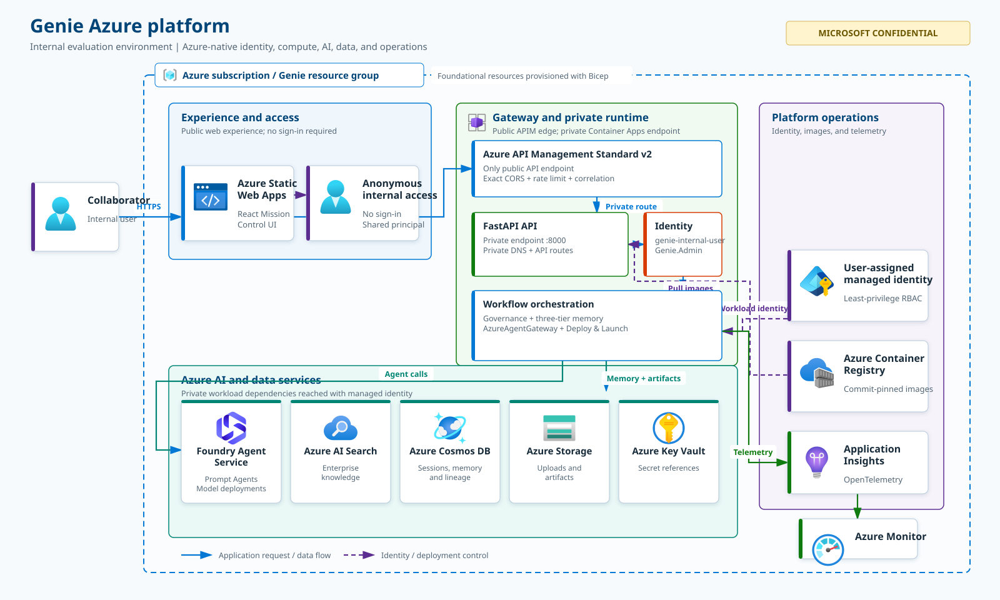
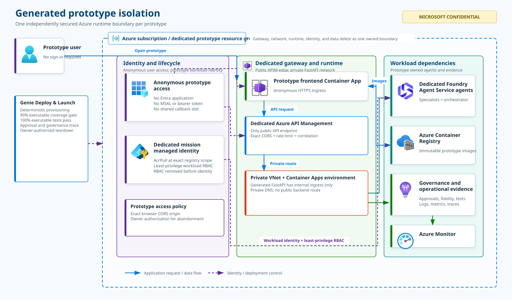

# Genie — Agentic Experience Center

Genie is an Azure-native Agentic AI solutioning platform. It ingests transcripts, recordings, documents, and customer context and transforms them into an interactive AI **Mission Control** experience — where requirement discovery, agent collaboration, architecture design, governance decisions, memory updates, approvals, and final outputs can all be observed **in real time**.

## Purpose and use boundary

> [!IMPORTANT]
> **MICROSOFT CONFIDENTIAL — INTERNAL COLLABORATION ONLY**
>
> Genie is an **art-of-the-possible prototype** for rapidly validating an agentic solution vision, architecture, interaction model, and requirement coverage. It is not a generally available Microsoft product, production reference implementation, or support commitment. **Do not deploy Genie, or a Genie-generated prototype, directly to production.** Before any production use, complete an independent architecture review, threat model, privacy and Responsible AI review, accessibility review, data-governance assessment, operational-readiness review, performance and resilience testing, and approval through the owning organization's standard engineering and release processes.

Genie is **not** a report generator. Every artifact it produces is backed by a traceable chain of agent execution, governance events, and approved memory rather than a static template.

---

## Table of contents

- [Purpose and use boundary](#purpose-and-use-boundary)
- [Architecture](#architecture)
  - [Genie Azure platform](#genie-azure-platform)
  - [Generated prototype isolation](#generated-prototype-isolation)
  - [Modernize & Deliver pipeline](#modernize--deliver-pipeline)
- [Quickstart: deploy to your own Azure subscription](#quickstart-deploy-to-your-own-azure-subscription)
- [Core concepts](#core-concepts)
- [Agents](#agents)
- [Workflows](#workflows)
- [How a mission gets built](#how-a-mission-gets-built)
- [Deploy & Launch pipeline](#deploy--launch-pipeline)
- [Repository layout](#repository-layout)
- [Local development](#local-development)
- [Configuration reference](#configuration-reference)
- [Authentication](#authentication)
- [Testing](#testing)
- [Troubleshooting](#troubleshooting)
- [Deploy log](#deploy-log)
- [Known gaps / next phases](#known-gaps--next-phases)

---


## Architecture

Genie follows Clean Architecture in application code and uses Azure-native identity, hosting, data, AI, and observability services. The diagrams below separate the long-lived **Genie control plane** from the isolated Azure resources created for each generated prototype.

### Genie Azure platform

[](docs/architecture/genie-azure-platform.svg)

*Figure 1. Genie evaluation platform. Select the diagram to open the scalable SVG. The service symbols come from the [official Microsoft Azure Architecture Icons](https://learn.microsoft.com/azure/architecture/icons/).*

| Azure concern | Implementation |
|---|---|
| **Web experience** | React/TypeScript on Azure Static Web Apps; no sign-in or bearer token is required |
| **API access boundary** | Public Standard v2 API Management is the only Internet-facing API endpoint; outbound VNet integration, private DNS, and a Container Apps environment private endpoint reach FastAPI on `8000` while environment public access remains disabled |
| **Agent execution** | `AzureAgentGateway` is the only production execution path to independently provisioned Azure AI Foundry Prompt Agents |
| **Evidence understanding** | Azure Content Understanding `prebuilt-documentSearch` converts supported documents and images into grounded Markdown through managed identity before Discovery agents run |
| **Identity and secrets** | User-assigned managed identity and least-privilege Azure RBAC; secrets belong in Key Vault and are never embedded in images or source |
| **Memory and artifacts** | Cosmos DB for durable session/memory/lineage state, Azure AI Search for enterprise knowledge, and Azure Storage for uploads and generated artifacts |
| **Images and hosting** | Commit-pinned FastAPI images in Azure Container Registry, deployed to a dedicated backend Azure Container App inside the Container Apps environment |
| **Observability** | Application Insights and Azure Monitor receive structured logs, traces, metrics, correlation IDs, and governance telemetry |
| **Infrastructure** | Subscription-scoped Bicep (`infra/main.bicep`) creates the resource group, every foundational Azure resource (including the Container Registry and backend Container App), and a dedicated APIM subnet in one deployment - see [Quickstart](#quickstart-deploy-to-your-own-azure-subscription); GitHub Actions deploys the gateway/private endpoint and application revisions through Azure OIDC for Genie's own hosted environment |

### Generated prototype isolation

Deploy & Launch creates a separate runtime boundary for every newly generated prototype. Generated prototypes do **not** use Microsoft Entra ID or inherit Genie's managed identity, Container Apps environment, resource group, network, or data ownership. Genie and generated prototypes require no sign-in.

[](docs/architecture/generated-prototype-isolation.svg)

*Figure 2. Per-prototype security and runtime isolation. Select the diagram to open the scalable SVG.*

Each prototype receives a tagged `genie-proto-<mission-slug>` resource group, dedicated APIM service, VNet and private DNS, an internal backend Container Apps environment, a public frontend Container Apps environment, exact CORS origin, backend/frontend Container Apps, mission managed identity, RBAC assignments, and generated Foundry agents. The backend enables ingress at the app boundary so VNet-integrated APIM can reach it, while the internal environment keeps that ingress private and unreachable from the internet. The separate public environment makes only the generated static frontend internet-reachable and remains disposable with the prototype resource group. The generated frontend and APIM endpoint are anonymous; APIM enforces exact-origin browser CORS, per-client rate limiting, and correlation IDs before forwarding over the private network. CORS is not authentication, so non-browser clients that know the APIM URL can call it. The durable Cosmos inventory records the shared `genie-internal-user` owner, mission metadata, URLs, resource group, TTL, and cleanup state. The fixed internal principal has `Genie.Admin`, so all callers share inventory and cleanup authority.

### Modernize & Deliver pipeline

"Modernize and deliver" is a separate concern from the two Azure-topology diagrams above - it is one of Genie's mission flows, letting a user bind an existing GitHub repository, generate a governed Azure AI Foundry modernization plan for one of six capabilities, and (once approved) have Genie itself open a real draft pull request.

[](docs/architecture/modernize-deliver-pipeline.svg)

*Figure 3. The Modernize & Deliver pipeline. Select the diagram to open the scalable SVG.*

Every step is a real, deterministic call against GitHub (via the GitHub MCP connection) and Azure AI Foundry - never a simulated or narrated result. Five of the six capabilities (language/runtime upgrade, framework upgrade, dependency upgrade/replacement, strategy recommendation, and monolith-to-modular) end at the opened draft pull request plus a capability-specific "what's next" message; only Rehost to Azure has an additional, separately governed Azure Container Apps deployment step.

### Layering rules (enforced by tests)

- Azure SDK imports are confined to an explicit allow-list of Foundry, deployment, transcription, and generated-prototype infrastructure adapters. A standing test (`tests/unit/test_architecture_boundary.py`) scans the backend source tree and fails if an application/domain module crosses that boundary.
- Every Genie business/debugging **agent is an independently deployed Azure AI Foundry agent resource** (created via the Foundry portal, CLI, or the provisioning scripts in this repo) — Genie never implements agent reasoning as ad hoc Python classes, and never calls `create_agent()` at request time.
- The frontend **never** calls Azure AI Foundry directly — a static scan test (`no_foundry_direct_access.test.tsx`) fails the build if any non-`httpClient.ts` file performs a raw `fetch()` call or imports a Foundry SDK / hostname.
- Execution goes through `AzureAgentGateway` whenever Azure AI Foundry is configured. Local/mock agents, static demo data, and fallback execution are only permitted when `GENIE_ALLOW_LOCAL_AGENTS=true` (and no Foundry endpoint is configured) — otherwise the gateway fails closed instead of ever silently falling back.

### Three-tier memory architecture

| Tier | Purpose | Backend |
|---|---|---|
| **Personal Agent Memory** | Observations, work products, intermediate summaries — accessible only by the owning agent unless policy allows | In-memory (dev) / Cosmos DB (production) |
| **Shared Collaboration Memory** | Goals, constraints, assumptions, risks, findings, approved artifacts — every read/write emits a governance event | In-memory (dev) / Cosmos DB (production, including workflow handoffs across revisions) |
| **Enterprise Knowledge Memory** | Industry patterns, reference architectures, reusable best practices — customer data is never promoted here without approval | Azure AI Search |

### Governance

Every agent execution, agent-to-agent handoff, memory read/write, tool invocation, policy check, and approval decision is recorded as a `GovernanceEvent`, giving full session replay and decision-lineage traceability. `GovernanceProvider` is a pluggable interface (`Agent365GovernanceProvider` marker for production, `LocalGovernanceTraceProvider` for local/dev only) — production startup fails closed if no real provider is injected.

**Triage Mode** (sidebar toggle, off by default) renders a full-height, right-docked panel that polls `GET /sessions/{id}/governance/events` and filters to `agent_execution` events. Because `WorkflowStepExecutor.execute_step()` records that event the instant an individual agent call resolves — not once a whole (possibly multi-step) workflow run/resume call returns — the panel reflects the orchestrator's real agent-call order and timing, including cases where several ungated steps execute back-to-back within one HTTP call. Each feed item shows a gamified XP/level readout plus a truncated preview of that agent's real output (`detail.output_preview`); there is no synthetic or simulated activity.

### Fail-closed startup

Before accepting any traffic, the backend runs 10 mandatory startup validators (`RuntimeVersion`, `Configuration`, `ProviderMode`, `ProductionSafety`, `AgentRegistry`, `WorkflowRegistry`, `PromptTemplate`, `MemoryPolicy`, `GovernanceProvider`, `NoHardcoding`), plus (in production mode only) Foundry-specific validators that verify every enabled agent's `foundry_agent_id` actually resolves in Azure AI Foundry and has no critical configuration drift. `/health/ready` only returns 200 once all validation has passed.

---

## Quickstart: deploy to your own Azure subscription

Genie deploys into **any Azure subscription you own** - never a value or credential belonging to anyone else. One script provisions a complete, isolated evaluation environment end to end:

```powershell
git clone <this-repo-url>
cd Genie-SaS
./scripts/deploy_quickstart.ps1
```

It's fully interactive and never assumes a specific tenant/subscription/account:

1. Confirms your signed-in `az` identity (or runs `az login` for you) and lets you pick which subscription to deploy into.
2. Prompts for everything the deployment needs - environment name, Azure region, your own GitHub Personal Access Token (for the GitHub MCP connection Modernize & Deliver uses), an APIM publisher contact, and which LLM model to deploy. Nothing is pre-filled with a real value, and no credential is ever written to a file this repository tracks.
3. If a previous Genie deployment already exists for that exact environment name, offers to remove it first - always with an explicit typed confirmation, and scoped only to that one resource group (see [`scripts/remove_existing_deployment.ps1`](scripts/remove_existing_deployment.ps1); pass `-RemovePreviousDeployment` to skip the prompt).
4. Validates Azure resource-provider readiness (fails closed rather than deploying partway).
5. Deploys `infra/main.bicep` - a single subscription-scoped Bicep template that creates its own resource group and **every** foundational Azure resource Genie needs: managed identity, Key Vault, Storage, AI Search, Cosmos DB, Azure AI Foundry (+ your chosen model deployment), VNet, Container Apps environment, **Azure Container Registry**, and a **bootstrap backend Container App** - see [Architecture](#genie-azure-platform). This step alone does **not** create API Management (step 7) - APIM can only be wired up once this step's backend Container App already exists.
6. Builds and pushes the real FastAPI image, then rolls it onto that Container App.
7. Provisions the dedicated Standard v2 APIM gateway (`scripts/deploy_platform_gateway.ps1`) - this is the step that actually creates Azure API Management. If you only run `infra/main.bicep` on its own (skipping this script), you will correctly see no APIM at all - that's expected, not a bug.
8. Provisions every Genie agent as a real Azure AI Foundry resource (`scripts/provision_foundry_agents.py`).
9. Builds and deploys the frontend to the Static Web App Bicep already created.
10. Runs the same health checks documented in [Troubleshooting](#troubleshooting).

This is intentionally **long-running** (Azure API Management Standard v2 provisioning alone commonly takes 30-45 minutes) and **stops at the first failure** rather than attempting a partial/best-effort deployment - every stage it calls is independently idempotent, so re-running the script after fixing a problem is safe. To start over from a clean slate instead of resuming, step 3 above offers this every time, or run [`scripts/remove_existing_deployment.ps1`](scripts/remove_existing_deployment.ps1) directly.

Want to understand or customize an individual stage, reuse existing Azure resources, or see how Genie's own continuous deployment pipeline works? See [docs/DEPLOYMENT.md](docs/DEPLOYMENT.md) for the full manual/advanced reference.

> Per the [Purpose and use boundary](#purpose-and-use-boundary) above: this reproduces Genie's **art-of-the-possible evaluation environment**, not a production-ready deployment.

---

## Core concepts

- **Config-driven, never hardcoded.** Agent definitions, workflow definitions, prompt templates, endpoints, deployment names, subscription/tenant ids, customer data, secrets, and expected AI outputs are never hardcoded — they live under `config/agents`, `config/prompts`, `config/workflows`, `config/policies`, and environment variables.
- **Strongly typed everywhere.** Pydantic v2 models on the backend, TypeScript types mirroring every backend model on the frontend.
- **Async throughout** the backend service layer.
- **Dependency injection** — every service is constructed via a `create_X(...)` factory that takes its collaborators as explicit parameters, making every layer independently testable.

---

## Agents

Agents are **never** implemented as Python/TypeScript classes containing reasoning logic. Each agent is a real resource provisioned in Azure AI Foundry; Genie's `config/agents/registry.yaml` registry only records *which* Foundry resource backs each logical agent id, its capabilities, memory access, and prompt template reference. `AzureAgentGateway` resolves the prompt, opens a thread against the existing Foundry agent, posts the message, and reads the reply — it never creates agents at runtime.

### The real agent lineup

Genie's mission pipeline is deliberately lean — seven real Foundry agents, no inert "catalog" of unused agents:

| Agent id | Name | Role | Prompt template | Notes |
|---|---|---|---|---|
| `genie-orchestrator` | Genie Orchestrator | mission_orchestration | `orchestrator-mission-v1` | The **only** agent every workflow step actually addresses directly — see [delegation pattern](#the-orchestrator-delegation-pattern) below |
| `requirements-analyst` | Requirements Analyst | requirement_discovery | `requirements-extraction-v1` | Extracts goals/requirements/risks and rules on agentic-workflow qualification |
| `architecture-designer` | Architecture Designer | architecture_design | `architecture-recommendation-v1` | Designs the multi-agent workflow and shapes an [Impeccable](https://impeccable.style/)-style, domain-specific surface mode and visual direction for the single-page UI |
| `build-agent` | Build Agent | solution_build | `build-generation-v1` / `build-generation-component-v1` / `build-component-regeneration-v1` | Generates the real UI + specialist agent + orchestrator code one component at a time; every UI generation/regeneration path applies the Impeccable design contract |
| `security-assessment-agent` | Security Assessment Agent | security_assessment | `security-assessment-v1` | Independent OWASP Top 10 review of the generated build; reports `SECURITY_GATE: PASS/FAIL` |
| `test-generation-agent` | Test Generation Agent | test_generation | `test-generation-v1` | Independent test-coverage review of the generated build; reports `TEST_COVERAGE_GATE: PASS/FAIL` |
| `debugging-agent` | Debugging Agent | debugging | `failure-diagnosis-v1` | Diagnoses a detected workflow/agent execution failure |

### The orchestrator delegation pattern

Every `solution-discovery-workflow` step invokes `genie-orchestrator`, never the specialist directly. `genie-orchestrator` calls exactly one of its own registered Foundry function-calling tools (`call_requirements_analyst`, `call_architecture_designer`, `call_build_agent`, `call_security_assessment_agent`, `call_test_generation_agent` — implemented in `app/agents/tools/orchestration_tools.py`) to execute that phase's real specialist through the exact same `AzureAgentGateway` path as any other agent call, then returns that specialist's output **verbatim** as the step's own result. This exists because the pinned `azure-ai-projects` SDK version has no native "Connected Agents" mechanism for Prompt Agents — `connected_agent_ids` in the registry is realized via genuine per-phase function tools instead, not a Foundry-native feature. Each agent's own registry entry also declares `connected_agent_ids` purely for inventory/documentation, mirroring what `genie-orchestrator` is actually wired to call.

### Agent metadata fields

Every agent entry carries: `id`, `name`, `role`, `description`, `capabilities`, `allowed_tools`, `memory_access` (subset of `personal`/`shared`/`enterprise`), `foundry_agent_id` (the real provisioned Foundry resource id), `model_deployment_ref` (optional — informational only, defaults to `Settings.default_llm`), `owner` (accountable team, never a person), `governance_policy_id`, `prompt_template_ref`, `connected_agent_ids` (documentation only — see above), and `enabled`.

### Default LLM

`Settings.default_llm` (env `GENIE_DEFAULT_LLM`) applies to any agent that doesn't declare its own `model_deployment_ref`. Currently `gpt-5-mini` by default (`architecture-designer` overrides to `gpt-5-1`, demonstrating per-agent LLM configurability). Anthropic Claude models were evaluated but require an Azure Marketplace subscription with non-zero SKU quota, which is not available by default.

---

## Workflows

Workflows (`config/workflows/registry.yaml`) define ordered, dependency-graphed steps; `WorkflowRuntime` computes execution "waves" from the `depends_on` graph and runs same-wave steps in parallel via `asyncio.gather`. Genie's own Mission Control flow is deliberately just human-paced stages — each step has `requires_human_proceed: true`, so a run simply stops at `waiting_for_proceed` until a human explicitly resumes it; editing an earlier, already-persisted stage never cascades into automatically re-running a downstream one.

- **`solution-discovery-workflow`** — three steps, all addressed to `genie-orchestrator` (see [delegation pattern](#the-orchestrator-delegation-pattern) above):
  1. `analyze-requirements` (prompt `orchestrator-requirements-phase-v1`, tool `call_requirements_analyst`) — extract requirements from the session transcript.
  2. `design-architecture` (prompt `orchestrator-architecture-phase-v1`, tool `call_architecture_designer`, human-gated) — derive the multi-agent workflow + UI design from the approved requirements.
  3. `build-solution` (prompt `orchestrator-build-phase-v1`, tool `call_build_agent`, human-gated) — generate the real UI + agent + orchestrator code for the approved architecture. On a retried attempt, this step's own prior output is fed back in as `previous_build_output` so `call_build_agent` skips regenerating any component that already succeeded, instead of rebuilding the whole mission from scratch.

  Test generation and its real execution are deliberately **not** steps in this workflow — they happen later, inside the separate [Deploy & Launch pipeline](#deploy--launch-pipeline), against the mission's actually-deployed build.
- **`discovery-build-workflow`** — a Build-only path used after a user selects a fully analyzed Discovery solution. The approved Discovery `requirements_text` and `architecture_text` are supplied directly to the existing `genie-orchestrator` → `build-agent` path; Requirements and Architecture are not rerun or represented by synthetic completed steps. Deploy & Launch reads those durable Build inputs when the legacy upstream steps are absent.
- **`debugging-workflow`** — a single `diagnose-failure` step (agent `debugging-agent`, prompt `failure-diagnosis-v1`) triggered on a detected workflow/agent execution failure, executed through the exact same `AzureAgentGateway` path as every other workflow (never a bespoke/local diagnostic path).

### Persona-led Discovery

The Landing page offers two distinct paths: **Start Prototype** enters the original Requirements-first workflow, while **Start Discovery** opens one durable progressive workspace. In production, Discovery sends supported customer documents and images to Azure Content Understanding before agent analysis. Its explicit allowlist covers PDF, TIFF and common image formats, Word, Excel, PowerPoint, OpenDocument, email, EPUB, HTML, Markdown, RTF, XML, JSON, CSV/TSV, KML, and plain text. Content Understanding contributes OCR, document structure, tables, and grounded Markdown; PDF and standalone image inputs can additionally contribute generated descriptions of diagrams and charts. Embedded-image semantic analysis in Office files is not claimed. Local development remains intentionally narrower: deterministic UTF-8 text, text PDFs, and DOCX only, with unsupported or lossy input rejected rather than treated as evidence.

The Foundry-hosted Discovery agents synthesize that evidence across files, identify personas, and keep known facts, risks, contradictions, assumptions, and information gaps distinct. Clarification questions target unresolved evidence needed for implementation. Probable Azure-native solutions include tradeoffs, evidence references, structured reference-architecture nodes and edges, AI feasibility, and independently resolved Azure Retail Prices data. Removing analyzed evidence invalidates every derived result so stale conclusions cannot survive a source change.

When material clarification is needed, customers can answer all questions in a batch or work through unresolved questions one at a time. Every question includes two to four Foundry-generated, evidence-aware answer choices and an editable free-text field, so a customer can select a likely answer or provide a different one. When the evidence already resolves every material implementation decision, Genie does not show an empty Q&A mode choice and proceeds directly to probable-solution generation. Skipping a question records only a recommendation offer; Genie calls the Architecture Designer for a Microsoft/Azure best-practice recommendation only after the user explicitly accepts that offer. The user can stop after Q&A and resume the same Cosmos-backed case later, add customer material for a new analysis revision, or delete an abandoned pre-Build case together with only its case-prefixed Shared Collaboration Memory records.

Probable solutions include Build-ready requirements and architecture, tradeoffs, AI feasibility, a deterministic React Flow service topology backed by a fixed allowlist of local [official Microsoft Azure Architecture Icons](https://learn.microsoft.com/azure/architecture/icons/), and an architecture-derived Azure solution cost. Foundry supplies the Azure services and their relationships, while Dagre computes stable left-to-right presentation coordinates so model-generated positions cannot overlap the service nodes. Every pricing input must map to an explicit service node. The agent proposes Retail Prices service/product/SKU/meter/region and billing-unit assumptions but never supplies prices; Genie resolves unit prices through the Azure Retail Prices API and presents monthly and annual solution totals, the contributing service inputs, assumptions, exclusions, and `complete`, `partial`, or `unavailable` retail-price coverage instead of inventing missing costs. Exact lookups are preferred; a bounded normalized lookup handles differences between architecture labels and Retail API taxonomy plus globally priced services. Partial or unavailable persisted estimates expose **Refresh Azure pricing**, which recalculates only pricing without regenerating the architecture.

Every active Discovery also exposes **Export PDF** beside **Save discovery**. It uses the browser's native Save as PDF flow with an A4 landscape print layout containing the complete rendered Discovery: evidence, selected personas, findings, gaps and assumptions, answered questions, probable solutions, Azure architecture, tradeoffs, feasibility, and cost details. Application navigation, trace panels, and interactive controls are excluded from the exported document.

### Agentic-workflow qualification check

The Requirement Discovery Map doesn't just list extracted requirements — it also surfaces whether they actually **qualify for a multi-agent agentic workflow** in the first place, versus being better served by a simpler, deterministic solution. This is deliberately **not** a Python business rule: the judgment is made by the existing `requirements-analyst` agent as part of its normal `analyze-requirements` step. Its prompt (`requirements-extraction-v1`) instructs it to end its output with two machine-parseable lines:

```
AGENTIC_WORKFLOW_QUALIFICATION: QUALIFIED | NOT_QUALIFIED
QUALIFICATION_REASON: <one or two plain-language sentences>
```

The backend (`RequirementsService.get_qualification`, `GET /sessions/{id}/requirements/{workflow_run_id}/qualification`) only *extracts* this verdict via a regex parser — it never invents or overrides the agent's own reasoning. If the requirements don't qualify, `RequirementDiscoveryPage` shows a graceful Fluent `MessageBar` banner explaining why, using the agent's own stated reason. The step id this check watches is configurable via `GENIE_REQUIREMENTS_QUALIFICATION_STEP_ID` (defaults to `analyze-requirements`), never hardcoded.

---

## How a mission gets built

This is the "how": the exact mechanism Genie uses to turn an uploaded transcript into a working, requirements-traceable UI + multi-agent backend — end to end, nothing hardcoded or templated.

| Stage | Governed outcome | Approval or gate |
|---|---|---|
| **1. Ingest** | Transcript, recording, or document enters the session scope | Upload validation |
| **2. Requirements** | Requirements Analyst classifies scope and creates the numbered critical path | Human approval |
| **3. Architecture** | Architecture Designer produces the multi-agent workflow and single-page UI design | Human approval |
| **4. Build** | Build Agent generates one traceable component at a time | Automatic repair for code that cannot run |
| **5. Assess and test** | Security Assessment and Test Generation run independently | `SECURITY_GATE` and `TEST_COVERAGE_GATE` |
| **6. Workshop** | Peer-review findings and selected fixes are reconciled | Human approval |
| **7. Deploy & Launch** | The deterministic pipeline provisions the isolated Azure prototype | Launches with visible validation gaps after bounded repair; only technical, security, authorization, or deployment failures block |

### 1. Requirements are pinned into a single scope contract

`requirements-analyst` (prompt `requirements-extraction-v1`) classifies every functional requirement as `MUST-HAVE` or `NICE-TO-HAVE` (erring toward MUST-HAVE when ambiguous — the goal is to capture full scope, never shrink it), then emits a numbered **"Critical path (must build first):"** list. This list is the one scope boundary every later stage is measured against. The same step also emits the `AGENTIC_WORKFLOW_QUALIFICATION` verdict described above.

### 2. Architecture Designer decides *what* to build — strictly bounded to that scope

`architecture-designer` (prompt `architecture-recommendation-v1`) reasons out two sections from the approved requirements alone:

- **`## Multi-Agent Workflow`** — exactly one Orchestrator Agent plus however many specialist agents the critical path genuinely needs (no "best practice" agents invented beyond what the requirements ask for).
- **`## Single-Page UI Design`** — only the mission-specific *input* zone(s) (1-3 zones), using a fixed, deterministic field→control mapping so every mission's UI stays consistent: ≤6 mutually exclusive choices → dropdown; multi-select → checkbox group; bounded number where position matters → slider; exact number → number input; toggle → checkbox; file/folder → drag-and-drop picker; date/time → picker; only genuinely open-ended values → text field. The surrounding shell always supplies the live Agent Pipeline panel and Mission Queue (progress, streamed narration, results, downloads) identically for every mission, so this design step never touches that — only the bespoke input surface.

The prompt is explicit: *"Stay strictly within the 'Critical path:' scope... treat [anything outside it] as future backlog, out of scope for this design."*

### 3. Build Agent turns that design into real code — one component at a time, with zero drift allowed

`call_build_agent` (`app/agents/tools/orchestration_tools.py`) invokes the Build Agent **once per component** (`build-generation-component-v1`), in a fixed bottom-up order: each specialist agent module (alphabetical), then the Orchestrator module, then the UI component. The prompt hard-constrains every component to the architecture's own list: *"Every zone and every agent you generate code for MUST come directly from that exact list below — never invent, add, rename, or merge."* The UI component must implement **only** the input zones named in step 2, using the same deterministic control-mapping rule, styled with Genie's own shell classes (`genie-card`, `genie-zone-title`, `genie-btn-primary`, `genie-dropzone`) and a fixed contract (`{ onSubmit: (message, attachments?) => void }`) — it never renders its own progress/output/agent-status UI, because the shell already does. On a retried build, `previous_build_output` lets the tool skip regenerating any component that already succeeded rather than rebuilding the whole mission from scratch. Users can also request a targeted change to a single already-generated component from Workshop Center (`WorkshopService.regenerate_component`, prompt `build-component-regeneration-v1`) without touching anything else.

When architecture prose includes `REQ-###` ids, `architecture_parsing.parse_component_requirement_assignments` uses them to give each component focused context through `{assigned_requirements}`. Missing literal ids do not block Architecture or Build; the full approved requirements remain available to generation, and deployed behavior is validated independently.

The generated orchestrator module has one more fail-closed contract: `code_materializer.materialize_build` rejects the parsed build with a `MaterializedCodeError` unless it defines the exact literal class `class OrchestratorAgent:` — the deterministic backend scaffold (`_MAIN_PY_TEMPLATE`) hardcodes `from orchestrator import OrchestratorAgent`, so a misnamed class would otherwise deploy a prototype whose backend never actually runs the generated business logic. This is enforced at materialization time (before any deploy), on top of the `build-generation-component-v1` prompt's own instruction to name the class correctly.

### 4. Two independent agents verify the build against the original requirements — never trusting the builder's own claims

- **Security Assessment Agent** (`security-assessment-v1`) reviews the entire generated artifact against the OWASP Top 10 every time (not just the diff) and is explicitly told to *"form your own independent judgment... do not defer to, assume the correctness of, or be swayed by"* the Build Agent's own claims. Ends with `SECURITY_GATE: PASS|FAIL` plus structured findings.
- **Test Generation Agent** (`test-generation-v1`) generates real, pytest-discoverable unit/integration tests and Vitest/RTL UI tests, and independently confirms *"every requirement's critical path have at least one covering test"* before reporting `TEST_COVERAGE_GATE: PASS|FAIL`.

Both marker-line verdicts are parsed verbatim (never invented or overridden) by `PeerReviewService` (`app/services/peer_review_service.py`) using the same "agents return marker lines, never JSON" convention used throughout Genie. Workshop Center's **Apply Selected Fixes** action regenerates the build with a customer-chosen subset of findings and forces both gates to re-run against the new artifact.

### 5. Human approval + full decision lineage at every hop

Every stage above (`design-architecture`, `build-solution`) is `requires_human_proceed: true` — nothing auto-advances, and revisiting an earlier stage never silently cascades into re-running a downstream one. `TraceabilityService` (`app/governance/traceability_service.py`) assembles a complete, customer-facing lineage per recommendation — which agent produced it, which evidence/memory it used, which approvals were granted, and every governance event on its trace id — so any generated screen or agent can be traced back to the exact requirement and approval that authorized it. This is what Genie's **Replay Center** and **Triage Mode** panels render live.

---

## Deploy & Launch pipeline

Deploy & Launch is deliberately **not** an LLM-narrative workflow step — it is a real, deterministic, code-driven Azure provisioning pipeline (`app/deploy_launch/pipeline_service.py`) that executes each named step in this exact order against real Azure SDKs — never fabricating a result for a step it didn't actually perform. Production startup fails when required deployment or prototype-APIM settings are absent; explicit Null collaborators exist only for local tests. It runs once a mission's `build-solution` step has been approved, and it deploys **one customer mission's generated build** (a separate concern from Genie's own infrastructure, which is provisioned once via `infra/main.bicep`).

| # | Step id | Customer-facing name | What actually happens |
|---|---|---|---|
| 1 | `generate-access-policy` | Generate Access Policy & Least Access | Derives a least-privilege access policy for the mission's generated agents |
| 2 | `provision-foundry-agents` | Deploy Agents to Foundry | Provisions each generated specialist + orchestrator agent as a real Azure AI Foundry resource |
| 3 | `deploy-backend-service` | Deploy Backend Service | Provisions a prototype-owned VNet, private DNS zone, internal Container Apps environment, and dedicated Standard v2 API Management service; builds FastAPI; and enables app-boundary ingress inside the internal environment. APIM is the only public API endpoint and reaches FastAPI only over the prototype private network |
| 4 | `sync-frontend-integration` | Update Frontend Integrations | Wires the generated anonymous UI to the dedicated APIM endpoint; no Entra, MSAL, bearer-token, or acceptance-key runtime configuration is generated |
| 5 | `deploy-frontend-app` | Deploy Frontend | Builds the mission UI under Node 22, runs the pinned Apache-2.0 Impeccable `3.6.0` detector over generated TSX/CSS as advisory quality feedback, provisions a prototype-owned public Consumption Container Apps environment, then deploys a mission-specific frontend Container App. APIM's deny-by-default bootstrap CORS origin is replaced with the returned exact HTTPS origin |
| 6 | `generate-test-suite` | Generate Requirement Acceptance Tests | Test Generation Agent writes real black-box tests against the deployed prototype's actual mission URLs (no mocks/patches), targeting every approved requirement id. Missing, malformed, mock-based, or weak goal tests trigger bounded correction; unresolved issues remain explicit validation gaps and do not hide the deployed prototype |
| 7 | `execute-test-suite` | Requirement Validation | Generated tests call the dedicated APIM endpoint directly. Failures, timeouts, and missing goal evidence trigger automatic regeneration and redeployment up to `GENIE_DEPLOYMENT_FIDELITY_MAX_REPAIR_ATTEMPTS`; exhausted or failed repair remains visible as validation evidence rather than blocking Launch |
| 8 | `launch-mission` | Launch | Mints the customer-facing launch link for the deployed prototype and identifies any remaining validation gaps |

Each step's real status (`pending` → `running` → `completed`/`failed`/`skipped`) streams live to the Deploy & Launch page so the human watches actual provisioning happen — never a simulated progress bar. **Requirement Validation** (step 7) never trusts generated claims of completeness: it records real pytest outcomes, attempts bounded repair, and leaves unresolved gaps visible without withholding an otherwise working prototype.

Prototype backend and frontend Container App names preserve the readable `genie-<mission>-<component>` form when it fits Azure's 32-character limit. Longer workload names are shortened deterministically with a collision-resistant hash; deployment and governed cleanup use the same derived name.

---

## Repository layout

```
backend/           FastAPI application (Python 3.12+)
  app/
    agents/        AgentRegistry, AzureAgentGateway, orchestration tools, Foundry provider/sync/lifecycle
    discovery/     Durable Discovery case models, repository, and state service
    api/            19 routers (thin — auth + delegation only)
    architecture/   Architecture Studio services
    config/         Settings (pydantic-settings, env prefix GENIE_)
    debugging/      Debugging workflow trigger service
    deploy_launch/  Deploy & Launch pipeline (real, deterministic Azure provisioning
                    of one mission's generated build - see "Deploy & Launch pipeline")
    deployment/     Pre-infra deployment-readiness tooling (resource provider checks)
    governance/      Governance, lineage, decision graph, approval, replay, traceability services
    memory/         Personal / Shared / Enterprise memory services
    models/         Shared Pydantic models
    orchestration/  WorkflowRuntime, AgentOrchestrator, handoff/collaboration/reanalysis
    outputs/        Final Output Center services
    prompts/        PromptRegistry
    repositories/   Protocol + in-memory repository implementations
    security/       Fixed internal principal and authorization dependencies
    services/       Session / Requirements / Workshop / Architecture / Peer Review / Output /
                    Foundry agent provisioning & lifecycle services
    transcription/  Upload/recording transcription (speech-to-text) service
    utils/          Shared YAML loader
    validation/     10 fail-closed startup validators + runner
    workflows/      WorkflowRegistry
  tests/            Unit + integration tests (pytest)

frontend/           React + TypeScript Mission Control UI (Vite)
  src/
    app/            App bootstrap and router
    components/     Shared UI components
    features/       9 feature pages (landing, upload, requirement-map,
                     architecture-studio, workshop-center, deploy-launch,
                     replay-center, final-output-center, triage) - plus two
                     hub wrappers in layouts/ (RequirementsHubPage,
                     OutputsHubPage) that group related pages under one
                     linear nav step via sub-tabs
    hooks/          Data-fetching hooks per feature
    layouts/        AppShell and navigation
    services/        httpClient and one API client per backend router
    state/           SessionContext, trace id registry
    types/           TypeScript types mirroring backend Pydantic models
  tests/            Vitest component + static-scan tests

config/             Externalized configuration (never hardcoded in source)
  agents/           Agent registry + Foundry Supported Agents catalog
  prompts/          Prompt templates
  workflows/        Workflow registry
  policies/         memory_policy.yaml, governance_policy.yaml, approval_policy.yaml
  deployment/       resource_providers.yaml (Azure RP allow-list for deployment tooling)

infra/              Bicep infrastructure-as-code
  main.bicep                        Subscription-scoped entry point (creates its own RG)
  modules/foundational-resources.bicep   RG-scope aggregator
  modules/container-registry.bicep       Azure Container Registry (AcrPull RBAC only)
  modules/backend-container-app.bicep    The real backend Container App (bootstrap image)
  modules/*.bicep                   One module per resource type
  platform-private-gateway.bicep    Standard v2 APIM gateway + private network cutover

scripts/            Operator CLI scripts
  deploy_quickstart.ps1            One-command deploy into any Azure subscription - see Quickstart
  remove_existing_deployment.ps1   Safely removes a previous deployment's resource group before a fresh retry
  (deployment readiness, RBAC role generation, Foundry agent
   provisioning/sync/validation/inventory export, individual deploy stages)

docs/GENIE_BUILD_SPEC.md   Full build specification
docs/DEPLOYMENT.md         Manual/advanced deployment reference + CI/CD one-time setup
docs/CHANGELOG.md          Dated deploy log (what changed in the shared environment, and why)
e2e/                       Playwright end-to-end tests (scaffolding)
.github/copilot-instructions.md   Architecture/coding rules enforced across the repo
```

---

## Local development

### Prerequisites

- Python 3.12+
- Node.js 20+ (LTS)
- An Azure subscription with an Azure AI Foundry project for every agent execution

### Backend

```powershell
cd backend
python -m venv .venv
.\.venv\Scripts\python.exe -m pip install -e ".[dev]"
.\.venv\Scripts\python.exe -m pytest -v          # run tests
.\.venv\Scripts\python.exe -m ruff check app tests  # lint
.\.venv\Scripts\python.exe -m uvicorn app.main:create_app --factory --reload
```

> **Windows on ARM64 note:** do not install `uvicorn[standard]` — `httptools` has no `win_arm64` wheel. Use plain `uvicorn`. If `azure-identity`'s dependency resolver pulls a `cryptography` version with no `win_arm64` wheel, run `pip install cryptography --only-binary=:all:` first.

Copy `backend/.env.example` to `backend/.env` and fill in real values, or set the environment variables listed in [Configuration reference](#configuration-reference). `GENIE_AZURE_FOUNDRY_ENDPOINT` and `GENIE_AZURE_FOUNDRY_PROJECT_NAME` are mandatory. Genie has no local or mock agent execution mode.

### Frontend

```powershell
cd frontend
npm install
npm run dev          # local dev server
npm run build         # tsc -b && vite build -> dist/
npm run test          # vitest
npm run typecheck
npm run lint
```

Set `frontend/.env.development` (or `.env.local`) with `VITE_GENIE_API_BASE_URL` pointing at your local backend. No authentication variables are required.

---

## Configuration reference

All backend configuration is via environment variables prefixed `GENIE_` (pydantic-settings, see `backend/app/config/settings.py`). Nothing here should ever be hardcoded into source — every value below is meant to be supplied per-deployment.

| Variable | Default | Purpose |
|---|---|---|
| `GENIE_SERVICE_NAME` | `genie-backend` | Service identity for logs/telemetry |
| `GENIE_ENVIRONMENT` | `development` | `development` \| `test` \| `production` |
| `GENIE_LOG_LEVEL` | `INFO` | Log verbosity |
| `GENIE_GOVERNANCE_PROVIDER` | `local` | `local` \| `agent365` — production requires a real provider |
| `GENIE_ALLOW_MOCK_AGENTS` | `true` | Must be `false` in production |
| `GENIE_ALLOW_LOCAL_AGENTS` | `true` | Must be `false` in production |
| `GENIE_USE_SYNTHETIC_DATA` | `true` | Must be `false` in production |
| `GENIE_AZURE_FOUNDRY_ENDPOINT` | *(none)* | `https://<account>.services.ai.azure.com/api/projects/<project>` |
| `GENIE_AZURE_FOUNDRY_PROJECT_NAME` | *(none)* | Foundry project name |
| `GENIE_AZURE_FOUNDRY_RESOURCE_GROUP` | *(falls back to `GENIE_DEPLOYMENT_RESOURCE_GROUP`)* | Resource group containing the Foundry account, if different from where Deploy & Launch provisions new deployments (e.g. a dedicated environment reusing an existing Foundry project) |
| `GENIE_AZURE_CONTENT_UNDERSTANDING_ENDPOINT` | *(derived from Foundry endpoint)* | Optional HTTPS AIServices account root URL for document/image evidence analysis |
| `GENIE_CONTENT_UNDERSTANDING_ANALYZER_ID` | `prebuilt-documentSearch` | Externally selectable Content Understanding analyzer |
| `GENIE_CONTENT_UNDERSTANDING_API_VERSION` | `2025-11-01` | Pinned GA Content Understanding REST API |
| `GENIE_CONTENT_UNDERSTANDING_PROCESSING_LOCATION` | `geography` | `geography` \| `dataZone` \| `global` processing boundary |
| `GENIE_CONTENT_UNDERSTANDING_TIMEOUT_SECONDS` | `300` | End-to-end analysis polling deadline |
| `GENIE_CONTENT_UNDERSTANDING_POLL_INTERVAL_SECONDS` | `2` | Delay between operation-status requests |
| `GENIE_AZURE_RETAIL_PRICES_ENDPOINT` | `https://prices.azure.com/api/retail/prices` | Public Azure Retail Prices API used for deterministic Discovery estimates |
| `GENIE_MEMORY_STORE_BACKEND` | `in_memory` | `in_memory` \| `cosmos_db` — production requires `cosmos_db` |
| `GENIE_MEMORY_STORE_ENDPOINT` | *(none)* | Required in production when backend is `cosmos_db` |
| `GENIE_MEMORY_STORE_DATABASE_NAME` | `genie` | Cosmos database containing durable sessions, upload text, workflow checkpoints, and prototype inventory |
| `GENIE_MEMORY_STORE_CONTAINER_NAME` | `memory` | Shared Cosmos container partitioned by record family |
| `GENIE_LINEAGE_STORE_BACKEND` | `in_memory` | Same pattern as memory store, for governance/lineage |
| `GENIE_LINEAGE_STORE_ENDPOINT` | *(none)* | Required in production |
| `GENIE_DEFAULT_LLM` | `gpt-5-mini` | Default model deployment name for agents that omit `model_deployment_ref` |
| `GENIE_DEBUGGING_WORKFLOW_ID` | `debugging-workflow` | Workflow id run on `FailureDetected` |
| `GENIE_REQUIREMENTS_QUALIFICATION_STEP_ID` | `analyze-requirements` | Workflow step id whose output is checked for an agentic-workflow qualification verdict |
| `GENIE_DEPLOYMENT_FIDELITY_MAX_REPAIR_ATTEMPTS` | `3` | Max automatic regenerate-and-redeploy attempts Requirement Validation makes before launching with visible gaps |
| `GENIE_DEPLOYMENT_FIDELITY_MIN_COVERAGE_PERCENT` | `90` | Target percentage of approved requirements with executable acceptance tests; uncovered requirement IDs remain visible as gaps |
| `GENIE_DEPLOYMENT_TEST_EXECUTION_TIMEOUT_SECONDS` | `300` | Max seconds Requirement Validation allows its real black-box pytest subprocess before recording a timeout gap |
| `GENIE_PROTOTYPE_API_GATEWAY_ENABLED` | `false` | Enables a dedicated Azure API Management service and private runtime network for every newly deployed prototype; mandatory (`true`) in production |
| `GENIE_PROTOTYPE_API_GATEWAY_PUBLISHER_EMAIL` | *(none)* | Required APIM publisher contact email supplied as external deployment configuration |
| `GENIE_PROTOTYPE_API_GATEWAY_PUBLISHER_NAME` | *(none)* | Required APIM publisher display name supplied as external deployment configuration |
| `GENIE_PROTOTYPE_API_GATEWAY_SKU_NAME` | `StandardV2` | APIM SKU; `StandardV2` or `PremiumV2` so the gateway can reach the private backend VNet |
| `GENIE_PROTOTYPE_API_GATEWAY_CAPACITY` | `1` | Capacity units for each prototype's dedicated APIM service |
| `GENIE_PROTOTYPE_DEFAULT_TTL_DAYS` | `7` | Initial owner prototype lifetime (1-90 days) |
| `GENIE_PROTOTYPE_MAX_ACTIVE_PER_OWNER` | `0` | Optional per-owner active prototype quota; `0` allows unlimited active prototypes |
| `GENIE_PROTOTYPE_CLEANUP_INTERVAL_SECONDS` | `3600` | Expired-prototype reconciliation interval; failed deletion remains visible and retryable |
| `GENIE_KEY_VAULT_URI` | *(none)* | Required in production |
| `GENIE_CORS_ALLOWED_ORIGINS` | *(empty)* | Comma-separated browser origins allowed to call the API (e.g. the deployed frontend's URL) |
| `GENIE_CONFIG_ROOT` | `config` | Root directory for agents/prompts/workflows/policies |
| `AZURE_CLIENT_ID` | *(none)* | **Required** when running under a Container App / VM with a **user-assigned** managed identity — tells `DefaultAzureCredential` which identity to use |
| `GENIE_WORK_IQ_ENABLED` | `false` | Enables the Work IQ IQ provider (delegated Microsoft Entra OAuth) |
| `GENIE_WORK_IQ_MCP_ENDPOINT` | *(none)* | Microsoft's documented endpoint: `https://workiq.svc.cloud.microsoft/mcp` |
| `GENIE_WORK_IQ_RETRIEVE_TOOL` | *(none)* | The Work IQ MCP tool name to invoke for retrieval; confirm via `tools/list`, never hardcode blind |
| `GENIE_WORK_IQ_QUERY_ARGUMENT` | `query` | Tool argument name the configured retrieve tool expects for the query string |
| `GENIE_WORK_IQ_SCOPES` | *(defaults to the confirmed `WorkIQAgent.Ask` scope)* | Space-separated delegated OAuth scopes requested for Work IQ |
| `GENIE_FABRIC_IQ_ENABLED` | `false` | Enables the Fabric IQ provider (delegated Microsoft Entra OAuth) |
| `GENIE_FABRIC_IQ_MCP_ENDPOINT` | *(none)* | Microsoft's documented endpoint: `https://fabriciq.svc.cloud.microsoft/v1/mcp/fabriciq` |
| `GENIE_FABRIC_IQ_RETRIEVE_TOOL` | *(none)* | The Fabric IQ MCP tool name to invoke; confirm via `tools/list` |
| `GENIE_FABRIC_IQ_SCOPES` | *(none — required when enabled)* | Space-separated delegated Power BI Service API scopes, confirmed against your own app registration |
| `GENIE_FOUNDRY_IQ_ENABLED` | `false` | Enables the Foundry IQ provider (administrator-managed static token) |
| `GENIE_FOUNDRY_MCP_ENABLED` | `false` | Enables the Microsoft Foundry MCP provider (administrator-managed static token; currently unconfirmed for backend use, see `docs/architecture/genie-sas-microsoft-iq.md`) |
| `GENIE_IQ_OAUTH_TENANT_ID` | *(none)* | Required when Work IQ or Fabric IQ is enabled — the single Entra tenant Genie-SaS's delegated connections are restricted to |
| `GENIE_IQ_OAUTH_CLIENT_ID` | *(none)* | Genie-SaS's own confidential-client Entra app registration id — see `docs/setup/genie-sas-entra-development.md` |
| `GENIE_IQ_OAUTH_CLIENT_SECRET_ENV_VAR` | *(none)* | Names the environment variable holding the client secret value — the secret itself is never a typed setting |
| `GENIE_IQ_OAUTH_REDIRECT_URI` | *(none)* | Must exactly match a **Web** platform redirect URI registered on the app (e.g. `https://<host>/iq/connections/callback`) |
| `GENIE_IQ_OAUTH_STATE_TTL_SECONDS` | `600` | How long an unclaimed OAuth `state` value remains valid |
| `GENIE_IQ_DELEGATED_OAUTH_ALLOWED_IN_PRODUCTION` | `false` | Must be explicitly `true`, in addition to full OAuth configuration, before a delegated IQ provider may be enabled in production |

Frontend (`frontend/.env.production` / `.env.development`, Vite `VITE_` prefix):

| Variable | Purpose |
|---|---|
| `VITE_GENIE_API_BASE_URL` | Platform APIM gateway URL in production; local FastAPI URL in development |

---

## Authentication

Genie and every generated prototype are intentionally anonymous:

- **Genie API and frontend**: the SPA opens without a redirect or token and sends no `Authorization` header. Public Standard v2 APIM enforces the configured exact-origin CORS policy, rate limit, and correlation header, then reaches FastAPI through outbound VNet integration and the Container Apps private endpoint. Container Apps environment public access is disabled. CORS does not stop non-browser clients that know the public APIM URL.
- **Internal principal**: every API request resolves to the deterministic `genie-internal-user` principal with `Genie.Admin`. Request headers cannot change that identity. Sessions, governance attribution, prototype ownership, inventory, and cleanup authority are therefore shared across all callers; there is no per-user isolation or meaningful user-role distinction.
- **Generated prototypes**: every Deploy & Launch run owns a dedicated API Management service, VNet, private DNS zone, internal Container Apps environment, exact CORS policy, resource group, managed identity, RBAC assignments, and Foundry agents. The generated SPA and APIM endpoint require no sign-in or bearer token. APIM enforces exact-origin browser CORS, rate limiting, and correlation before forwarding over the private network; generated FastAPI has no public ingress.
- **Azure workload identity remains**: removing interactive user authentication does not remove managed identity. `DefaultAzureCredential` still uses the Container App's user-assigned identity for Cosmos DB, Foundry, Azure management, ACR, storage, and other Azure service calls under least-privilege RBAC.
- **Durable workflow and prototype state**: production uses managed-identity Cosmos access. Upload records retain extracted transcript/document text, and workflow runs checkpoint their full step results after each completed wave, so source material, requirements, architecture, and generated build outputs remain available after a backend revision rollout. Startup also hydrates deployment runs before readiness and marks interrupted deployment work failed rather than pretending it completed. A cancellable hourly reconciler deletes expired terminal prototypes, stores `deletion_pending`/`deletion_failed` state, and preserves failures for retry.

---

## Testing

| Layer | Command | Notes |
|---|---|---|
| Backend unit + integration | `pytest` (from `backend/`) | Includes production-safety and fail-closed startup tests |
| Backend lint | `ruff check app tests` | |
| Frontend component tests | `npm run test` (Vitest) | Includes static-scan tests guarding against hardcoded demo data and direct Foundry access |
| Frontend type check | `npm run typecheck` | |
| Frontend lint | `npm run lint` | `--max-warnings=0` |
| End-to-end | Playwright (`e2e/`) | Scaffolding present; expand per feature as needed |

---

## Troubleshooting

- **`az acr build` hangs indefinitely with a local (`.`) build context** — a known issue on some Windows ARM64 machines (tar-packing step never completes). Workaround: build from a pushed git remote URL instead (`az acr build ... https://github.com/<org>/<repo>.git#<branch>`); for a private repository, embed a token in the URL rather than making the repository public.
- **Container App crash-loops with `ManagedIdentityCredential: ... Unable to load the proper Managed Identity`** — set `AZURE_CLIENT_ID` to the user-assigned identity's **client id** (not principal id).
- **`PermissionDenied` calling `create_agent`** — the "Cognitive Services User" role must be assigned at the Foundry **project** scope, not just the account scope; RBAC propagation can take a few minutes.
- **`InsufficientQuota` deploying a Marketplace model** — the subscription has a default quota of 0 for most partner model SKUs; request a quota increase before retrying.
- **az/gh/npm not found in a fresh terminal** — these CLIs are commonly installed but not yet appended to `PATH` in a brand-new shell session; re-add their install directories to `$env:Path` for that session.

---

## Deploy log

Every deployment to the shared Azure evaluation environment is recorded in [docs/CHANGELOG.md](docs/CHANGELOG.md): commit, what changed, and why. Update that file as part of the same commit that ships the fix/feature, before pushing to `master` triggers [Continuous deployment](docs/DEPLOYMENT.md#continuous-deployment-github-actions).

---

## Known gaps / next phases

- CI/CD (`.github/workflows/ci.yml`) runs backend pytest/ruff and frontend typecheck/lint/vitest on every push/PR to `main`, then auto-deploys the public APIM/private Container Apps backend and Static Web App on pushes once both pass.
- End-to-end Playwright coverage (`e2e/`) is scaffolded but not yet fully built out.
- **Future enhancement - Impeccable agent design workflow**: evolve the current prompt guidance and pre-deployment detector into an explicit Azure AI Foundry design workflow. Pin and integrity-check the npm-installed Impeccable skill; invoke a dedicated `impeccable-ui-designer` production agent through `AzureAgentGateway` to create a strongly typed, prototype-specific design contract from the approved requirements and architecture; require every initial UI generation and Workshop regeneration to consume that contract; then render desktop/mobile views and run a bounded detector-feedback repair loop before deployment. Persist the skill/version hash, design contract, detector findings, repair attempts, and final decision in Shared Collaboration Memory and the governance trace, and fail closed when the design contract, detector, or required evidence is unavailable. Impeccable remains an agent design skill and detector, not a React component library.
- Genie and prototype APIM URLs are callable by non-browser clients without authentication. Exact-origin CORS constrains browsers only; the FastAPI backends are network-private, but authentication must be reintroduced before handling sensitive or multi-user workloads.
- Shared Collaboration Memory currently has no write call sites anywhere in the backend — nothing ever calls `memory_service.shared.write`. The Requirement Discovery Map's main requirements list (which reads from Shared Memory) is therefore likely empty in real usage today; the agentic-workflow qualification check above was deliberately built to read `WorkflowRunResult.step_results` directly instead, so it works independently of this gap.
